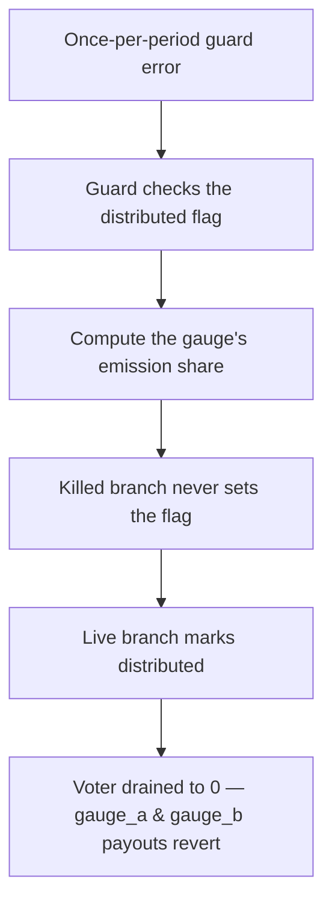

# KittenSwap: killed-gauge distributions can be replayed to block valid payouts

> **Vulnerability classes:** vuln/dos · vuln/logic · vuln/reward-accounting
>
> **Reproduction:** a faithful minimal reproduction of the vulnerable finding — the killed-gauge branch of `Voter::_distribute` is reproduced **verbatim** (marked `@>`) with faithful minimal doubles (KITTEN token, Minter period funding, Algebra/standard gauges); local deploy, no fork.

<!-- source-auditvault: https://github.com/pashov/audits/blob/master/team/md/KittenSwap-security-review_2025-07-31.md -->

## Root cause

When a gauge is killed (`isAlive == false`), `_distribute` routes that gauge's pending emissions back to the `minter` and zeroes them out — but, unlike the live `else` branch, it never sets `es.distributed = true`. The `if (es.distributed) revert` guard therefore never trips for a killed gauge, so anyone can call `distribute(killedGauge)` repeatedly within the same period. The vulnerable branch, reproduced verbatim from the audited `Voter`:

```solidity
    function _distribute(uint256 _period, address _gauge) internal {
...
        IVoter.Emissions storage es = ps.gaugeEmissions[_gauge];
        if (es.distributed) revert EmissionsAlreadyDistributedForPeriod();

        uint256 emissions = (ps.totalEmissions * ps.gaugeTotalVotes[_gauge]) /
            ps.globalTotalVotes;
...
        if (gauge[_pool].isAlive == false) {
@>          kitten.transfer(address(minter), emissions);
            emissions = 0;
        } else {
            es.amount = emissions;
            es.distributed = true;
        }

        if (gauge[_pool].isAlgebra) _claimAndDistributeAlgebraPoolFees(_pool);
        kitten.approve(_gauge, emissions);
        IGauge(_gauge).notifyRewardAmount(emissions);
...
    }
```

Only the live `else` branch persists `es.distributed = true`, so a normal gauge is protected from a second distribution. The killed branch omits that write, leaving the guard permanently disarmed for that gauge.

## Why it's exploitable here

Following the finding's worked example — `period_2` begins with `100` KITTEN of emissions and votes `gauge_a = 45`, `gauge_b = 45`, killed Algebra `gauge_c = 10`:

1. The attacker calls `distribute(gauge_c)`. The minter funds the Voter with `100e18`, and the killed branch routes `gauge_c`'s `10e18` share back to the minter. The Voter now holds `90e18` — exactly what is owed to `gauge_a` and `gauge_b`.
2. Because `es.distributed` was never set, the attacker replays `distribute(gauge_c)` nine more times. Each call recomputes the same `10e18` and routes it back to the minter, draining the Voter to `0`.
3. `distribute(gauge_a)` now reverts: the Voter has no KITTEN left to fund the live standard gauge's `transferFrom` pull. `gauge_a` and `gauge_b`'s combined `90e18` of valid emissions are blocked for the entire period.

(The finding notes a killed *standard* gauge reverts on a zero notify, so the replay only works on Algebra gauges, whose gauge accepts a zero-amount notify because its rewards come from claimed pool fees — the synthetic models `gauge_c` as exactly such a killed Algebra gauge.)

## Attack path



## Marked-line walkthrough (Playground)

The EVM Playground pins each step to the exact executed source line in `0xbd4fd5a3…`:

1. **L192** — Once-per-period guard error: Setup: the custom error the once-per-period guard reverts with, meant to stop any gauge from being distributed twice in the same period.
2. **L235** — Guard checks the distributed flag: The guard reverts only when es.distributed is already true, but a killed gauge never sets that flag, so this check never blocks a replay.
3. **L237** — Compute the gauge's emission share: Emissions are computed pro-rata from the gauge's votes: 10 of 100 total votes yields 10e18 KITTEN, recomputed identically on every call.
4. **L242** — Killed branch never sets the flag: Root cause: the killed-gauge branch sends emissions back to the minter and zeroes them but never sets es.distributed=true, so distribute() replays every call.
5. **L244** — Live branch marks distributed: Only the live else branch stores es.amount and sets es.distributed=true, protecting normal gauges; killed gauges skip it and stay replayable.
6. **L262** — Drained Voter blocks valid payouts: The nine replays drain the Voter's remaining 90e18 back to the minter, so gauge_a and gauge_b's valid payouts revert; that misrouted amount is the harm.

## PoC

Registry (Foundry, local deploy — verbatim vulnerable source + harm-asserting test):

```bash
cd 61951-h-01-repeated-distributions-for-killed-gauges-can-block-vali_exp && forge test -vvv
```

The browser Playground replays the same synthetic opcode-for-opcode and measures the harm: **one honest distribution leaves 90e18 owed to the live gauges, then nine killed-gauge replays drain the Voter back to the minter, so the live gauge's valid distribution reverts**. Both gates are green (registry `forge test` PASS + Playground `_verify-poc` **VERDICT: PASS**).
