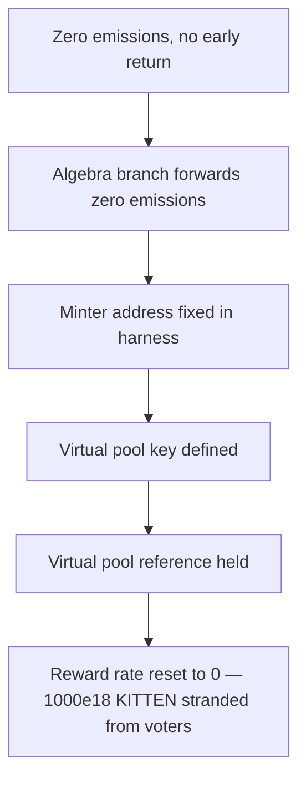

# KittenSwap: distributing a stale zero-vote period resets a gauge's reward rate to 0

> **Vulnerability classes:** vuln/logic/reward-calculation · impact/loss-of-funds/reward-theft
>
> **Reproduction:** a faithful minimal reproduction of the vulnerable finding — the vulnerable `Voter._distribute` emissions calculation, plus the `AlgebraGauge._notifyRewardAmount` / `EternalVirtualPool.setRates` reset chain, are reproduced **verbatim** (marked `@>`) with faithful minimal doubles; local deploy, no fork.

<!-- source-auditvault: https://github.com/pashov/audits/blob/master/team/md/KittenSwap-security-review_2025-07-31.md -->

## Root cause

`Voter.distribute(_period, _gauge)` accepts any valid past period so a missed distribution can settle in the current period, but `_distribute` never returns early when the supplied gauge had no votes for that past period (`ps.gaugeTotalVotes[_gauge] == 0`). Because the past period itself had global votes, `emissions` computes to exactly `0` with no guard, and that `0` is forwarded to `IGauge(_gauge).notifyRewardAmount(0)`. The vulnerable lines, reproduced verbatim from the finding:

```solidity
@>      uint256 emissions = (ps.totalEmissions * ps.gaugeTotalVotes[_gauge]) / // @audit: gauge could have 0 votes for past period
            ps.globalTotalVotes;
        address _pool = gaugeToPool[_gauge];

        // transfer emissions to minter if gauge is killed
        if (gauge[_pool].isAlive == false) {
            kitten.transfer(address(minter), emissions);
            emissions = 0;
        } else {
            es.amount = emissions;
            es.distributed = true;
        }

        if (gauge[_pool].isAlgebra) _claimAndDistributeAlgebraPoolFees(_pool);
        kitten.approve(_gauge, emissions);
        IGauge(_gauge).notifyRewardAmount(emissions);
```

For an Algebra gauge, `notifyRewardAmount(0)` reaches `AlgebraGauge._notifyRewardAmount(0, 0)` → `algebraGaugeFactory.setRates(key, 0 / duration, 0 / duration)` → `EternalVirtualPool.setRates(0, 0)`, which overwrites the gauge's eternal-farming reward rate with `0`. Rewards already funded for the live period stay locked in the virtual pool but never stream.

## Why it's exploitable here

Following the finding's first vector ("resetting reward rates to 0") with the PoC's concrete numbers:

1. **Period 6 (current)** — the gauge has votes, so a legitimate distribution funds the eternal virtual pool with `1000e18` KITTEN and sets a positive `rewardRate0` (~`1.65e15`/sec over the one-week duration). This is expected behavior.
2. The attacker calls `distribute(4, algebraGauge)`. Period 4 is a valid past period that *did* have global votes, but the gauge never existed then — so `gaugeTotalVotes[gauge] == 0` while `globalTotalVotes > 0`.
3. `emissions = totalEmissions * 0 / globalTotalVotes = 0`. There is no early return, so the `0` flows onward: `notifyRewardAmount(0)` → `_notifyRewardAmount(0,0)` → `setRates(key, 0, 0)` → `EternalVirtualPool.setRates(0, 0)`.
4. `rewardRate0` is reset from its positive value back to `0`. The `1000e18` KITTEN already funded remains in the pool at rate `0` and never streams to the period-6 voters it was funded for — a reward-theft / denial-of-service.
5. The attack is repeatable `n` times, once per valid past period that existed before the gauge was created.

## Attack path



## Marked-line walkthrough (Playground)

The EVM Playground pins each step to the exact executed source line in `0xcc0e8eed…`:

1. **L297** — Zero emissions, no early return: Root cause: Voter._distribute never returns early when the gauge had no votes for the supplied past period, so emissions computes to 0 and is forwarded on.
2. **L319** — Algebra branch forwards zero emissions: The gauge is flagged Algebra, so _distribute claims pool fees and then forwards the zero emissions into the gauge's notifyRewardAmount.
3. **L335** — Minter address fixed in harness: Setup: the harness fixes the MINTER address that _distribute would forward emissions to if the gauge were killed.
4. **L336** — Virtual pool key defined: Setup: KEY identifies the eternal-farming virtual pool that the factory forwards setRates calls to.
5. **L341** — Virtual pool reference held: Setup: the harness holds the eternal-farming virtual pool whose reward rate the zero-emissions distribution will reset to 0.
6. **L348** — Pre-attack reward rate recorded: Setup: resetRateFrom records the positive reward rate set by the legitimate period-6 distribution, before the attack zeros it.
7. **L354** — Harm marker token deployed: Setup: the harness deploys the marker token that records the 1000e18 KITTEN stranded at rate 0 as the measured harm.

## PoC

Registry (Foundry, local deploy — verbatim vulnerable source + harm-asserting test):

```bash
cd 61952-h-02-reward-rates-can-be-reset-to-0-and-future-rewards-can-b_exp && forge test -vvv
```

The browser Playground replays the same synthetic opcode-for-opcode and measures the harm: **a legitimate period-6 distribution funds the pool with 1000e18 KITTEN and a positive reward rate, then `distribute(4, gauge)` for a zero-vote past period resets the rate to 0 and strands the full 1000e18 from its voters**. Both gates are green (registry `forge test` PASS + Playground `_verify-poc` **VERDICT: PASS**).
