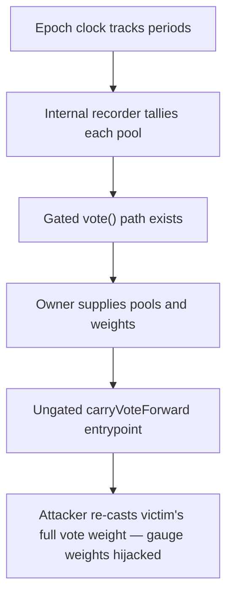

# KittenSwap: permissionless voting through `Voter::carryVoteForward()`

> **Vulnerability classes:** vuln/access-control · vuln/governance
>
> **Reproduction:** a faithful minimal reproduction of the vulnerable finding — the vulnerable `carryVoteForward` entrypoint is reproduced **verbatim** (marked `@>`) with faithful minimal doubles; local deploy, no fork.

<!-- source-auditvault: https://github.com/pashov/audits/blob/master/team/md/KittenSwap-security-review_2025-07-31.md -->

## Root cause

The `carryVoteForward` function in `Voter.sol` is `public` with no access control: it re-casts a `veKITTEN`'s past-period vote into the next period but never checks that `msg.sender` owns or is approved for `_tokenId`. The vulnerable lines, reproduced verbatim:

```solidity
    /// @notice Carry forward votes from past period
@>  function carryVoteForward(uint256 _tokenId, uint256 _fromPeriod) public {
        IVoter.Period storage ps = period[_fromPeriod];
        uint256 nextPeriod = getCurrentPeriod() + 1;
```

The gated `vote()` path guards its entry with `veKitten.isApprovedOrOwner(msg.sender, _tokenId)`, but `carryVoteForward` omits that check entirely. Because the check is missing, anyone can force any `veKITTEN`'s previous vote to be re-cast for the next period without the owner's authorization — permissionless manipulation of the ve(3,3) gauge weights.

## Why it's exploitable here

Following the synthetic scenario with veKITTEN #42 and a voting power of `1000e18`:

1. The honest owner of veKITTEN #42 casts a legitimate vote of `1000e18` for the pool in period 1 through the access-controlled `vote()` path.
2. The epoch advances; the current period is now 1, so the next votable period is 2.
3. An attacker who is **neither the owner nor approved** for token 42 calls `carryVoteForward(42, 1)`.
4. The function reads the victim's stored period-1 weight (`1000e18`) for the pool and replays it into period 2 via `_vote`.
5. `poolWeight[2][POOL]` becomes `1000e18` — the victim's entire voting power was cast for the next period without their consent, letting anyone steer gauge weights (and thus emissions) using other people's votes.

## Attack path



## Marked-line walkthrough (Playground)

The EVM Playground pins each step to the exact executed source line in `0xce01759b…`:

1. **L108** — Epoch clock tracks periods: Setup: the epoch-clock double stores the current voting period, which getCurrentPeriod() returns to decide where new votes land.
2. **L135** — Internal recorder tallies each pool: The shared _vote helper walks each pool in the list and records its weight into per-period storage; both the legit and carry paths use it.
3. **L148** — Gated vote() path exists: Setup: the legitimate vote() path takes a tokenId and is the access-controlled way an owner casts a vote for the next period.
4. **L150** — Owner supplies pools and weights: Setup: vote() also takes the pool list and matching weights, applied only after an ownership check gates the call.
5. **L157** — Ungated carryVoteForward entrypoint: Root cause: carryVoteForward is public with no isApprovedOrOwner check, so anyone can re-cast any veKITTEN's past vote for the next period.
6. **L165** — Copies victim's prior weight: For each pool the function reads the victim's stored weight from the source period, rebuilding the exact vote to replay it forward.
7. **L174** — Honest owner seeds legit vote: Setup: the honest veKITTEN owner mints its NFT and casts a real period-1 vote through the gated vote() path — the vote an attacker later carries forward.

## PoC

Registry (Foundry, local deploy — verbatim vulnerable source + harm-asserting test):

```bash
cd 61953-h-03-permissionless-voting-through-votercarryvoteforward-pas_exp && forge test -vvv
```

The browser Playground replays the same synthetic opcode-for-opcode and measures the harm: **an unauthorized third party carries the victim's full `1000e18` vote forward into the next period without owning or being approved for the veKITTEN**. Both gates are green (registry `forge test` PASS + Playground `_verify-poc` **VERDICT: PASS**).
