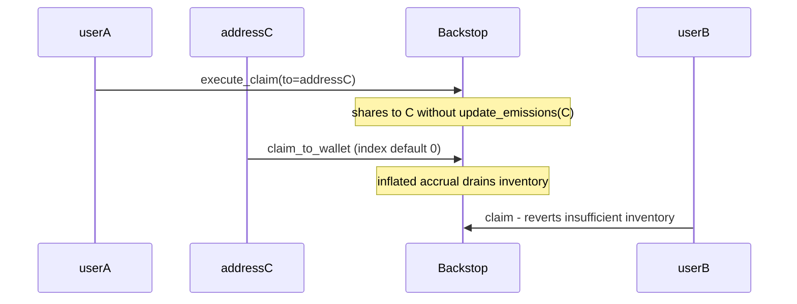

# Blend v2 — Steal other users' emissions via vulnerable claim

> **Vulnerability classes:** reward-theft · lockup · missing emission checkpoint
>
> **Reproduction:** self-contained Foundry PoC (Solidity reduction of Soroban backstop
> emissions accounting) with **only `forge-std`** — no fork.
> Full trace: [output.txt](output.txt).

<!-- non-defihacklabs -->
<!-- source-auditvault: https://github.com/Auditware/AuditVault/blob/main/findings/62062-h-02-user-can-steal-other-users-emissions-due-to-vulnerable.md -->
<!-- date: 2025-02 -->

---

## Key info

| | |
|---|---|
| **Impact** | **HIGH** — claim-to-third-party deposits shares without emission init → inflated claim steals inventory |
| **Protocol** | [Blend](https://blend.capital/) v2 — backstop emissions |
| **Vulnerable code** | `execute_claim` adds shares to `to` without `update_emissions(to)` |
| **Finding** | Code4rena — 2025-02-blend · #62062 · [H-02] · reporter **oakcobalt** |
| **Report** | [code4rena.com/reports/2025-02-blend-v2-audit-certora-formal-verification](https://code4rena.com/reports/2025-02-blend-v2-audit-certora-formal-verification) |
| **Source** | [AuditVault](https://github.com/Auditware/AuditVault/blob/main/findings/62062-h-02-user-can-steal-other-users-emissions-due-to-vulnerable.md) |
| **Compiler** | `^0.8.24` (PoC synthetic; original is Soroban/Rust) |

## TL;DR

1. `execute_claim` can deposit exchanged backstop LP to a different `to` address.
2. It updates `to`'s share balance **without** `update_emissions(to)`.
3. A fresh `to` later claims with default index 0 while holding shares → accrues full historical index.
4. Stolen inventory leaves other users unable to claim.

## The vulnerable code

```solidity
// Deposit LP tokens into pool backstop
let to_mint = pool_balance.convert_to_shares(deposit_amount);
pool_balance.deposit(deposit_amount, to_mint);
// @audit missing update_emissions(to)
user_balance.add_shares(to_mint); // @> VULN
```

## Root cause

Share balance and emission index must be checkpointed atomically. Skipping the checkpoint on the deposit recipient leaves them able to claim unearned historical emissions.

## Diagrams



## Impact

Direct theft of other depositors' emissions budget; victim claims fail for lack of inventory.

## Sources

- AuditVault: https://github.com/Auditware/AuditVault/blob/main/findings/62062-h-02-user-can-steal-other-users-emissions-due-to-vulnerable.md
- Report: https://code4rena.com/reports/2025-02-blend-v2-audit-certora-formal-verification
- Repo@commit: code-423n4/2025-02-blend@f23b3260763488f365ef6a95bfb139c95b0ed0f9 `blend-contracts-v2/backstop/src/emissions/claim.rs`

Taxonomy: `[[direct-drain]]` · `[[lockup]]` · `severity/high` · `sector/lending`
