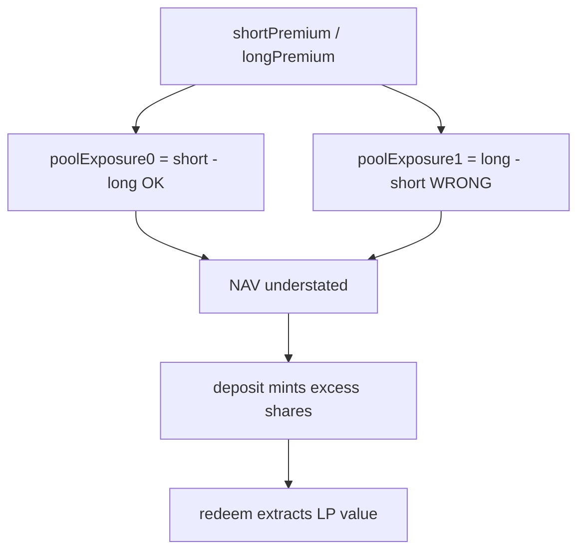

# Panoptic Hypovault — poolExposure1 premium operands reversed

> **Vulnerability classes:** vuln/logic/wrong-math · impact/loss-of-funds/direct-drain · stale-price

> **Reproduction:** self-contained Foundry PoC with only `forge-std`.
> Full trace: [output.txt](output.txt). PoC:
> [test/62092-h-01-the-poolexposure-for-token1-is-erroneously-calculated-a_exp.sol](test/62092-h-01-the-poolexposure-for-token1-is-erroneously-calculated-a_exp.sol).

<!-- non-defihacklabs -->
<!-- source-auditvault: https://github.com/Auditware/AuditVault/blob/main/findings/62092-h-01-the-poolexposure-for-token1-is-erroneously-calculated-a.md -->
<!-- date: 2025-06 -->

**AuditVault taxonomy:** `severity/high` · `sector/perpetuals` · `sector/oracle` · `platform/code4rena` · `defi/price-manipulation`

---

## Key info

| | |
|---|---|
| **Impact** | **HIGH** — wrong NAV → excess deposit shares → extract 100e18 from LPs |
| **Protocol** | Panoptic Hypovault / PanopticVaultAccountant |
| **Vulnerable code** | `poolExposure1 = long.left - short.left` (reversed) |
| **Bug class** | Sign / operand swap in premium accounting |
| **Finding** | Code4rena 2025-06-panoptic-hypovault · #62092 · **H-01** · 0xAura |
| **Report** | [code4rena 2025-06-panoptic-hypovault](https://code4rena.com/reports/2025-06-panoptic-hypovault) |
| **Source** | [AuditVault](https://github.com/Auditware/AuditVault/blob/main/findings/62092-h-01-the-poolexposure-for-token1-is-erroneously-calculated-a.md) |
| **Status** | Audit finding. Reproduced as a standalone local PoC. |
| **Compiler** | `^0.8.24` (PoC) |

---

## TL;DR

1. Short premium is an asset; long premium is a liability.
2. `poolExposure0` correctly does short − long; `poolExposure1` reverses operands.
3. NAV understated (1050 vs 1250); deposit mints excess shares; redeem profits 100e18.

---

## The vulnerable code

```solidity
poolExposure0 = int256(uint256(shortPremium.rightSlot())) - int256(uint256(longPremium.rightSlot()));
poolExposure1 = int256(uint256(longPremium.leftSlot()))
    - int256(uint256(shortPremium.leftSlot())); // @> VULN
// FIX: short.left - long.left
```

---

## Root cause

`getAccumulatedFeesAndPositionsData` returns short (owed to vault) and long (owed by vault). Token1 exposure subtracts short from long instead of the reverse, flipping the premium contribution for token1.

## Attack walkthrough

1. Premiums: short (200,150), long (50,50) → correct net +250; buggy net +50.
2. Vault cash 1000 → buggy NAV 1050 vs correct 1250.
3. Deposit 1050 against 1050 NAV → 1000 shares (fair ~840).
4. Redeem against true value → +100e18 profit.

## Diagrams



## Impact

All deposits/withdrawals priced off `computeNAV` mis-value token1 premium exposure. Users can systematically over-mint shares or under-receive assets.

## Sources

- [AuditVault finding #62092](https://github.com/Auditware/AuditVault/blob/main/findings/62092-h-01-the-poolexposure-for-token1-is-erroneously-calculated-a.md)
- [Code4rena 2025-06-panoptic-hypovault](https://code4rena.com/reports/2025-06-panoptic-hypovault)
- Reduced source: `PanopticVaultAccountant.sol` @ `code-423n4/2025-06-panoptic@8ef6d86`
