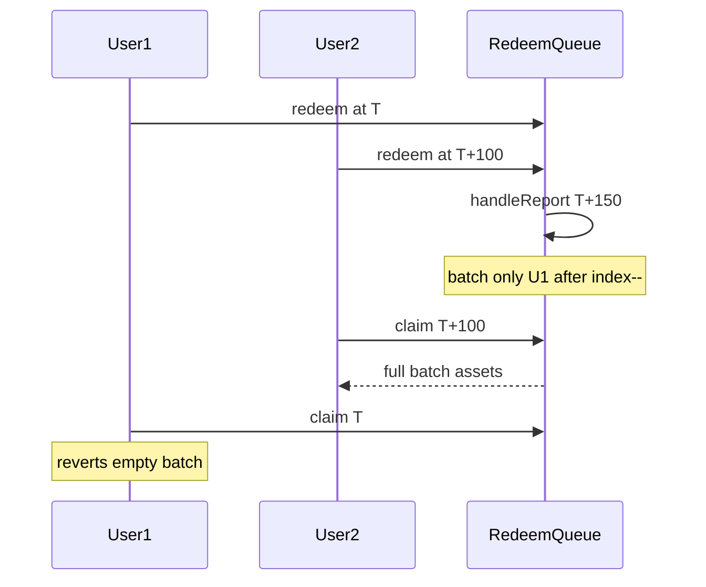

# Mellow Flexible Vaults — RedeemQueue batch vs claim timestamp mismatch

> **Vulnerability classes:** vuln/dos/frozen-funds · impact/loss-of-funds/direct-drain · locked-funds

> **Reproduction:** self-contained Foundry PoC with only `forge-std`.
> Full trace: [output.txt](output.txt). PoC:
> [test/62107-h-2-redeemqueue-accounting-mismatch-between-batch-creation-a_exp.sol](test/62107-h-2-redeemqueue-accounting-mismatch-between-batch-creation-a_exp.sol).

<!-- non-defihacklabs -->
<!-- source-auditvault: https://github.com/Auditware/AuditVault/blob/main/findings/62107-h-2-redeemqueue-accounting-mismatch-between-batch-creation-a.md -->
<!-- date: 2025-07 -->

**AuditVault taxonomy:** `severity/high` · `sector/oracle` · `sector/token` · `platform/sherlock` · `frozen-funds` · `direct-drain`

---

## Key info

| | |
|---|---|
| **Impact** | **HIGH** — ineligible claimer drains batch; honest redeemer locked out |
| **Protocol** | Mellow Flexible Vaults RedeemQueue |
| **Vulnerable code** | `_handleReport`: `latestEligibleIndex--` after `upperLookupRecent` |
| **Bug class** | Off-by-one timestamp boundary mismatch |
| **Finding** | Sherlock 2025-07-mellow-flexible-vaults · #62107 · **H-2** |
| **Report** | [sherlock-audit/2025-07-mellow-flexible-vaults-judging](https://github.com/sherlock-audit/2025-07-mellow-flexible-vaults-judging) |
| **Source** | [AuditVault](https://github.com/Auditware/AuditVault/blob/main/findings/62107-h-2-redeemqueue-accounting-mismatch-between-batch-creation-a.md) |
| **Status** | Fixed by protocol (PR #11). Reproduced as standalone local PoC. |
| **Compiler** | `^0.8.24` (PoC) |

---

## TL;DR

1. Batch creation excludes the last request at/before the report timestamp (`index--`).
2. Claim eligibility still allows any request with `ts ≤ priceTimestamp`.
3. User2 claims from a batch funded only by User1; User1 cannot claim.

---

## The vulnerable code

```solidity
latestEligibleIndex = uint256(timestamps.upperLookupRecent(timestamp));
if (latestEligibleIndex == 0) return;
latestEligibleIndex--; // @> VULN
// FIX: remove the decrement
```

---

## Root cause

`upperLookupRecent` already returns the last checkpoint ≤ timestamp. Decrementing excludes that request from the batch while `claim` still treats it as eligible via the price timestamp.

## Attack walkthrough

1. Redeems at T, T+100, T+200 (10M shares each).
2. `handleReport(T+150)` batches only T (User1).
3. User2 (T+100) claims and drains the batch assets.
4. User1 claim reverts — funds locked / stolen.

## Diagrams



## Impact

Broken batch accounting permanently strands later-batched shares and lets ineligible claimers take funded assets.

## Sources

- [AuditVault finding #62107](https://github.com/Auditware/AuditVault/blob/main/findings/62107-h-2-redeemqueue-accounting-mismatch-between-batch-creation-a.md)
- [Sherlock issue #65](https://github.com/sherlock-audit/2025-07-mellow-flexible-vaults-judging/issues/65)
- Reduced source: `RedeemQueue.sol` @ `sherlock-audit/2025-07-mellow-flexible-vaults@eca8836`
