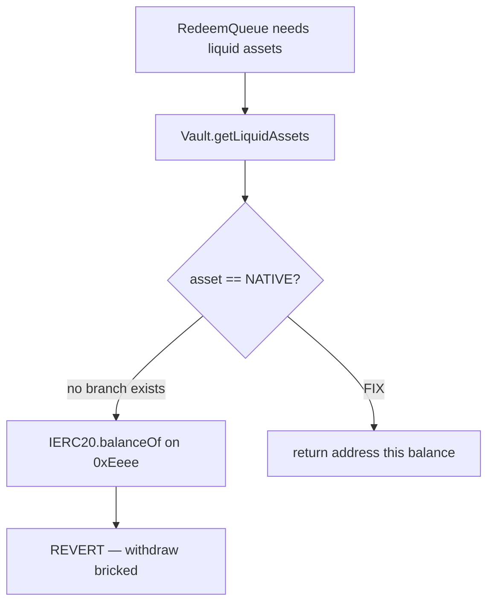

# Mellow Flexible Vaults — native token withdrawals permanently bricked

> **Vulnerability classes:** vuln/dos/frozen-funds · locked-funds · known-pattern

> **Reproduction:** self-contained Foundry PoC with only `forge-std`.
> Full trace: [output.txt](output.txt). PoC:
> [test/62108-h-3-unable-to-withdraw-native-tokens-because-vault-and-redee_exp.sol](test/62108-h-3-unable-to-withdraw-native-tokens-because-vault-and-redee_exp.sol).

<!-- non-defihacklabs -->
<!-- source-auditvault: https://github.com/Auditware/AuditVault/blob/main/findings/62108-h-3-unable-to-withdraw-native-tokens-because-vault-and-redee.md -->
<!-- date: 2025-07 -->

**AuditVault taxonomy:** `severity/high` · `sector/staking` · `sector/token` · `platform/sherlock` · `locked-funds` · `reentrancy-guard`

---

## Key info

| | |
|---|---|
| **Impact** | **HIGH** — native-asset withdraw path always reverts; deposits stuck |
| **Protocol** | Mellow Flexible Vaults ShareModule / BasicRedeemHook |
| **Vulnerable code** | `getLiquidAssets` uses `IERC20(asset).balanceOf` for all assets |
| **Bug class** | Missing native-token branch |
| **Finding** | Sherlock 2025-07-mellow-flexible-vaults · #62108 · **H-3** |
| **Report** | [sherlock-audit/2025-07-mellow-flexible-vaults-judging](https://github.com/sherlock-audit/2025-07-mellow-flexible-vaults-judging) |
| **Source** | [AuditVault](https://github.com/Auditware/AuditVault/blob/main/findings/62108-h-3-unable-to-withdraw-native-tokens-because-vault-and-redee.md) |
| **Status** | Fixed by protocol (PR #10). Reproduced as standalone local PoC. |
| **Compiler** | `^0.8.24` (PoC) |

---

## TL;DR

1. Protocol lists native token (`0xEeee…eEEeE`) as a supported asset.
2. Liquid-asset queries always call ERC20 `balanceOf` on the asset address.
3. Native sentinel has no code → call reverts → redeem processing is impossible.

---

## The vulnerable code

```solidity
function getLiquidAssets() public view returns (uint256) {
    return hook == address(0)
        ? IERC20(asset).balanceOf(address(this)) // @> VULN
        : IRedeemHook(hook).getLiquidAssets(asset);
    // FIX: if (asset == NATIVE) return address(this).balance;
}
```

---

## Root cause

Native ETH is not an ERC20. Using `balanceOf` on the sentinel address reverts, so both the no-hook path and `BasicRedeemHook` break for native vaults.

## Attack walkthrough / harm demo

1. Configure vault asset = native sentinel; deposit ETH.
2. Redeem queue calls `vault.getLiquidAssets()` → revert.
3. `processWithdraw` cannot complete; funds cannot leave via the redeem path.

## Diagrams



## Impact

Any vault using native ETH as the asset cannot process redemptions. Deposited native value is stuck from the protocol's withdraw path (admin rescue aside).

## Sources

- [AuditVault finding #62108](https://github.com/Auditware/AuditVault/blob/main/findings/62108-h-3-unable-to-withdraw-native-tokens-because-vault-and-redee.md)
- [Sherlock issue #147](https://github.com/sherlock-audit/2025-07-mellow-flexible-vaults-judging/issues/147)
- Reduced source: `ShareModule.sol` / `BasicRedeemHook.sol` @ `eca8836`
