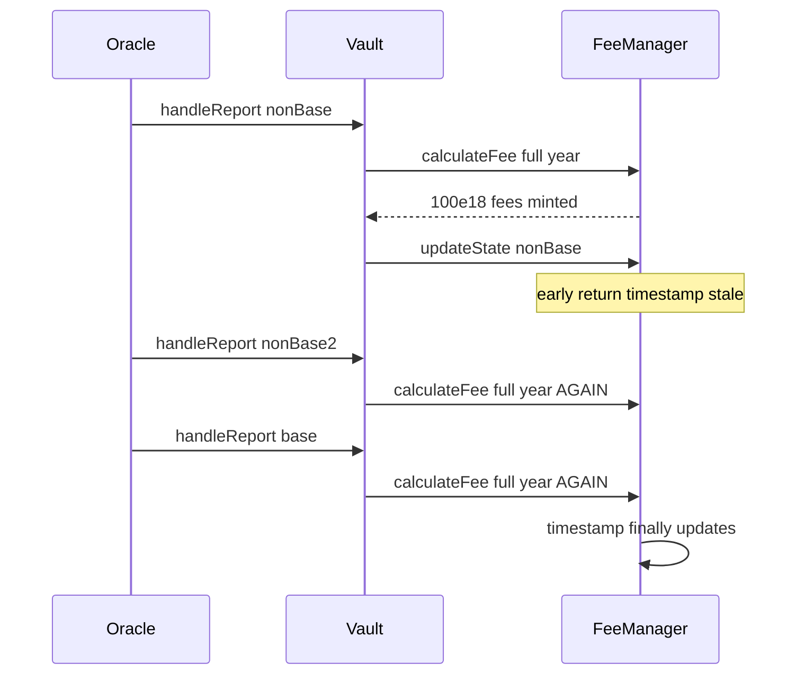

# Mellow Flexible Vaults — protocol fee multi-accrual in submitReports

> **Vulnerability classes:** vuln/logic/fee-calculation · wrong-state · fee-accounting

> **Reproduction:** self-contained Foundry PoC with only `forge-std`.
> Full trace: [output.txt](output.txt). PoC:
> [test/62109-h-4-protocol-fee-multiple-accrual-in-oraclesubmitreports-she_exp.sol](test/62109-h-4-protocol-fee-multiple-accrual-in-oraclesubmitreports-she_exp.sol).

<!-- non-defihacklabs -->
<!-- source-auditvault: https://github.com/Auditware/AuditVault/blob/main/findings/62109-h-4-protocol-fee-multiple-accrual-in-oraclesubmitreports-she.md -->
<!-- date: 2025-07 -->

**AuditVault taxonomy:** `severity/high` · `sector/oracle` · `platform/sherlock` · `fee-calculation` · `fee-accounting`

---

## Key info

| | |
|---|---|
| **Impact** | **HIGH** — same time window charged once per asset report; LPs diluted |
| **Protocol** | Mellow Flexible Vaults Oracle / FeeManager / ShareModule |
| **Vulnerable code** | `FeeManager.updateState` returns early for non-base assets |
| **Bug class** | Fee timestamp not advanced per report / only on base asset |
| **Finding** | Sherlock 2025-07-mellow-flexible-vaults · #62109 · **H-4** |
| **Report** | [sherlock-audit/2025-07-mellow-flexible-vaults-judging](https://github.com/sherlock-audit/2025-07-mellow-flexible-vaults-judging) |
| **Source** | [AuditVault](https://github.com/Auditware/AuditVault/blob/main/findings/62109-h-4-protocol-fee-multiple-accrual-in-oraclesubmitreports-she.md) |
| **Status** | Fixed by protocol (PR #6). Reproduced as standalone local PoC. |
| **Compiler** | `^0.8.24` (PoC) |

---

## TL;DR

1. Each `handleReport` accrues protocol fees from last timestamp → now.
2. `updateState` only writes the timestamp when the asset is the base asset.
3. Non-base-first batch re-accrues the same year three times → >300e18 fees vs 100e18 fair.

---

## The vulnerable code

```solidity
function updateState(address asset, uint256 priceD18) external {
    if ($.baseAsset[vault] != asset) {
        return; // @> VULN — timestamp not advanced
    }
    $.timestamps[vault] = block.timestamp;
}
```

---

## Root cause

Fee accrual is per-report, but the clock only advances on the base asset. Non-base reports leave `timestamps[vault]` unchanged, so each subsequent report in the same batch recharges the full elapsed interval.

## Attack walkthrough

1. 1000e18 shares, 10% protocol fee, last timestamp = now − 365 days.
2. `submitReports([nonBase, nonBase, base])`.
3. Fee recipient receives >300e18 shares (finding threshold); fair single accrual is 100e18.

## Diagrams



## Impact

Protocol fees can be charged N times per batch of N assets when non-base assets are ordered first, diluting LPs by minting excess fee shares.

## Sources

- [AuditVault finding #62109](https://github.com/Auditware/AuditVault/blob/main/findings/62109-h-4-protocol-fee-multiple-accrual-in-oraclesubmitreports-she.md)
- [Sherlock issue #167](https://github.com/sherlock-audit/2025-07-mellow-flexible-vaults-judging/issues/167)
- Reduced source: `FeeManager.sol` / `Oracle.sol` @ `eca8836`
