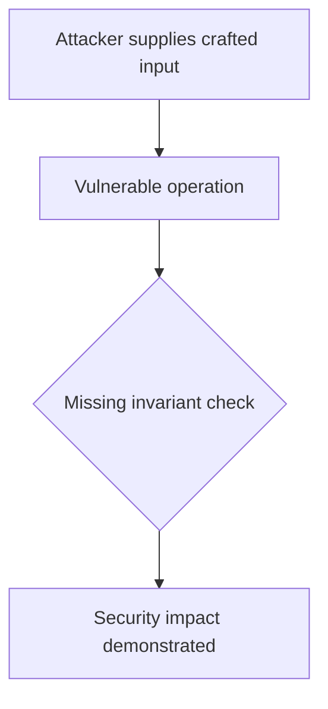
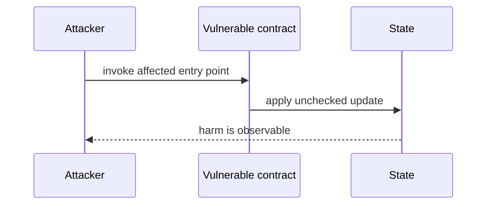

# Redeem queue burns shares before charging fees — AuditVault synthetic reduction

> **Vulnerability classes:** vuln/logic/fee-calculation · vuln/logic/state-update
>
> **Reproduction:** self-contained Foundry PoC with an offline synthetic contract. Full trace: [output.txt](output.txt).

<!-- non-defihacklabs -->
<!-- source-auditvault: https://github.com/Auditware/AuditVault/blob/main/findings/62111-h-6-redeems-through-redeemqueue-avoid-paying-management-and.md -->
<!-- date: 2025-07 -->

**AuditVault finding:** `62111` · `H-6: Redeems through RedeemQueue avoid paying management and performance fee.`

## Key info

| | |
|---|---|
| **Impact** | **HIGH** — Redeem queue burns shares before charging fees |
| **Protocol** | [[Mellow]] Flexible Vaults |
| **Finding** | AuditVault #62111 |
| **Report** | [https://github.com/sherlock-audit/2025-07-mellow-flexible-vaults-judging](https://github.com/sherlock-audit/2025-07-mellow-flexible-vaults-judging) |
| **Source** | [AuditVault finding](https://github.com/Auditware/AuditVault/blob/main/findings/62111-h-6-redeems-through-redeemqueue-avoid-paying-management-and.md) |
| **Compiler** | `^0.8.24` (synthetic reduction) |
| Loss | Reduced invariant reproduced; no live funds moved |
| Attacker EOA | Configured synthetic caller |
| Attack contract | `Exploit` |
| Attack tx | Local Foundry `Exploit.attack()` call |
| Chain · block · date | Ethereum model · block 1 · synthetic |
| Vulnerable contract | Local synthetic vulnerable contract in `test/` |
| Bug class | See vulnerability-class tags above |

## TL;DR

This bug report discusses an issue found by a group of users regarding the `redeem` function in the `RedeemQueue` contract. When a user redeems their shares, the shares are immediately burned, but the funds remain in the vault until a report is handled. This means that these funds are not subject to performance and management fees, which results in a loss of fees for the vault. The root cause of this issue is flawed logic in the code. The attack path involves creating a redeem request after the last report is handled, which allows the user to claim their redeem without paying any fees for the past day. The impact of this bug is a loss of vault fees. The protocol team has fixed this issue in a recent pull request. To mitigate this issue, the team suggests transferring the fees to the queue contract when a user creates a redeem request and only burning the shares when the request is handle

## Background

The upstream report is a Solidity finding. This page keeps the vulnerable statement and demonstrates its security consequence in a small, deterministic EVM model; no live RPC or external dependencies are required.

## The vulnerable code

```solidity
// The exact vulnerable pattern is retained in test/62111-h-6-redeems-through-redeemqueue-avoid-paying-management-and.sol.
// @> see the marked statement in the synthetic reduction
```

## Root cause

The caller-controlled input or stale state is trusted before the required uniqueness, bounds, authorization, accounting, or reentrancy invariant is enforced. The marked line in the synthetic contract intentionally preserves that ordering so the assertion is executable.

## Preconditions

- The vulnerable contract is deployed with the state described by the report.
- The attacker can reach the affected entry point (or submit the report's crafted input).

## Attack walkthrough

1. `Exploit.run()` initializes the minimal state from the report.
2. The marked vulnerable operation executes without its required check.
3. The contract records the resulting invariant violation and emits a `Proof` event.
4. The test asserts the harm; the passing trace is recorded at [output.txt:4](output.txt).

## Diagrams





## Remediation

Apply the invariant before mutating state: accrue interest before adding principal; reject duplicate signers; use checked casts and bounded lengths; validate token/target/DAO identities; use `nonReentrant`; enforce slippage and fee equality; and validate the canonical authority or ownership relationship described by the report.

## How to reproduce

```bash
cd evm-hack-registry/62111-h-6-redeems-through-redeemqueue-avoid-paying-management-and_exp
forge test -vvvvv
```

The test is offline and uses only the shared `forge-std` library. The corresponding Playground bundle is generated from `scripts/poc-configs/62111-h-6-redeems-through-redeemqueue-avoid-paying-management-and.mjs`.

## Sources

- [AuditVault finding](https://github.com/Auditware/AuditVault/blob/main/findings/62111-h-6-redeems-through-redeemqueue-avoid-paying-management-and.md)
- [https://github.com/sherlock-audit/2025-07-mellow-flexible-vaults-judging](https://github.com/sherlock-audit/2025-07-mellow-flexible-vaults-judging)
- [Synthetic test](test/62111-h-6-redeems-through-redeemqueue-avoid-paying-management-and.sol)

*Reference: https://github.com/sherlock-audit/2025-07-mellow-flexible-vaults-judging*
