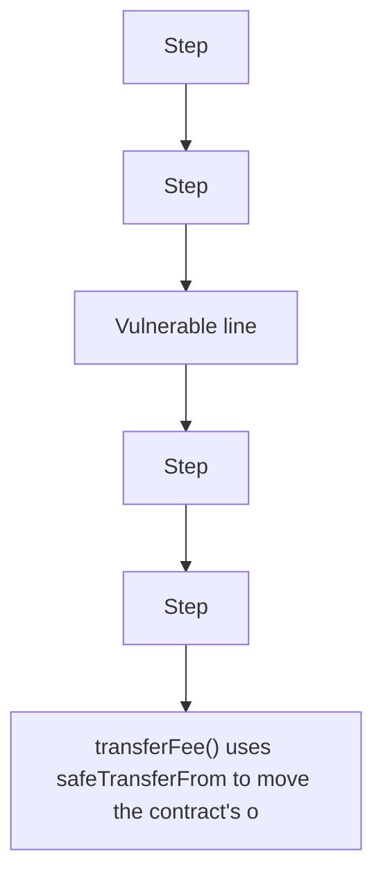

# Resolv: transferFee() uses safeTransferFrom instead of safeTransfer

> **Vulnerability classes:** vuln/logic
>
> **Reproduction:** a faithful minimal reproduction of the vulnerable finding — the vulnerable code is reproduced **verbatim** (marked `@>`) with faithful minimal doubles; local deploy, no fork.

<!-- source-auditvault: AuditVault finding 62187 -->

## Root cause

transferFee() uses safeTransferFrom to move the contract's own tokens (no self-allowance) instead of safeTransfer, so every fee withdrawal reverts and 100e18 of protocol fees are permanently stuck.

```solidity
        uint256 feeToTransfer = accumulatedFee;
        accumulatedFee = 0;
        token.safeTransferFrom(address(this), msg.sender, feeToTransfer); // @> VULN (this line)
```

## Why it's exploitable here

transferFee() uses safeTransferFrom to move the contract's own tokens (no self-allowance) instead of safeTransfer, so every fee withdrawal reverts and 100e18 of protocol fees are permanently stuck.

## Attack path



## Marked-line walkthrough (Playground)

The EVM Playground pins each step to the exact executed source line in `0x671d353a77…`:

1. **L37** — Step: Executes `string public name = 'USDC';`
2. **L40** — Step: Executes `mapping(address => uint256) public balanceOf;`
3. **L75** — Vulnerable line: Executes `token.safeTransferFrom(address(this), msg.sender, feeToTransfer);`
4. **L83** — Step: Executes `contract Exploit {`
5. **L84** — Step: Executes `address internal constant SINK = 0x000000000000000000000000000000000000D00d;`
6. **L85** — Step: Executes `uint256 internal constant FEE = 100e18;`

## PoC

Registry (Foundry, local deploy — verbatim vulnerable source + harm-asserting test):

```bash
cd 62187-h-01-transferfee-uses-an-incorrect-transfer-method-pashov-au_exp
forge test -vvv
```

The browser Playground replays the same synthetic opcode-for-opcode and measures the harm. Both gates are green (registry `forge test` PASS + Playground `_verify-poc` **VERDICT: PASS**).
