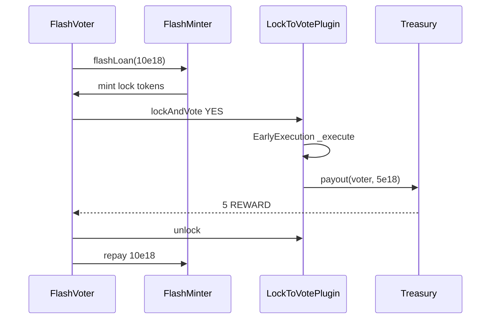

# Aragon — EarlyExecution proposals vulnerable to flashloan vote attacks

> **Vulnerability classes:** vuln/governance/flashloan-vote · trigger/flash-loan · impact/unauthorized-execution

> **Reproduction:** a self-contained Foundry PoC that compiles & runs in an
> isolated project with **only `forge-std`** — no fork, no RPC, no `anvil_state`.
> Full trace: [output.txt](output.txt). PoC:
> [test/62256-proposals-created-with-voting-mode-earlyexecution-are-vulner_exp.sol](test/62256-proposals-created-with-voting-mode-earlyexecution-are-vulner_exp.sol).

<!-- non-defihacklabs -->
<!-- source-auditvault: https://github.com/Auditware/AuditVault/blob/main/findings/62256-proposals-created-with-voting-mode-earlyexecution-are-vulner.md -->
<!-- date: 2025-07 -->

---

## Key info

| | |
|---|---|
| **Impact** | **HIGH** — anyone can early-execute an `EarlyExecution` proposal by flashloaning (or flashminting) lockable tokens, voting YES, unlocking, and repaying in one tx |
| **Protocol** | [Aragon](https://aragon.org) Lock-to-Vote governance plugin |
| **Vulnerable code** | `LockToVotePlugin` EarlyExecution path: succeed → `_execute` in the same vote tx |
| **Bug class** | Same-block flashloan governance capture |
| **Finding** | Spearbit — Aragon Security Review July 2025 · #62256 · reporter **Om Parikh** |
| **Report** | [Aragon-Spearbit-Security-Review-July-2025.pdf](https://github.com/spearbit/portfolio/blob/master/pdfs/Aragon-Spearbit-Security-Review-July-2025.pdf) |
| **Source** | [AuditVault](https://github.com/Auditware/AuditVault/blob/main/findings/62256-proposals-created-with-voting-mode-earlyexecution-are-vulner.md) |
| **Status** | Audit finding — fixed in PR 26 (EarlyExecution removed). Reproduced here as a standalone local PoC. |
| **Compiler** | `^0.8.24` (PoC) |

---

## TL;DR

1. `EarlyExecution` mode executes a proposal as soon as a YES vote pushes it over the support threshold.
2. If the lock token is flashloanable/flashmintable, an attacker can temporarily lock enough weight to cast that YES vote.
3. Inside the same transaction they unlock and repay the flashloan — no lasting stake.
4. The proposal action runs (here: drain a 5 REWARD treasury pot to the flash voter).
5. **HARM:** unauthorized early execution + treasury payout with zero lasting lock.

---

## The vulnerable code

```solidity
function _vote(...) internal {
    // tally YES/NO ...
    if (p.mode == VotingMode.EarlyExecution && _hasSucceeded(p)) {
        _execute(proposalId); // @> VULN: same-tx early execute after flashloaned YES
        // FIX: delay execute to a later block, or remove EarlyExecution (Aragon PR 26)
    }
}
```

Attack shape (finding PoC):

```
flashloan → lock → lockAndVote(YES) → early execute → unlock → repay
```

---

## Root cause

Early execution binds “proposal succeeded” to “execute now” without requiring economic finality of the voting weight. Ephemeral flashloaned weight is enough.

## Preconditions

- Proposal created with `VotingMode.EarlyExecution`.
- Lock token can be flashloaned or flashminted.
- Attacker can reach the support / min-participation thresholds with temporary weight.

## Attack walkthrough

1. Create EarlyExecution proposal: `treasury.payout(voter, 5 ether)`.
2. Flashmint 10 lock tokens to the FlashVoter.
3. `lockAndVote(YES, 10e18)` — threshold met → `_execute` runs.
4. Unlock and repay the flashmint.
5. Voter holds 5 REWARD; treasury is empty; locked balance is 0.

## Diagrams



## Impact

- Any EarlyExecution proposal can be force-executed without lasting voter capital.
- DAO actions (transfers, permission grants, upgrades) become flashloan-triggerable.
- Aragon removed EarlyExecution rather than add a same-block delay.

## Sources

- [AuditVault finding #62256](https://github.com/Auditware/AuditVault/blob/main/findings/62256-proposals-created-with-voting-mode-earlyexecution-are-vulner.md)
- [Spearbit Aragon July 2025 report](https://github.com/spearbit/portfolio/blob/master/pdfs/Aragon-Spearbit-Security-Review-July-2025.pdf)
- Fixed in Aragon PR 26 (EarlyExecution removed)

### Taxonomy (AuditVault)

- `severity/high` · `sector/governance` · `platform/spearbit` · `trigger/flash-loan`
- genome: flash-loan-attack · role-bypass · flashloan-callback-auth · proposal-state-check
