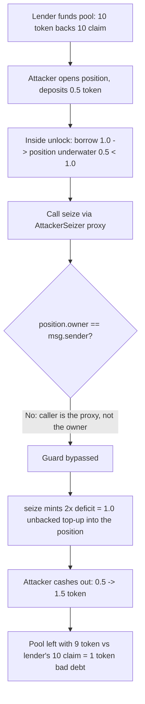

# Licredity — proxy-based self-liquidation creates bad debt for lenders

> **Vulnerability classes:** vuln/access-control/insufficient-guard · vuln/logic/liquidation-manipulation · vuln/loss-of-funds/bad-debt

> **Reproduction:** a self-contained Foundry PoC that compiles & runs in an
> isolated project with **only `forge-std`** — no fork, no RPC, no `anvil_state`.
> Full trace: [output.txt](output.txt). PoC:
> [test/62347-proxy-based-self-liquidation-creates-bad-debt-for-lenders-cy_exp.sol](test/62347-proxy-based-self-liquidation-creates-bad-debt-for-lenders-cy_exp.sol).

<!-- non-defihacklabs -->
<!-- source-auditvault: https://github.com/Auditware/AuditVault/blob/main/findings/62347-proxy-based-self-liquidation-creates-bad-debt-for-lenders-cy.md -->
<!-- date: 2025-09 -->

---

## Key info

| | |
|---|---|
| **Impact** | **HIGH** — a position owner self-liquidates their own deliberately-underwater position to mint an unbacked liquidation top-up, extracting base token that lenders can no longer redeem (socialized bad debt) |
| **Protocol** | [Licredity](https://licredity.com) v2.0 — lending (position/liquidation core) |
| **Vulnerable code** | `Licredity.seize` — the self-seize guard `if (position.owner == msg.sender) revert CannotSeizeOwnPosition()` |
| **Bug class** | Insufficient guard: checks only the immediate caller, bypassable by routing the seize through a proxy contract |
| **Finding** | Cyfrin — Licredity v2.0, 2025-09 · #62347 · reporter **Immeas** |
| **Report** | [2025-09-01-cyfrin-licredity-v2.0.md](https://github.com/solodit/solodit_content/blob/main/reports/Cyfrin/2025-09-01-cyfrin-licredity-v2.0.md) |
| **Source** | [AuditVault](https://github.com/Auditware/AuditVault/blob/main/findings/62347-proxy-based-self-liquidation-creates-bad-debt-for-lenders-cy.md) |
| **Status** | Audit finding — caught in review (not exploited on-chain). Reproduced here as a standalone local PoC. |
| **Compiler** | `^0.8.24` (PoC) |

This is an **audit finding**, not a historical on-chain incident. The real Licredity
is a Uniswap-v4 singleton; the PoC keeps the vulnerable `seize` owner-check verbatim
(selector `0x7c474390`) and a faithful reduction of the top-up accounting so the
socialized bad debt becomes a measurable token loss.

---

## TL;DR

1. `Licredity.seize` tries to stop an owner from profitably self-liquidating with
   `if (position.owner == msg.sender) revert CannotSeizeOwnPosition()`.
2. This checks **only the immediate caller**. Routing the seize through a helper
   ("proxy") contract makes `msg.sender` the helper, so the guard passes.
3. The owner opens a position with a little collateral, borrows against it to make
   it **underwater** (all inside one `unlock`), then self-seizes via the proxy.
4. `seize` mints a top-up of **2× the deficit** as **unbacked** debt fungible into
   the position ("to encourage seizure", socialized onto lenders), restoring its
   apparent health and returning ownership to the attacker.
5. The attacker cashes out — 0.5 token of honest collateral becomes **1.5 token**
   (+1.0 conjured from nothing). The pool now backs the lender's 10-token claim
   with only 9 token: a 1-token unrecoverable loss equal to the attacker's gain.

---

## The vulnerable code

The insufficient guard (verbatim, `Licredity.seize`):

```solidity
// prevents owner from purposely causing a position to be underwater then profit from seizing it
// require(position.owner != msg.sender, CannotSeizeOwnPosition());
if (position.owner == msg.sender) {           // @> only checks the direct caller
    assembly ("memory-safe") {
        mstore(0x00, 0x7c474390)              // 'CannotSeizeOwnPosition()'
        revert(0x1c, 0x04)
    }
}
```

The unbacked top-up it mints on an underwater position (verbatim):

```solidity
if (value < debt) {
    topup = _deficitToTopup(debt - value);    // 2x the deficit
    _mint(address(this), topup);              // unbacked debt fungible — socialized bad debt
    position.debtFungibleCollateral += topup;
    totalDebt += topup;
    value += topup;
}
```

The proxy that bypasses the guard (finding's PoC, verbatim):

```solidity
contract AttackerSeizer {
    function seize(uint256 positionId) external {
        licredity.seize(positionId, msg.sender); // msg.sender in seize is THIS proxy, not the owner
    }
}
```

---

## Root cause

The guard equates "owner self-liquidating" with "owner is the direct `msg.sender`".
An owner-controlled helper contract breaks that equivalence: it is a distinct
`msg.sender` while still acting for the owner. Combined with a liquidation top-up
that mints unbacked value, the owner can manufacture profit at the lenders' expense.

## Preconditions

- The owner can deploy a helper contract (permissionless).
- `seize` pays an underwater position a top-up funded by socialized bad debt (the
  protocol's intended liquidation subsidy).
- A lender-funded pool exists (the value at risk).

## Attack walkthrough

From [output.txt](output.txt), with a lender who has funded 10 token (pool solvent 10:10):

1. Attacker opens a position and deposits **0.5 token** of collateral.
2. Inside `unlock`, borrows **1.0** debt fungible → position underwater (0.5 < 1.0).
3. Calls `seize` via the `AttackerSeizer` proxy — the `owner == msg.sender` guard is
   **false** (owner is the router, caller is the proxy), so it does not revert.
4. `seize` mints `2 × (1.0 − 0.5) = 1.0` unbacked top-up into the position and
   returns ownership to the attacker.
5. Attacker repays from the topped-up collateral, withdraws the freed base token, and
   redeems the borrowed fungible — ending with **1.5 token**.
6. **HARM:** attacker +1.0 token (from nothing); the pool holds only **9 token**
   against the lender's **10-token** claim — a 1-token unrecoverable loss (the
   socialized bad debt). A control test confirms a *direct* self-seize reverts with
   `CannotSeizeOwnPosition()` — proving the proxy is what bypasses the guard.

## Diagrams



```mermaid
sequenceDiagram
    participant O as Owner (AttackerRouter)
    participant P as AttackerSeizer (proxy)
    participant L as Licredity
    O->>L: open + deposit 0.5, unlock
    O->>L: increaseDebtShare(1.0) -> underwater
    O->>P: seize(id)
    P->>L: seize(id, recipient = owner)
    Note over L: owner != msg.sender(proxy) -> guard passes
    Note over L: mint 2x deficit = 1.0 unbacked top-up
    O->>L: repay + withdraw + redeem
    Note over O,L: attacker +1.0 token; lenders -1.0 (bad debt)
```

## Remediation

Do not rely on `msg.sender` alone. Additionally forbid seizing a position that the
owner interacted with earlier in the same `unlock` (or track the position's owner at
`unlock` entry), so an owner cannot self-liquidate through any caller. (The exact
fix is out of scope for this reduced repro.)

## How to reproduce

```bash
cd ~/RustroverProjects/audits/evm-hack-registry/62347-proxy-based-self-liquidation-creates-bad-debt-for-lenders-cy_exp
forge test -vvv
# Fully local — no fork, no RPC, no anvil_state required.
# Expected: both tests PASS:
#   test_directSelfSeize_isBlocked            (control: direct self-seize reverts)
#   test_seize_ownPosition_using_external_contract (attack: proxy bypass; attacker +1, lender -1)
```

PoC source: [test/62347-proxy-based-self-liquidation-creates-bad-debt-for-lenders-cy_exp.sol](test/62347-proxy-based-self-liquidation-creates-bad-debt-for-lenders-cy_exp.sol)
— the verbatim vulnerable `seize` owner-check plus the finding's
`AttackerSeizer`/`AttackerRouter` PoC and a control test.

> Note: the 2× top-up factor and 1:1 debt-fungible/token pool economics are
> reduced-model assumptions (real Licredity is a Uniswap-v4 singleton, out of
> scope), so the exact +1.0 / −1.0 magnitudes validate the model; the bug class
> (proxy bypass of the self-seize guard → owner captures the liquidation subsidy →
> socialized bad debt) and the verbatim vulnerable line are faithful.

---

*Reference: finding **#62347** by **Immeas** in the [Cyfrin Licredity v2.0 review (Sep 2025)](https://github.com/solodit/solodit_content/blob/main/reports/Cyfrin/2025-09-01-cyfrin-licredity-v2.0.md) · curated by [AuditVault](https://github.com/Auditware/AuditVault/blob/main/findings/62347-proxy-based-self-liquidation-creates-bad-debt-for-lenders-cy.md)*
