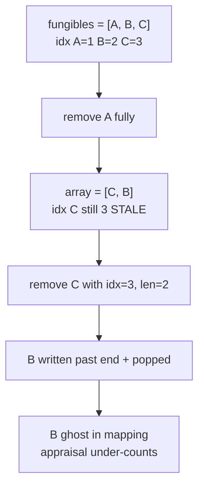

# Licredity — swap-and-pop without index fix-up corrupts Position fungibles

> **Vulnerability classes:** vuln/data-structure/stale-index · vuln/accounting/desync · impact/incorrect-health

> **Reproduction:** a self-contained Foundry PoC that compiles & runs in an
> isolated project with **only `forge-std`** — no fork, no RPC, no `anvil_state`.
> Full trace: [output.txt](output.txt). PoC:
> [test/62348-swap-and-pop-without-index-fix-up-corrupts-positions-fungibl_exp.sol](test/62348-swap-and-pop-without-index-fix-up-corrupts-positions-fungibl_exp.sol).

<!-- non-defihacklabs -->
<!-- source-auditvault: https://github.com/Auditware/AuditVault/blob/main/findings/62348-swap-and-pop-without-index-fix-up-corrupts-positions-fungibl.md -->
<!-- date: 2025-09 -->

---

## Key info

| | |
|---|---|
| **Impact** | **HIGH** — removing one fungible can silently drop another from the position's enumeration array while leaving a ghost balance in the mapping; appraisal that walks `fungibles[]` under-counts collateral |
| **Protocol** | [Licredity](https://licredity.com) v1/v2 — position collateral accounting |
| **Vulnerable code** | `Position::removeFungible` swap-and-pop assembly (missing moved-element index fix-up) |
| **Bug class** | Stale cached index after swap-and-pop |
| **Finding** | Cyfrin — Licredity v2.0, 2025-09 · #62348 · reporter **Immeas** |
| **Report** | [2025-09-01-cyfrin-licredity-v2.0.md](https://github.com/solodit/solodit_content/blob/main/reports/Cyfrin/2025-09-01-cyfrin-licredity-v2.0.md) |
| **Source** | [AuditVault](https://github.com/Auditware/AuditVault/blob/main/findings/62348-swap-and-pop-without-index-fix-up-corrupts-positions-fungibl.md) |
| **Status** | Audit finding — fixed in PR#64. Reproduced here as a standalone local PoC. |
| **Compiler** | `^0.8.24` (PoC) |

---

## TL;DR

1. `Position` tracks fungibles in an array **and** a `fungibleStates` mapping (1-based index + balance).
2. On full remove, the code swap-and-pops the array but **never** updates the moved tail element's cached index.
3. Remove A from `[A,B,C]` → array becomes `[C,B]` but `index(C)` stays 3.
4. Remove C with stale index=3 while len=2 → B is written past the array end and popped from the live range.
5. **HARM:** B has a ghost mapping balance of 1 ether but is missing from `fungibles[]`; appraisal under-counts.

---

## The vulnerable code

```solidity
// remove a fungible from the fungibles array
assembly ("memory-safe") {
    let slot := add(self.slot, FUNGIBLES_OFFSET)
    let len := sload(slot)
    mstore(0x00, slot)
    let dataSlot := keccak256(0x00, 0x20)

    if iszero(eq(index, len)) {
        sstore(add(dataSlot, sub(index, 1)), sload(add(dataSlot, sub(len, 1))))
    }

    sstore(add(dataSlot, sub(len, 1)), 0)
    sstore(slot, sub(len, 1)) // @> VULN: no fungibleStates[moved].index = index
}
```

**Fix:** after the swap, set `fungibleStates[moved].index = index` (1-based).

---

## Root cause

Two structures must stay in sync. The array move is performed; the mapping index is not. Later removals trust the stale index and corrupt neighboring slots.

## Preconditions

- A position holds ≥2 fungibles.
- A non-tail asset is fully removed (triggers swap-and-pop).
- A subsequent remove uses the moved asset's stale index.

## Attack walkthrough

1. Deposit A, B, C → indexes 1, 2, 3.
2. Fully remove A → C moves to slot 0; `index(C)` stays 3.
3. Fully remove C → assembly uses index=3, len=2; B vanishes from the array.
4. `fungibleBalance(B) == 1 ether` but B ∉ `fungibles[]`; `appraise()` under-counts.

## Diagrams



## Impact

- Inconsistent `fungibles[]` vs `fungibleStates`.
- Removing X can drop Y from the array.
- Valuation/health that iterates the array under- or over-counts positions.

## Sources

- [AuditVault finding #62348](https://github.com/Auditware/AuditVault/blob/main/findings/62348-swap-and-pop-without-index-fix-up-corrupts-positions-fungibl.md)
- [Cyfrin Licredity v2.0 report](https://github.com/solodit/solodit_content/blob/main/reports/Cyfrin/2025-09-01-cyfrin-licredity-v2.0.md)
- Vulnerable source: `Licredity/licredity-v1-core@e8ae10a` — `src/types/Position.sol` (`removeFungible`)
- Fix: [PR#64](https://github.com/Licredity/licredity-v1-core/pull/64) commit `ad095fc`

### Taxonomy (AuditVault)

- `severity/high` · `sector/lending` · `sector/dex` · `platform/cyfrin`
- genome: lockup · permanent · fot-slippage · liquidation-underwater · oracle-freshness
