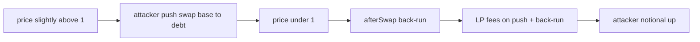

# Licredity — self-triggered afterSwap back-run enables LP fee farming

> **Vulnerability classes:** vuln/mev/self-backrun · impact/fee-extraction · sector/dex

> **Reproduction:** a self-contained Foundry PoC that compiles & runs in an
> isolated project with **only `forge-std`** — no fork, no RPC, no `anvil_state`.
> Full trace: [output.txt](output.txt). PoC:
> [test/62349-self-triggered-licredity-afterswap-back-run-enables-lp-fee-f_exp.sol](test/62349-self-triggered-licredity-afterswap-back-run-enables-lp-fee-f_exp.sol).

<!-- non-defihacklabs -->
<!-- source-auditvault: https://github.com/Auditware/AuditVault/blob/main/findings/62349-self-triggered-licredity-afterswap-back-run-enables-lp-fee-f.md -->
<!-- date: 2025-09 -->

---

## Key info

| | |
|---|---|
| **Impact** | **HIGH** — a dominant LP around price=1 can push price just under parity, earn LP fees on both the push and the hook’s auto back-run, then recover principal near 1:1 — repeatable fee mining |
| **Protocol** | [Licredity](https://licredity.com) v1/v2 — Uniswap v4 hook (`_afterSwap`) |
| **Vulnerable code** | `Licredity::_afterSwap` back-run when `sqrtPriceX96 <= ONE` |
| **Bug class** | Self-triggered back-run that pays a second fee leg to the same LP |
| **Finding** | Cyfrin — Licredity v2.0, 2025-09 · #62349 · reporter **Immeas** |
| **Report** | [2025-09-01-cyfrin-licredity-v2.0.md](https://github.com/solodit/solodit_content/blob/main/reports/Cyfrin/2025-09-01-cyfrin-licredity-v2.0.md) |
| **Source** | [AuditVault](https://github.com/Auditware/AuditVault/blob/main/findings/62349-self-triggered-licredity-afterswap-back-run-enables-lp-fee-f.md) |
| **Status** | Audit finding — fixed in PR#61/#78 (swaps ending below 1 revert). Reproduced as a local synthetic. |
| **Compiler** | `^0.8.24` (PoC) |

---

## TL;DR

1. When price hits/goes below 1, `_afterSwap` auto back-runs a reverse swap to restore parity.
2. That back-run pays swap fees to LPs.
3. A dominant LP around 1 captures nearly all fees on the push **and** the back-run.
4. Principal is recoverable near 1:1 (`exchangeFungible` / inventory).
5. **HARM:** attacker base+debt notional rises — steady economic drain.

---

## The vulnerable code

```solidity
if (sqrtPriceX96 <= ONE_SQRT_PRICE_X96) {
    // back run swap to revert the effect of the current swap, using exactOut
    IPoolManager.SwapParams memory params =
        IPoolManager.SwapParams(false, -balanceDelta.amount0(), MAX_SQRT_PRICE_X96 - 1);
    balanceDelta = poolManager.swap(poolKey, params, ""); // @> VULN: second fee leg
}
```

**Fix options:** revert swaps that would end below 1; whitelist LP below 1; skip fees when `sender == address(this)`.

---

## Root cause

The stabilization back-run is economically equivalent to a free second swap for whoever owns the active liquidity around parity. Dominant LPs double-dip fees with low directional risk.

## Preconditions

- Attacker provides most liquidity in ticks around 1.
- Can push price just under 1 with a swap.
- Hook still performs the fee-paying back-run (pre-fix).

## Attack walkthrough

1. Seed pool with price slightly above 1; attacker is ~80% of L.
2. Push base→debt (exact-out) until price ≤ 1.
3. `_afterSwap` back-runs debt→base, paying another LP fee leg.
4. Collect LP fees; notional (base+debt) is higher than before.

## Diagrams



## Impact

- Repeatable fee extraction from traders and the stabilization path.
- Drains system value whenever the attacker can steer price just under 1.
- Post-fix: swaps ending below 1 revert.

## Sources

- [AuditVault finding #62349](https://github.com/Auditware/AuditVault/blob/main/findings/62349-self-triggered-licredity-afterswap-back-run-enables-lp-fee-f.md)
- [Cyfrin Licredity v2.0 report](https://github.com/solodit/solodit_content/blob/main/reports/Cyfrin/2025-09-01-cyfrin-licredity-v2.0.md)
- Vulnerable source: `Licredity/licredity-v1-core@e8ae10a` — `src/Licredity.sol` (`_afterSwap`)
- Fix: [PR#61](https://github.com/Licredity/licredity-v1-core/pull/61), [PR#78](https://github.com/Licredity/licredity-v1-core/pull/78)

### Taxonomy (AuditVault)

- `severity/high` · `sector/dex` · `sector/lending` · `platform/cyfrin` · `impact/mev/backrun`
- genome: missing-allowance · indirect-loss · backrun · frontrun-exposure
