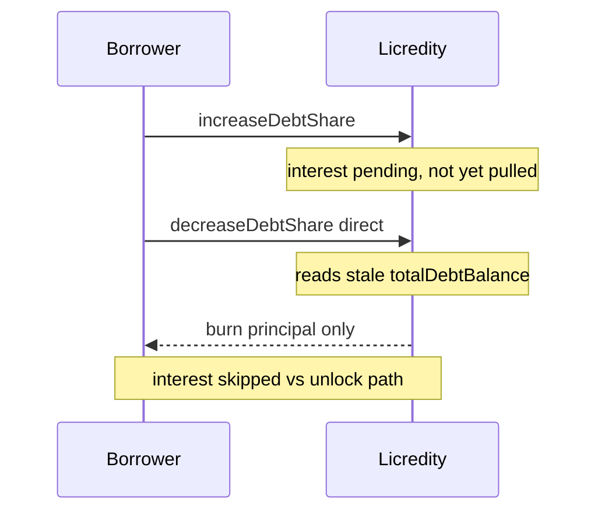

# Licredity — decreaseDebtShare bypasses interest accrual

> **Vulnerability classes:** vuln/accounting/missing-accrual · impact/yield-theft · trigger/direct-call

> **Reproduction:** a self-contained Foundry PoC that compiles & runs in an
> isolated project with **only `forge-std`** — no fork, no RPC, no `anvil_state`.
> Full trace: [output.txt](output.txt). PoC:
> [test/62350-licreditydecreasedebtshare-bypasses-interest-accrual-cyfrin_exp.sol](test/62350-licreditydecreasedebtshare-bypasses-interest-accrual-cyfrin_exp.sol).

<!-- non-defihacklabs -->
<!-- source-auditvault: https://github.com/Auditware/AuditVault/blob/main/findings/62350-licreditydecreasedebtshare-bypasses-interest-accrual-cyfrin.md -->
<!-- date: 2025-09 -->

---

## Key info

| | |
|---|---|
| **Impact** | **HIGH** — borrowers can repay via direct `decreaseDebtShare` using a stale debt ratio, skipping accrued interest and reducing LP/protocol yield |
| **Protocol** | [Licredity](https://licredity.com) v1/v2 — debt share accounting |
| **Vulnerable code** | `Licredity::decreaseDebtShare` — missing `_collectInterest()` before reading `totalDebtBalance/totalDebtShare` |
| **Bug class** | Missing pull-accrual on a “safe” path |
| **Finding** | Cyfrin — Licredity v2.0, 2025-09 · #62350 · reporter **Immeas** |
| **Report** | [2025-09-01-cyfrin-licredity-v2.0.md](https://github.com/solodit/solodit_content/blob/main/reports/Cyfrin/2025-09-01-cyfrin-licredity-v2.0.md) |
| **Source** | [AuditVault](https://github.com/Auditware/AuditVault/blob/main/findings/62350-licreditydecreasedebtshare-bypasses-interest-accrual-cyfrin.md) |
| **Status** | Audit finding — fixed in PR#59. Reproduced here as a standalone local PoC. |
| **Compiler** | `^0.8.24` (PoC) |

---

## TL;DR

1. Interest accrues only in `unlock` / swap / LP add-remove paths.
2. `decreaseDebtShare` is allowed outside `unlock` because it only reduces debt.
3. It burns `fullMulDivUp(delta, totalDebtBalance, totalDebtShare)` **without** accruing first.
4. After time/pending interest is due, a direct repay costs **principal only**.
5. **HARM:** `amountRepaid == amountBorrowed` while the accrued preview is strictly higher.

---

## The vulnerable code

```solidity
function decreaseDebtShare(uint256 positionId, uint256 delta, bool useBalance)
    external
    returns (uint256 amount)
{
    // FIX: _collectInterest();
    uint256 _totalDebtShare = totalDebtShare; // @> VULN: stale ratio
    uint256 _totalDebtBalance = totalDebtBalance;
    amount = _fullMulDivUp(delta, _totalDebtBalance, _totalDebtShare);
    // ... burn amount, decrease shares ...
}
```

---

## Root cause

“Repay-only” was treated as safe and skipped the accrual gate that every other state-changing path hits. The share→balance conversion then uses a stale index.

## Preconditions

- Outstanding debt shares exist.
- Interest is pending (time elapsed / accrual not yet pulled).
- Borrower calls `decreaseDebtShare` directly (not via `unlock`).

## Attack walkthrough

1. Open position, borrow `DELTA` shares → receive principal debt fungible.
2. Interest becomes pending (in the real system: time passes; in the synthetic: a one-shot pending accrual flag).
3. Preview with accrual > principal.
4. Direct `decreaseDebtShare` repays at the stale ratio → principal only.
5. Interest share never paid.

## Diagrams



## Impact

- Lower realized interest for LPs and protocol revenue.
- Distorted debt accounting until some other action accrues.
- Even unintentional early repayments reduce net APY.

## Sources

- [AuditVault finding #62350](https://github.com/Auditware/AuditVault/blob/main/findings/62350-licreditydecreasedebtshare-bypasses-interest-accrual-cyfrin.md)
- [Cyfrin Licredity v2.0 report](https://github.com/solodit/solodit_content/blob/main/reports/Cyfrin/2025-09-01-cyfrin-licredity-v2.0.md)
- Vulnerable source: `Licredity/licredity-v1-core@e8ae10a` — `src/Licredity.sol` (`decreaseDebtShare`)
- Fix: [PR#59](https://github.com/Licredity/licredity-v1-core/pull/59) commits `8ca2a35`, `81e54c0`

### Taxonomy (AuditVault)

- `severity/high` · `sector/lending` · `platform/cyfrin`
- genome: stale-price · defi/price-manipulation · debt-accrual-update · timestamp-dependence
