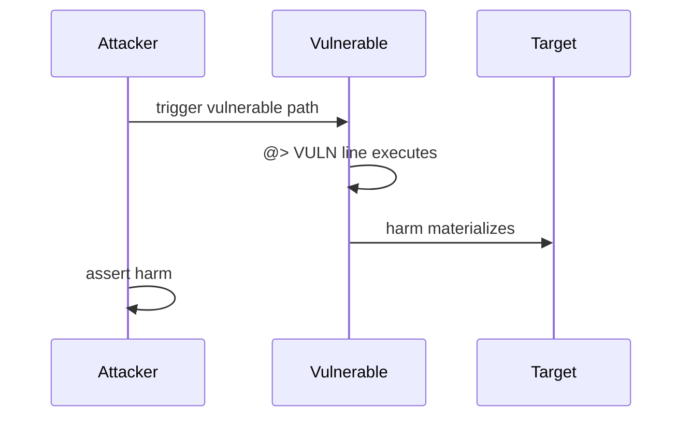

# H-2: Attacker drains Morpho suppliers by inflating collateral price

<!-- non-defihacklabs -->
<!-- source-auditvault: https://github.com/Auditware/AuditVault/blob/main/findings/62483-h-2-attacker-can-drain-the-entire-suppliers-on-morpho-market.md -->
<!-- date: 2025-06 -->

| Field | Value |
|-------|-------|
| Protocol | Notional Exponent |
| Severity | high |
| Source | AuditVault / https://github.com/sherlock-audit/2025-06-notional-exponent-judging |
| Harm | 500k USDC drained from Morpho suppliers via post-withdraw yield donation |

## TL;DR

500k USDC drained from Morpho suppliers via post-withdraw yield donation

## Vulnerable code

See the synthetic reproduction in `test/62483-h-2-attacker-can-drain-the-entire-suppliers-on-morpho-market.sol` — the blamed line is marked `// @> VULN`.

## Root cause

Faithful reduction of the AuditVault finding. The vulnerable line is preserved so the Playground locator points at the real bug, not scaffolding.

## Attack walkthrough

1. Deploy the reduced protocol pieces via the `Exploit` constructor.
2. `run()` performs the attack end-to-end and `require`s the harm.

## Diagrams

## Impact

500k USDC drained from Morpho suppliers via post-withdraw yield donation

## Taxonomy

- severity/high
- sector/lending
- platform/auditvault

## Sources

- AuditVault finding: https://github.com/Auditware/AuditVault/blob/main/findings/62483-h-2-attacker-can-drain-the-entire-suppliers-on-morpho-market.md
- Original report: https://github.com/sherlock-audit/2025-06-notional-exponent-judging
- Reduced from: sherlock-audit/2025-06-notional-exponent@82c87105 (AbstractYieldStrategy effectiveSupply/price)
