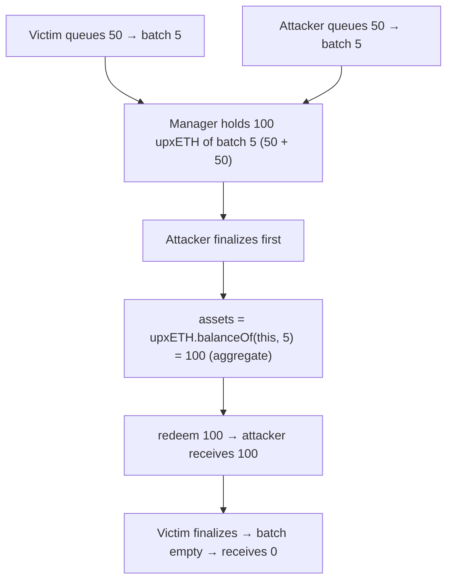

# Notional Exponent H-3: Dinero withdraw manager over-withdraws via batch-ID overlap

> **Vulnerability classes:** aggregate-vs-per-request accounting · shared-batch overlap · token overwithdrawal
>
> **Reproduction:** a faithful minimal reproduction of `DineroWithdrawRequestManager`
> `_initiateWithdrawImpl` / `_finalizeWithdrawImpl` (Sherlock `2025-06-notional-exponent`,
> `withdraws/Dinero.sol` @ main). The vulnerable finalize loop is reproduced **verbatim**
> (marked `@>`); PirexETH, the upxETH ERC-1155 receipt, WETH, and a second depositor are
> faithful minimal doubles. Local deploy, no fork.

<!-- source-auditvault: https://github.com/Auditware/AuditVault/blob/main/findings/62484-h-3-dinerowithdrawrequestmanager-vulnerable-to-token-overwit.md -->
<!-- date: 2025-06 -->

## Root cause

A withdrawal request encodes a **batch range** `[initialBatchId, finalBatchId]` captured
around `PirexETH.initiateRedemption`. The request id is made unique with a nonce — but the
comment itself flags the real hazard: *"Initial and final batch ids may overlap between
requests."*

`_finalizeWithdrawImpl` then claims per batch, aggregate-style:

```solidity
for (uint256 i = initialBatchId; i <= finalBatchId; i++) {
    uint256 assets = upxETH.balanceOf(address(this), i);   // @> whole batch, not this request's share
    if (assets == 0) continue;
    PirexETH.redeemWithUpxEth(i, assets, address(this));
    tokensClaimed += assets;
}
```

`upxETH` is an ERC-1155 keyed by `batchId`, and the manager holds the **sum** of every
request that landed in batch `i`. The finalize loop redeems that entire aggregate balance
for whoever finalizes first — it never tracks the per-request contribution. So when two
requests overlap on a batch, the **first finalizer drains the whole batch**, taking the
other request's tokens; the second finalizer finds the batch empty and gets nothing.

## Impact

- **Direct token overwithdrawal / theft of another user's withdrawal.** Any user whose
  request shares a batch with the attacker's request loses their redeemable amount to the
  attacker, who over-withdraws by exactly the victim's share.
- In the PoC, attacker and victim each queue 50; both land in batch 5. The attacker
  finalizes first and receives **100** (own 50 + victim's 50); the victim receives **0**.

## Attack walkthrough



## PoC

Registry (Foundry, local deploy — exploit path + a per-request-tracking control):

```bash
cd 62484-h-3-dinerowithdrawrequestmanager-vulnerable-to-token-overw_exp
forge test -vv
```

Expected: `test_attacker_overwithdrawsSharedBatch` PASS (attacker drains the full 100; 50
routed to the sink as the stolen share; victim gets 0) and `test_control_fixedClaimsPerRequestShare`
PASS (the fixed manager tracks each request's amount and claims exactly 50, leaving the
other 50 intact). The browser EVM Playground is served at
`/hacks/62484-h-3-dinerowithdrawrequestmanager-vulnerable-to-token-overw/`.

## Remediation

Track the per-request upxETH contribution at initiation and, on finalize, redeem only that
request's share (capped by the batch balance) — never the aggregate `balanceOf(this, i)`:

```solidity
// record amount per request on initiate; on finalize:
uint256 assets = requestAmount[requestId];
requestAmount[requestId] = 0;
PirexETH.redeemWithUpxEth(i, assets, address(this));
```

## References

- Sherlock 2025-06-notional-exponent, issue #297: https://github.com/sherlock-audit/2025-06-notional-exponent-judging/issues/297
- Vulnerable code: https://github.com/sherlock-audit/2025-06-notional-exponent/blob/82c87105f6b32bb362d7523356f235b5b07509f9/notional-v4/src/withdraws/Dinero.sol#L51
