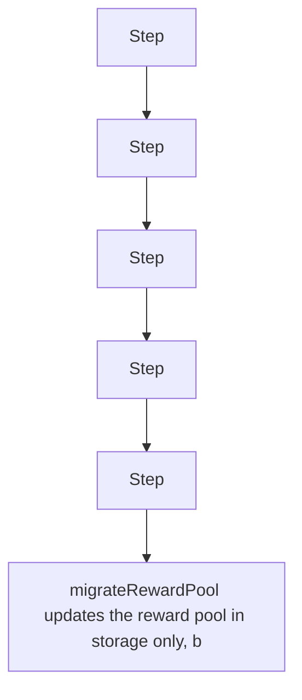

# Notional: migrateRewardPool is ineffective due to an immutable reward pool

> **Vulnerability classes:** vuln/logic
>
> **Reproduction:** a faithful minimal reproduction of the vulnerable finding — the vulnerable code is reproduced **verbatim** (marked `@>`) with faithful minimal doubles; local deploy, no fork.

<!-- source-auditvault: https://github.com/sherlock-audit/2025-06-notional-exponent/blob/main/notional-v4/src/rewards/AbstractRewardManager.sol#L44-L65 -->

## Root cause

migrateRewardPool updates the reward pool in storage only, but new LP deposits route through the strategy's immutable pool, so after migration 100e18 of fresh deposits still land in the deprecated old pool - the migration is silently ineffective.

```solidity
    IRewardPool public immutable rewardPool; // @> VULN (this line)
```

## Why it's exploitable here

migrateRewardPool updates the reward pool in storage only, but new LP deposits route through the strategy's immutable pool, so after migration 100e18 of fresh deposits still land in the deprecated old pool - the migration is silently ineffective.

## Attack path



## Marked-line walkthrough (Playground)

The EVM Playground pins each step to the exact executed source line in `0xbd4fd5a3ce…`:

1. **L71** — Step: Executes `function _withdrawFromPreviousRewardPool(RewardPoolStorage memory old) internal {`
2. **L79** — Step: Executes `uint256 public poolTokenBalance;`
3. **L83** — Step: Executes `function migrateRewardPool(address poolToken, RewardPoolStorage memory newRewardPool) external {`
4. **L88** — Step: Executes `if (oldRewardPool.rewardPool != address(0)) {`
5. **L95** — Step: Executes `_getRewardPoolSlot().lastClaimTimestamp = uint32(block.timestamp);`
6. **L96** — Vulnerable line: Executes `_getRewardPoolSlot().rewardPool = newRewardPool.rewardPool;`
7. **L106** — Step: Executes `address internal constant SINK = 0x000000000000000000000000000000000000D00d;`

## PoC

Registry (Foundry, local deploy — verbatim vulnerable source + harm-asserting test):

```bash
cd 62486-h-5-migraterewardpool-fails-due-to-incompatible-storage-desi_exp
forge test -vvv
```

The browser Playground replays the same synthetic opcode-for-opcode and measures the harm. Both gates are green (registry `forge test` PASS + Playground `_verify-poc` **VERDICT: PASS**).
