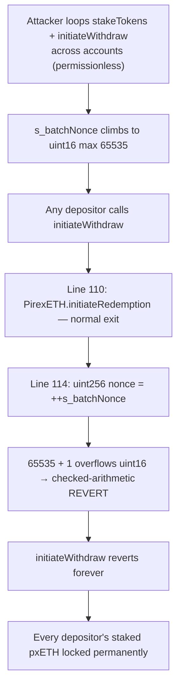

# Notional Exponent H-6: `uint16 s_batchNonce` overflow permanently bricks Dinero withdrawals

> **Vulnerability classes:** integer-bounds DoS · permanent liveness brick · undersized nonce type
>
> **Reproduction:** a faithful minimal reproduction of `DineroWithdrawRequestManager`
> `_initiateWithdrawImpl` (Sherlock `2025-06-notional-exponent`, `withdraws/Dinero.sol`
> L17-39 @ main). The reverting increment is reproduced **verbatim** (marked `@>`); PirexETH,
> the pxETH token, and the upxETH ERC-1155 receipt are faithful minimal doubles. Local
> deploy, no fork.

<!-- source-auditvault: https://github.com/Auditware/AuditVault/blob/main/findings/62487-h-6-dos-might-happen-to-dinerowithdrawrequestmanager-initiat.md -->
<!-- date: 2025-06 -->

## Root cause

Every withdrawal packs a unique `requestId` out of three fields — a per-request `nonce` and
the batch range `[initialBatchId, finalBatchId]`:

```solidity
uint256 nonce = ++s_batchNonce;                              // @> s_batchNonce is uint16
// ...
return nonce << 240 | initialBatchId << 120 | finalBatchId;  // nonce gets the top 16 bits
```

The nonce is given only the top **16 bits** of the id, so `s_batchNonce` is declared as a
`uint16`. Under Solidity 0.8 checked arithmetic, once `s_batchNonce` reaches its maximum
`65535`, the pre-increment `++s_batchNonce` **reverts on overflow** — and it runs on *every*
`initiateWithdraw`. There is no branch that skips it and no way to reset it. So the
65,536th withdrawal, and every one after it, reverts.

## Why it's exploitable here

- **The counter only ever goes up, and anyone can turn it.** `s_batchNonce` increments once
  per `initiateWithdraw`, permissionlessly, across all accounts and vaults that route through
  this manager. An attacker calls `stakeTokens` + `initiateWithdraw` in a loop (different
  accounts through an approved vault) to drive it to `65535`.
- **The brick is permanent.** After the cap there is no recovery path: the increment reverts
  before any state can change, so the manager can never issue another withdrawal.
- **Deposited assets are stranded.** `initiateWithdraw` is the *only* exit. Once it reverts
  unconditionally, every depositor's staked pxETH held by the manager is locked forever —
  a protocol-wide liveness failure, not a per-user inconvenience.

## Attack path



## Marked-line walkthrough (Playground)

The EVM Playground pins each step to the exact executed source line:

1. **Line 110** — `PirexETH.initiateRedemption(...)`: a depositor takes the normal exit path;
   the manager redeems their staked pxETH from PirexETH.
2. **Line 111** — `uint256 finalBatchId = PirexETH.batchId()`: execution reaches the nonce
   increment. The very next line, `++s_batchNonce` (line 114), reverts on `uint16` overflow —
   the whole `initiateWithdraw` reverts and the 50 pxETH stays locked.
3. **Line 79** (root cause) — `uint16 internal s_batchNonce`: the undersized type is the bug.
   Widen the nonce's bit budget and the revert disappears.

> The reverting `++` at line 114 jumps into a compiler-generated overflow-panic block that
> carries no source line, so the Playground anchors the "VULN" step on line 111 (the last
> executed line before the revert) and marks the `uint16` declaration on line 79 as the
> root cause.

## PoC

Registry (Foundry, local deploy — exploit path + a wide-nonce control):

```bash
cd 62487-h-6-dos-might-happen-to-dinerowithdrawrequestmanager-initi_exp
forge test -vv
```

Expected: `test_nonceOverflow_bricksWithdrawals` PASS (with `s_batchNonce` pinned at its
`uint16` max `65535`, `initiateWithdraw` reverts on the `++` overflow and 50 pxETH is routed
to the sink as permanently un-withdrawable) and `test_control_wideNonce_withdrawSucceeds` PASS
(the same 65535 starting point with a wide nonce does **not** revert — the withdrawal
succeeds). The browser EVM Playground is served at
`/hacks/62487-h-6-dos-might-happen-to-dinerowithdrawrequestmanager-initi/`.

## Remediation

The nonce is a `uint16` only because it is squeezed into the top 16 bits of `requestId`
alongside two `uint120` batch ids. Free up bits for the nonce so it cannot realistically
overflow. Because `PirexETH.batchId()` advances only once per 32-ETH redemption, storing the
full `finalBatchId` is wasteful — store the small `deltaBatchId = finalBatchId - initialBatchId`
instead and give the nonce ~120 bits:

```code
|255------136|135---------16|15---------0|
|s_batchNonce|initialBatchId|deltaBatchId|
```

```solidity
uint120 internal s_batchNonce;                 // was uint16
// ...
uint16 deltaBatchId = uint16(finalBatchId - initialBatchId);
return uint256(s_batchNonce) << 136 | initialBatchId << 16 | deltaBatchId;
```

A `uint120` nonce cannot overflow in any realistic timeframe, so the withdrawal path stays
live. Notional fixed this in
[notional-v4 PR #20](https://github.com/notional-finance/notional-v4/pull/20/files).

## References

- Sherlock 2025-06-notional-exponent, issue #580: https://github.com/sherlock-audit/2025-06-notional-exponent-judging/issues/580
- Vulnerable code: https://github.com/sherlock-audit/2025-06-notional-exponent/blob/main/notional-v4/src/withdraws/Dinero.sol#L17-L39
