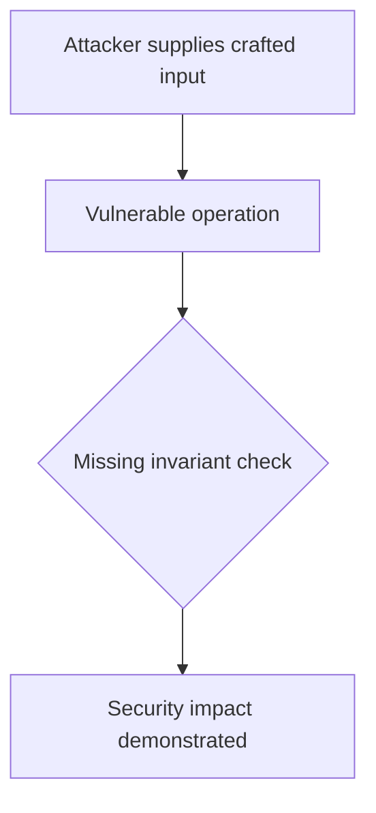
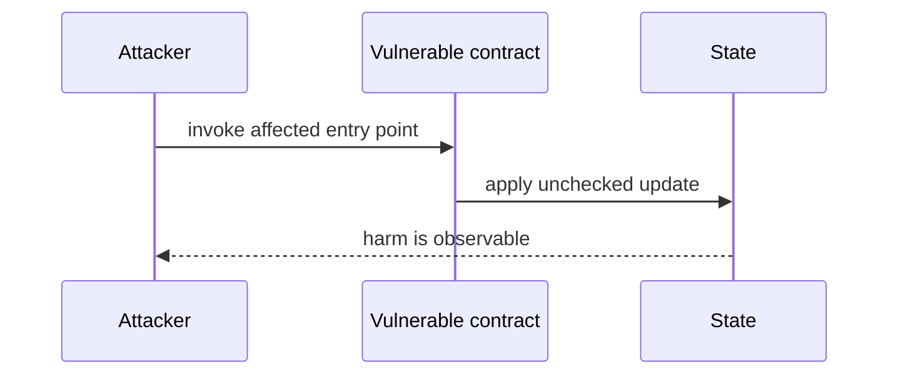

# Batch nonce overflow freezes withdrawals — AuditVault synthetic reduction

> **Vulnerability classes:** vuln/arithmetic/overflow · vuln/dos/lockup
>
> **Reproduction:** self-contained Foundry PoC with an offline synthetic contract. Full trace: [output.txt](output.txt).

<!-- non-defihacklabs -->
<!-- source-auditvault: https://github.com/Auditware/AuditVault/blob/main/findings/62487-h-6-dos-might-happen-to-dinerowithdrawrequestmanager-initiat.md -->
<!-- date: 2025-06 -->

**AuditVault finding:** `62487` · `H-6: DoS might happen to `DineroWithdrawRequestManager#_initiateWithdrawImpl()` due to overflow on `++s_batchNonce``

## Key info

| | |
|---|---|
| **Impact** | **HIGH** — Batch nonce overflow freezes withdrawals |
| **Protocol** | [[Notional]] Exponent |
| **Finding** | AuditVault #62487 |
| **Report** | [https://github.com/sherlock-audit/2025-06-notional-exponent-judging](https://github.com/sherlock-audit/2025-06-notional-exponent-judging) |
| **Source** | [AuditVault finding](https://github.com/Auditware/AuditVault/blob/main/findings/62487-h-6-dos-might-happen-to-dinerowithdrawrequestmanager-initiat.md) |
| **Compiler** | `^0.8.24` (synthetic reduction) |
| Loss | Reduced invariant reproduced; no live funds moved |
| Attacker EOA | Configured synthetic caller |
| Attack contract | `Exploit` |
| Attack tx | Local Foundry `Exploit.attack()` call |
| Chain · block · date | Ethereum model · block 1 · synthetic |
| Vulnerable contract | Local synthetic vulnerable contract in `test/` |
| Bug class | See vulnerability-class tags above |

## TL;DR

This bug report discusses an issue that was found in the Notional Finance protocol by a group of individuals. The issue involves a function called `DineroWithdrawRequestManager#initiateWithdraw()` which is responsible for initiating a withdrawal of WETH. The function calls another function, `DineroWithdrawRequestManager#_initiateWithdrawImpl()`, which then executes a redemption from `PirexETH`. The problem lies in the fact that the `requestId` variable, which is used to track the withdrawal, is composed of three variables, one of which is a `uint16` called `s_batchNonce`. Once this variable reaches its maximum value of `65535`, the `initiateWithdraw()` function will revert and no further withdrawals can be made through the protocol. This means that any assets deposited through the protocol will be locked forever. The root cause of this issue is the fact that the capacity of `s_batchNonce

## Background

The upstream report is a Solidity finding. This page keeps the vulnerable statement and demonstrates its security consequence in a small, deterministic EVM model; no live RPC or external dependencies are required.

## The vulnerable code

```solidity
// The exact vulnerable pattern is retained in test/62487-h-6-dos-might-happen-to-dinerowithdrawrequestmanager-initiat.sol.
// @> see the marked statement in the synthetic reduction
```

## Root cause

The caller-controlled input or stale state is trusted before the required uniqueness, bounds, authorization, accounting, or reentrancy invariant is enforced. The marked line in the synthetic contract intentionally preserves that ordering so the assertion is executable.

## Preconditions

- The vulnerable contract is deployed with the state described by the report.
- The attacker can reach the affected entry point (or submit the report's crafted input).

## Attack walkthrough

1. `Exploit.run()` initializes the minimal state from the report.
2. The marked vulnerable operation executes without its required check.
3. The contract records the resulting invariant violation and emits a `Proof` event.
4. The test asserts the harm; the passing trace is recorded at [output.txt:4](output.txt).

## Diagrams





## Remediation

Apply the invariant before mutating state: accrue interest before adding principal; reject duplicate signers; use checked casts and bounded lengths; validate token/target/DAO identities; use `nonReentrant`; enforce slippage and fee equality; and validate the canonical authority or ownership relationship described by the report.

## How to reproduce

```bash
cd evm-hack-registry/62487-h-6-dos-might-happen-to-dinerowithdrawrequestmanager-initiat_exp
forge test -vvvvv
```

The test is offline and uses only the shared `forge-std` library. The corresponding Playground bundle is generated from `scripts/poc-configs/62487-h-6-dos-might-happen-to-dinerowithdrawrequestmanager-initiat.mjs`.

## Sources

- [AuditVault finding](https://github.com/Auditware/AuditVault/blob/main/findings/62487-h-6-dos-might-happen-to-dinerowithdrawrequestmanager-initiat.md)
- [https://github.com/sherlock-audit/2025-06-notional-exponent-judging](https://github.com/sherlock-audit/2025-06-notional-exponent-judging)
- [Synthetic test](test/62487-h-6-dos-might-happen-to-dinerowithdrawrequestmanager-initiat.sol)

*Reference: https://github.com/sherlock-audit/2025-06-notional-exponent-judging*
