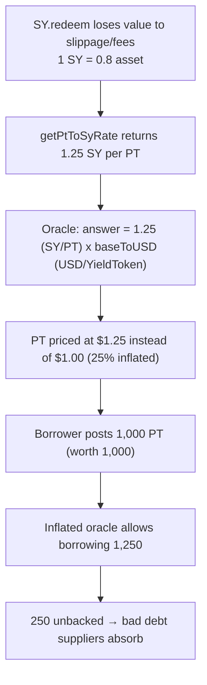

# Notional Exponent H-8: PendlePTOracle assumes 1 SY == 1 Yield Token → inflated PT price → bad debt

> **Vulnerability classes:** oracle price inflation · unit/denomination confusion (SY vs Yield Token) · collateral overvaluation
>
> **Reproduction:** a faithful minimal reproduction of `PendlePTOracle._getPTRate` /
> `_calculateBaseToQuote` (Sherlock `2025-06-notional-exponent`,
> `src/oracles/PendlePTOracle.sol` L61-89). The oracle math is reproduced **verbatim**
> (marked `@>`); the Pendle oracle, Chainlink feed, PT/asset tokens and a minimal
> collateral market are faithful minimal doubles. Local deploy, no fork.

<!-- source-auditvault: https://github.com/Auditware/AuditVault/blob/main/findings/62489-h-8-incorrect-assumption-that-one-1-pendle-standard-yield-sy.md -->
<!-- date: 2025-06 -->

## Root cause

A Pendle PT (Principal Token) is priced by combining two rates:

```solidity
function _getPTRate() internal view returns (int256) {
    uint256 ptRate = useSyOracleRate ?
        PENDLE_ORACLE.getPtToSyRate(pendleMarket, twapDuration) :   // @> SY per PT
        PENDLE_ORACLE.getPtToAssetRate(pendleMarket, twapDuration);
    return ptRate.toInt();
}

function _calculateBaseToQuote() internal view returns (...) {
    (, baseToUSD, ...) = baseToUSDOracle.latestRoundData();         // USD per Yield Token
    // ...
    int256 ptRate = _getPTRate();
    answer = (ptRate * baseToUSD) / baseToUSDDecimals;             // @> (SY per PT) x (USD per Yield Token)
}
```

When `useSyOracleRate == true` (a supported, in-the-test-suite configuration), `ptRate`
is **SY tokens per PT**. It is then multiplied by `baseToUSD`, the Chainlink **USD price of
the Yield Token** — the only feed that exists, because no oracle prices Pendle SY directly.
The formula it computes is:

```
(USD per PT) = (SY per PT) × (USD per Yield Token)
```

This is dimensionally correct **only if 1 SY == 1 Yield Token**. That is the buried
assumption, and it does not hold: `SY.redeem` can withdraw from an external staking protocol
or perform swaps, losing value to slippage and fees, so **1 SY is worth less than 1 Yield
Token**. When 1 SY = 0.8 asset, `getPtToSyRate` returns 1.25 SY per PT — and the oracle reads
that 1.25 as *1.25 Yield Tokens per PT*, overstating the PT price by 25%.

## Why it's exploitable here

- **The overvaluation flows straight into borrowing power.** An inflated PT price makes PT
  collateral look worth more than it is. A borrower posting PT can draw more asset than the
  collateral can ever repay.
- **No feed prices SY, so the wrong rate can't self-correct.** The Yield-Token USD feed is
  the only one available; the code substitutes it for the (unpriceable) SY denomination.
- **The loss lands on suppliers as bad debt.** The over-borrowed portion is unbacked. When
  the position is liquidated, the recovered collateral (true value) is less than the debt —
  the shortfall is protocol insolvency the suppliers absorb.

In the PoC, 1 SY = 0.8 asset (25% inflation). A borrower posts 1,000 PT truly worth 1,000
asset, the inflated oracle values it at 1,250, the borrower draws **1,250**, and the **250**
shortfall is bad debt routed to the sink.

## Attack path



## Marked-line walkthrough (Playground)

The EVM Playground pins each step to the exact executed source line in `PendlePTOracle`:

1. **Line 104** — `require(baseToUSD > 0, ...)`: the Chainlink USD price of the *Yield Token*
   is read (no feed prices SY directly).
2. **Line 97** (root cause) — `getPtToSyRate(pendleMarket, twapDuration)`: with
   `useSyOracleRate = true`, the oracle takes 1.25 **SY** per PT and treats it as 1.25
   **Yield Tokens** per PT — a 25% overstatement.
3. **Line 107** — `answer = (ptRate * baseToUSD) / baseToUSDDecimals`: the inflated $1.25 PT
   price is produced; downstream, 1,000 PT is valued at 1,250, the borrower over-draws, and
   250 becomes bad debt.

## PoC

Registry (Foundry, local deploy — exploit path + a fixed-oracle control):

```bash
cd 62489-h-8-incorrect-assumption-that-one-1-pendle-standard-yield-sy_exp
forge test -vv
```

Expected: `test_exploit_inflatedOracle_enablesBadDebt` PASS (the inflated oracle lets the
borrower draw 1,250 against PT worth 1,000; 250 asset of bad debt is routed to the sink) and
`test_control_fixedOracle_returnsTruePrice` PASS (the buggy SY-rate oracle answers 1.25e18
while the fixed asset-rate oracle answers 1.00e18 — the fix removes the 25% inflation). The
browser EVM Playground is served at
`/hacks/62489-h-8-incorrect-assumption-that-one-1-pendle-standard-yield-sy/`.

## Remediation

Do not assume 1 SY == 1 Yield Token. Either use `getPtToAssetRate` (asset-per-PT, which
already reflects the real SY→asset redemption value) as the PT rate, or convert the SY rate
to the asset denomination using the SY's true exchange rate (`SY.previewRedeem` / the SY↔asset
rate) before multiplying by the Yield-Token USD feed:

```solidity
// use the asset-denominated PT rate directly
int256 ptRate = PENDLE_ORACLE.getPtToAssetRate(pendleMarket, twapDuration).toInt();
answer = (ptRate * baseToUSD) / baseToUSDDecimals;
```

## References

- Sherlock 2025-06-notional-exponent, issue #689: https://github.com/sherlock-audit/2025-06-notional-exponent-judging/issues/689
- Vulnerable code: https://github.com/sherlock-audit/2025-06-notional-exponent/blob/main/notional-v4/src/oracles/PendlePTOracle.sol#L61-L89
- Pendle `IStandardizedYield.redeem` (slippage/`minTokenOut`): https://github.com/pendle-finance/pendle-core-v2-public/blob/46d13ce4168e8c5ad9e5641dd6380fea69e48490/contracts/interfaces/IStandardizedYield.sol#L87
