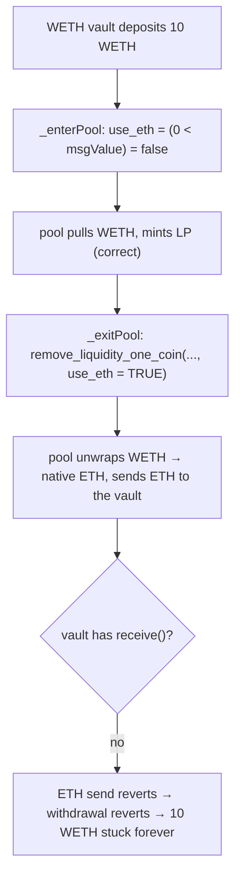

# Notional Exponent H-9: hardcoded `use_eth = true` on Curve V2 exit locks WETH-vault funds

> **Vulnerability classes:** curve-integration · enter/exit-asymmetry · native-eth-vs-weth · locked-funds
>
> **Reproduction:** a faithful minimal reproduction of `CurveConvex2Token._enterPool` /
> `_exitPool` (Sherlock `2025-06-notional-exponent`, `CurveConvex2Token.sol` @ main).
> The vulnerable enter/exit pair is reproduced **verbatim** (marked `@>`); the Curve V2
> pool, WETH, and the STUCK-WETH harm probe are faithful minimal doubles. Local deploy,
> no fork.

<!-- source-auditvault: https://github.com/Auditware/AuditVault/blob/main/findings/62490-h-9-hardcoded-useeth-true-in-remove-liquidity-one-coin-or-re.md -->
<!-- date: 2025-06 -->

## Root cause

Notional's Curve V2 single-sided LP vault computes the `use_eth` flag **dynamically on
entry** but **hardcodes it to `true` on exit**.

Entry (`_enterPool`) — correct:

```solidity
return ICurve2TokenPoolV2(CURVE_POOL).add_liquidity{value: msgValue}(
    amounts, minPoolClaim, 0 < msgValue // use_eth = true if msgValue > 0
);
```

A vault whose primary token is **WETH** (not native ETH) enters with `msgValue == 0`,
so `use_eth == false` and the pool pulls WETH. Correct.

Exit (`_exitPool`) — the bug:

```solidity
exitBalance = ICurve2TokenPoolV2(CURVE_POOL).remove_liquidity_one_coin(
    poolClaim, _PRIMARY_INDEX, _minAmounts[_PRIMARY_INDEX], true, address(this) // @> use_eth hardcoded true
);
```

When the pool's primary coin is WETH (so `ETH_INDEX == _PRIMARY_INDEX`), `use_eth == true`
makes the Curve pool **unwrap WETH to native ETH and send ETH** to the vault. But the
vault entered with WETH and has **no way to receive native ETH** (no `receive()`), so the
transfer reverts. Every `remove_liquidity_one_coin` / `remove_liquidity` call from the
vault reverts → the position can never be exited → the deposited WETH is **permanently
stuck**.

## Impact

- **Permanent loss of access to funds.** Any WETH-primary Curve V2 vault position can be
  entered but never withdrawn — the exit reverts on the native-ETH send. In the PoC, a
  10 WETH deposit is locked forever.
- Triggers on normal use, no attacker required; it's a self-inflicted freeze on the whole
  vault's WETH inventory for the affected pools (e.g. t/ETH, cvxETH — WETH is coin0).

## Attack walkthrough



## PoC

Registry (Foundry, local deploy — exploit path + a fixed-symmetry control):

```bash
cd 62490-h-9-hardcoded-useeth-true-in-remove-liquidity-one-coin-or-_exp
forge test -vv
```

Expected: `test_withdrawReverts_fundsStuck` PASS (withdrawal reverts with
`"eth transfer failed"`; 10 WETH locked; depositor recovers 0) and
`test_control_useEthFalse_withdrawSucceeds` PASS (exit with `use_eth = false` returns the
full 10 WETH). The browser EVM Playground is served at
`/hacks/62490-h-9-hardcoded-useeth-true-in-remove-liquidity-one-coin-or-/`.

## Remediation

Compute `use_eth` symmetrically with entry (i.e. `false` for a WETH vault), or unwrap on
entry / re-wrap on exit consistently. Never hardcode `use_eth = true` when the vault's
primary token is WETH rather than native ETH:

```diff
-    poolClaim, _PRIMARY_INDEX, _minAmounts[_PRIMARY_INDEX], true, address(this)
+    poolClaim, _PRIMARY_INDEX, _minAmounts[_PRIMARY_INDEX], TOKEN_1 == ETH, address(this)
```

## References

- Sherlock 2025-06-notional-exponent, issue #691: https://github.com/sherlock-audit/2025-06-notional-exponent-judging/issues/691
- Vulnerable code: https://github.com/sherlock-audit/2025-06-notional-exponent/blob/main/notional-v4/src/single-sided-lp/CurveConvex2Token.sol#L244
