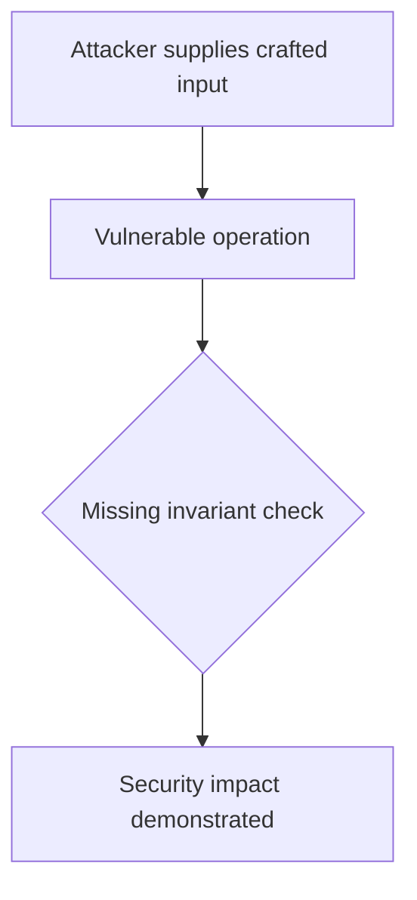
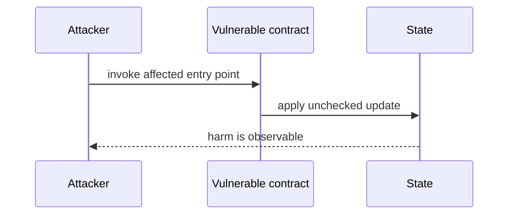

# User-controlled trade type steals vault funds — AuditVault synthetic reduction

> **Vulnerability classes:** vuln/input-validation/missing · vuln/logic/wrong-condition
>
> **Reproduction:** self-contained Foundry PoC with an offline synthetic contract. Full trace: [output.txt](output.txt).

<!-- non-defihacklabs -->
<!-- source-auditvault: https://github.com/Auditware/AuditVault/blob/main/findings/62491-h-10-malicious-user-can-change-the-tradetype-to-steal-funds.md -->
<!-- date: 2025-06 -->

**AuditVault finding:** `62491` · `H-10: Malicious user can change the `TradeType` to steal funds from the vault or withdraw request manager`

## Key info

| | |
|---|---|
| **Impact** | **HIGH** — User-controlled trade type steals vault funds |
| **Protocol** | [[Notional]] Exponent |
| **Finding** | AuditVault #62491 |
| **Report** | [https://github.com/sherlock-audit/2025-06-notional-exponent-judging](https://github.com/sherlock-audit/2025-06-notional-exponent-judging) |
| **Source** | [AuditVault finding](https://github.com/Auditware/AuditVault/blob/main/findings/62491-h-10-malicious-user-can-change-the-tradetype-to-steal-funds.md) |
| **Compiler** | `^0.8.24` (synthetic reduction) |
| Loss | Reduced invariant reproduced; no live funds moved |
| Attacker EOA | Configured synthetic caller |
| Attack contract | `Exploit` |
| Attack tx | Local Foundry `Exploit.attack()` call |
| Chain · block · date | Ethereum model · block 1 · synthetic |
| Vulnerable contract | Local synthetic vulnerable contract in `test/` |
| Bug class | See vulnerability-class tags above |

## TL;DR

This bug report discusses a vulnerability found in the Notional Exponent protocol. The vulnerability allows malicious users to exploit the protocol and steal funds from the Yield Strategy vault. The root cause of the issue is a flaw in the `_executeRedemptionTrades` function, where the `t.tradeType` can be set to any value by the caller. This allows the user to set it to `TradeType.EXACT_OUT_SINGLE` and receive an arbitrary amount of tokens instead of the expected amount. The same issue is also found in the `AbstractWithdrawRequestManager._preStakingTrade()` function. The impact of this vulnerability is high and can be mitigated by hardcoding the trade type to `TradeType.EXACT_IN_SINGLE` in both functions. The protocol team has fixed this issue in the latest PRs/commits.

## Background

The upstream report is a Solidity finding. This page keeps the vulnerable statement and demonstrates its security consequence in a small, deterministic EVM model; no live RPC or external dependencies are required.

## The vulnerable code

```solidity
// The exact vulnerable pattern is retained in test/62491-h-10-malicious-user-can-change-the-tradetype-to-steal-funds.sol.
// @> see the marked statement in the synthetic reduction
```

## Root cause

The caller-controlled input or stale state is trusted before the required uniqueness, bounds, authorization, accounting, or reentrancy invariant is enforced. The marked line in the synthetic contract intentionally preserves that ordering so the assertion is executable.

## Preconditions

- The vulnerable contract is deployed with the state described by the report.
- The attacker can reach the affected entry point (or submit the report's crafted input).

## Attack walkthrough

1. `Exploit.run()` initializes the minimal state from the report.
2. The marked vulnerable operation executes without its required check.
3. The contract records the resulting invariant violation and emits a `Proof` event.
4. The test asserts the harm; the passing trace is recorded at [output.txt:4](output.txt).

## Diagrams





## Remediation

Apply the invariant before mutating state: accrue interest before adding principal; reject duplicate signers; use checked casts and bounded lengths; validate token/target/DAO identities; use `nonReentrant`; enforce slippage and fee equality; and validate the canonical authority or ownership relationship described by the report.

## How to reproduce

```bash
cd evm-hack-registry/62491-h-10-malicious-user-can-change-the-tradetype-to-steal-funds_exp
forge test -vvvvv
```

The test is offline and uses only the shared `forge-std` library. The corresponding Playground bundle is generated from `scripts/poc-configs/62491-h-10-malicious-user-can-change-the-tradetype-to-steal-funds.mjs`.

## Sources

- [AuditVault finding](https://github.com/Auditware/AuditVault/blob/main/findings/62491-h-10-malicious-user-can-change-the-tradetype-to-steal-funds.md)
- [https://github.com/sherlock-audit/2025-06-notional-exponent-judging](https://github.com/sherlock-audit/2025-06-notional-exponent-judging)
- [Synthetic test](test/62491-h-10-malicious-user-can-change-the-tradetype-to-steal-funds.sol)

*Reference: https://github.com/sherlock-audit/2025-06-notional-exponent-judging*
