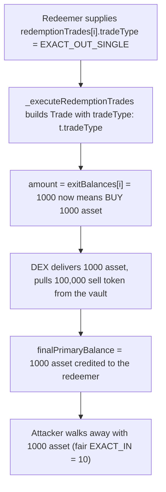

# Notional Exponent H-10: caller-controlled TradeType (EXACT_IN → EXACT_OUT) drains the vault on redemption

> **Vulnerability classes:** caller-controlled trade semantics · EXACT_IN vs EXACT_OUT confusion · vault fund drain
>
> **Reproduction:** a faithful minimal reproduction of
> `AbstractSingleSidedLP._executeRedemptionTrades` (Sherlock `2025-06-notional-exponent`,
> `src/single-sided-lp/AbstractSingleSidedLP.sol` L222-250). The redemption-trade loop is
> reproduced **verbatim** (marked `@>`); the DEX, tokens, and a minimal vault are faithful
> minimal doubles. Local deploy, no fork.

<!-- source-auditvault: https://github.com/Auditware/AuditVault/blob/main/findings/62491-h-10-malicious-user-can-change-the-tradetype-to-steal-funds.md -->
<!-- date: 2025-06 -->

## Root cause

On redemption, the vault trades every non-asset exit balance into the primary asset. The
comment says the intent plainly — *"Always sell the entire exit balance to the primary
token"* — an **EXACT_IN** swap: sell exactly `exitBalances[i]` of the sell token for as much
asset as the market gives. But the `Trade` is built with a **caller-supplied** trade type:

```solidity
TradeParams memory t = redemptionTrades[i];   // caller-controlled
Trade memory trade = Trade({
    tradeType: t.tradeType,                    // @> should be hardcoded EXACT_IN_SINGLE
    sellToken: address(tokens[i]),
    buyToken:  address(asset),
    amount:    exitBalances[i],                // meant as the SELL amount
    limit:     t.minPurchaseAmount,
    deadline:  block.timestamp,
    exchangeData: t.exchangeData
});
(, uint256 amountBought) = _executeTrade(trade, t.dexId);
```

`amount` is fixed to `exitBalances[i]`, but its **meaning depends on `tradeType`**:

- `EXACT_IN_SINGLE` → `amount` is the **input** (sell exactly `exitBalances[i]`).
- `EXACT_OUT_SINGLE` → `amount` is the **output** (buy exactly `exitBalances[i]` of the
  *asset*), and the DEX pulls however much sell token it needs.

By setting `tradeType = EXACT_OUT_SINGLE`, a redeemer flips `exitBalances[i]` from a sell
amount into a **buy amount of the valuable asset**. The DEX then delivers that large asset
amount to the redemption and drains the sell token it needs from the vault's own reserves.

## Why it's exploitable here

- **The trade type is attacker input, with no validation.** Anyone triggering a redemption
  supplies `redemptionTrades`, including `tradeType`.
- **The amount is valued in the wrong denomination after the flip.** `exitBalances[i]` was
  sized as a sell amount; as an *output* amount of a more valuable asset it represents far
  more value (the finding notes the 8-vs-18 decimal gap makes it astronomically larger on
  real tokens — `10000e18` "WBTC" = `1e14` WBTC).
- **The sell token comes from the vault, not the attacker.** Excess sell token on the vault
  (e.g. a reward token that happens to be the sell token) funds the over-purchase, so the
  loss is borne by all depositors.

In the PoC (1 asset = 100 sell token), an honest `EXACT_IN` redemption of 1,000 sell token
yields **10 asset**. Flipping to `EXACT_OUT` buys **1,000 asset** — 100× more — pulling
**100,000 sell token** from the vault's reserves. The 1,000 asset is credited to the
redeemer and forwarded to the attacker.

## Attack path



## Marked-line walkthrough (Playground)

The EVM Playground pins each step to the exact executed source line in `YieldVault`:

1. **Line 135** — `for (uint256 i; i < exitBalances.length; i++)`: the redemption loop is
   meant to sell the entire exit balance (1,000 sell token) into the asset (EXACT_IN → ~10).
2. **Line 145** (root cause) — `tradeType: t.tradeType`: the trade type is taken from the
   caller. The redeemer set `EXACT_OUT_SINGLE`, so the exit balance `1000` is now the asset
   **output** amount, not the sell amount.
3. **Line 153** — `_executeTrade(trade, t.dexId)`: the DEX buys 1,000 asset (100× the fair
   10) and drains 100,000 sell token from the vault's reserves.

## PoC

Registry (Foundry, local deploy — exploit path + a hardcoded-EXACT_IN control):

```bash
cd 62491-h-10-malicious-user-can-change-the-tradetype-to-steal-funds_exp
forge test -vv
```

Expected: `test_exploit_exactOutFlip_drainsVault` PASS (fair EXACT_IN yields 10 asset; the
EXACT_OUT flip yields 1,000 asset and drains 100,000 sell token from the vault; the attacker
receives 1,000 asset) and `test_control_fixedVault_exactInOnly` PASS (the fixed vault
hardcodes `EXACT_IN_SINGLE`, ignores the attacker's trade type, and yields only the fair 10
asset, spending only the 1,000 sell-token exit balance). The browser EVM Playground is served
at `/hacks/62491-h-10-malicious-user-can-change-the-tradetype-to-steal-funds/`.

## Remediation

Hardcode the trade type to `EXACT_IN_SINGLE` in both `_executeRedemptionTrades` and
`AbstractWithdrawRequestManager._preStakingTrade`, so the fixed `amount` is always the sell
amount and can never be reinterpreted as an output amount:

```solidity
Trade memory trade = Trade({
-   tradeType: t.tradeType,
+   tradeType: TradeType.EXACT_IN_SINGLE,
    sellToken: address(tokens[i]),
    buyToken:  address(asset),
    amount:    exitBalances[i],
    ...
});
```

Notional fixed this in
[notional-v4 PR #18](https://github.com/notional-finance/notional-v4/pull/18).

## References

- Sherlock 2025-06-notional-exponent, issue #715: https://github.com/sherlock-audit/2025-06-notional-exponent-judging/issues/715
- Vulnerable code: https://github.com/sherlock-audit/2025-06-notional-exponent/blob/main/notional-v4/src/single-sided-lp/AbstractSingleSidedLP.sol#L222-L250
- Second instance (`_preStakingTrade`): https://github.com/sherlock-audit/2025-06-notional-exponent/blob/main/notional-v4/src/withdraws/AbstractWithdrawRequestManager.sol#L268
