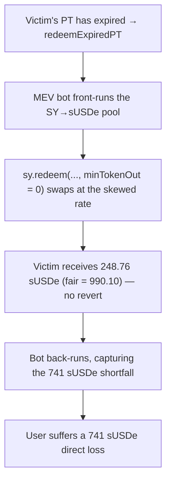

# Notional Exponent H-11: expired-PT redemption uses `sy.redeem(..., minTokenOut: 0)` → sandwich drains the user

> **Vulnerability classes:** missing slippage protection · MEV sandwich · unprotected external DEX swap
>
> **Reproduction:** a faithful minimal reproduction of `PendlePTLib.redeemExpiredPT`
> (Sherlock `2025-06-notional-exponent`, `src/staking/PendlePTLib.sol` L87). The redemption
> function is reproduced **verbatim** (marked `@>`); the SY, YT, PT, a constant-product DEX
> pool, and the tokens are faithful minimal doubles. Local deploy, no fork.

<!-- source-auditvault: https://github.com/Auditware/AuditVault/blob/main/findings/62492-h-11-missing-slippage-protection-in-expired-pt-redemption-ca.md -->
<!-- date: 2025-06 -->

## Root cause

When a Pendle PT has expired, `_redeemPT` routes to `PendlePTLib.redeemExpiredPT`, which
burns the PT for SY and then converts the SY to the exit token:

```solidity
function redeemExpiredPT(IPPrincipalToken pt, IPYieldToken yt, IStandardizedYield sy, address tokenOutSy, uint256 netPtIn)
    external returns (uint256 netTokenOut)
{
    pt.transfer(address(yt), netPtIn);
    uint256 netSyOut = yt.redeemPY(address(sy));
    netTokenOut = sy.redeem(address(this), netSyOut, tokenOutSy, 0, true); // @> minTokenOut = 0
}
```

The final `sy.redeem(..., minTokenOut: 0, ...)` sets the slippage floor to **zero**. Many SY
contracts implement `redeem` by performing an **external DEX swap** to convert the underlying
into `tokenOutSy` (Pendle's `IStandardizedYield.redeem` takes a `minTokenOut` precisely
because the conversion can slip). With the floor hardcoded to 0, the redeemer's swap accepts
*any* output — there is no protection against adverse market conditions or MEV.

## Why it's exploitable here

- **The swap is public and floor-less.** A redemption transaction executes a DEX swap with no
  minimum. An MEV bot can sandwich it: front-run to skew the pool, let the victim swap at the
  bad rate, and back-run to capture the difference.
- **The user has no control.** The redeemer cannot pass their own `minTokenOut` — the library
  hardcodes 0 — so they cannot protect themselves even if they wanted to.
- **It hits two flows.** Both instant redemption (`_executeInstantRedemption`) and withdraw
  initiation (`_initiateWithdraw`) reach this code, so the exposure is systemic.

In the PoC, a fair redemption of the victim's expired PT would return **990.10 sUSDe**. A
sandwicher front-runs the SY→sUSDe pool; because `minTokenOut = 0`, the victim's redemption
returns only **248.76 sUSDe** with no revert. The **741.34 sUSDe** shortfall is the user's
direct loss — and the bot's back-run captures **750.62 SY** worth of it.

## Attack path



## Marked-line walkthrough (Playground)

The EVM Playground pins each step to the exact executed source line in `PendlePTLib`:

1. **Line 144** — `pt.transfer(address(yt), netPtIn)`: the victim's expired PT is routed to
   the YieldToken to be burned.
2. **Line 145** — `netSyOut = yt.redeemPY(address(sy))`: the PT is burned and the SY shares
   are delivered to the SY contract.
3. **Line 147** (root cause) — `sy.redeem(address(this), netSyOut, tokenOutSy, 0, true)`: the
   SY→sUSDe DEX swap runs with a **zero** floor. With the pool pre-skewed by the front-run,
   the victim gets 248.76 sUSDe instead of 990.10 — and it does not revert.

## PoC

Registry (Foundry, local deploy — sandwich exploit + a `minTokenOut`-floor control):

```bash
cd 62492-h-11-missing-slippage-protection-in-expired-pt-redemption-ca_exp
forge test -vv
```

Expected: `test_exploit_sandwich_userLoses` PASS (fair redemption 990.10 sUSDe; sandwiched
redemption 248.76 sUSDe; the 741.34 sUSDe shortfall is recorded at the sink and the
sandwicher realizes 750.62 SY of profit) and `test_control_fixedLib_revertsOnSlippage` PASS
(the fixed library passes a real `minTokenOut` floor of 90% of fair, so the same sandwiched
swap **reverts** — the user is protected). The browser EVM Playground is served at
`/hacks/62492-h-11-missing-slippage-protection-in-expired-pt-redemption-ca/`.

## Remediation

Add a `minTokenOut` parameter to `redeemExpiredPT` and pass it through to `sy.redeem`; have
both calling flows (instant redemption and withdraw initiation) compute a floor from the
expected redemption rate:

```solidity
function redeemExpiredPT(..., uint256 netPtIn, uint256 minTokenOut) external returns (uint256 netTokenOut) {
    pt.transfer(address(yt), netPtIn);
    uint256 netSyOut = yt.redeemPY(address(sy));
    netTokenOut = sy.redeem(address(this), netSyOut, tokenOutSy, minTokenOut, true);
}
```

## References

- Sherlock 2025-06-notional-exponent, issue #874: https://github.com/sherlock-audit/2025-06-notional-exponent-judging/issues/874
- Vulnerable code: https://github.com/sherlock-audit/2025-06-notional-exponent/blob/main/notional-v4/src/staking/PendlePTLib.sol#L87
- Pendle `IStandardizedYield.redeem` (`minTokenOut`): https://github.com/pendle-finance/pendle-core-v2-public/blob/46d13ce4168e8c5ad9e5641dd6380fea69e48490/contracts/interfaces/IStandardizedYield.sol#L87
