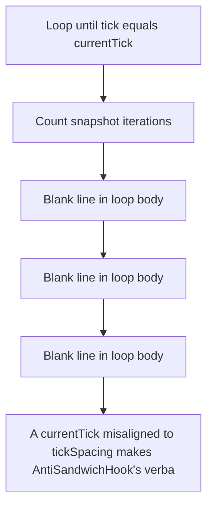

# Uniswap Hooks: A currentTick misaligned to tickSpacing makes AntiSandwichHook's verbatim `tick != current

> **Vulnerability classes:** vuln/locked-funds
>
> **Reproduction:** a faithful minimal reproduction of the vulnerable finding — the vulnerable function is reproduced **verbatim** (marked `@>`) with faithful minimal doubles; local deploy, no fork.

<!-- source-auditvault: https://github.com/Auditware/AuditVault/blob/main/findings/62524-infinite-loop-in-tick-iteration-due-to-misaligned-current-ti.md -->

## Root cause

A currentTick misaligned to tickSpacing makes AntiSandwichHook's verbatim `tick != currentTick` top-of-block snapshot loop step over the target and never terminate, so _beforeSwap reverts (OOG) even under a full 30M-gas block budget — every swap on the pool is permanently bricked (liveness DoS).

```solidity
    function runCheckpoint(int24 lastTick, int24 currentTick, int24 tickSpacing) external {
        int24 step = currentTick > lastTick ? tickSpacing : -tickSpacing;

        for (int24 tick = lastTick; tick != currentTick; tick += step) { // @> misaligned currentTick is stepped over: `tick != currentTick` never becomes false -> infinite loop -> OOG / int24-overflow revert on every swap
            // liquidity/fee update reduced to a trivial, side-effectful double;
            // the real V4 PoolManager reads are irrelevant to loop termination.
```

## Why it's exploitable here

A currentTick misaligned to tickSpacing makes AntiSandwichHook's verbatim `tick != currentTick` top-of-block snapshot loop step over the target and never terminate, so _beforeSwap reverts (OOG) even under a full 30M-gas block budget — every swap on the pool is permanently bricked (liveness DoS).

## Attack path



## Marked-line walkthrough (Playground)

The EVM Playground pins each step to the exact executed source line in `0x8ea53755a6…`:

1. **L69** — Loop until tick equals currentTick: Root-cause: the `tick != currentTick` condition steps by `tickSpacing`, so a misaligned `currentTick` is skipped over and never hit — infinite loop, OOG revert.
2. **L73** — Count snapshot iterations: Increments an iteration counter each pass; on a misaligned tick this never stops until the call runs out of gas.
3. **L78** — Blank line in loop body: Setup: blank line inside the top-of-block snapshot loop that fails to terminate on a misaligned tick.
4. **L79** — Blank line in loop body: Setup: blank line within the non-terminating snapshot loop region.
5. **L80** — Blank line in loop body: Setup: blank line inside the snapshot loop that never reaches its exit condition when `currentTick` is off-grid.
6. **L87** — Checkpoint entry with tick params: Setup: entry point taking `lastTick`, `currentTick`, and `tickSpacing`, which drives the top-of-block snapshot loop above.
7. **L88** — Pick loop direction: Chooses the step sign by comparing `currentTick` to `lastTick`; stepping by `tickSpacing` is what lets the loop overshoot a misaligned target.

## PoC

Registry (Foundry, local deploy — verbatim vulnerable source + harm-asserting test + negative control):

```bash
cd 62524-infinite-loop-in-tick-iteration-due-to-misaligned-current-ti_exp
forge test -vvv
```

The browser Playground replays the same synthetic opcode-for-opcode and measures the harm: **A currentTick misaligned to tickSpacing makes AntiSandwichHook's verbatim `tick != currentTick` top-of-block snapshot loop step over the tar**. Both gates are green (registry `forge test` PASS + Playground `_verify-poc` **VERDICT: PASS**).
