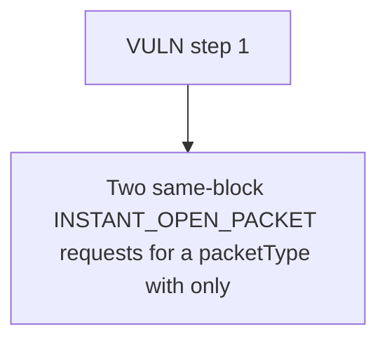

# RipIt: Two same-block INSTANT_OPEN_PACKET requests for a packetType with only 1 bundle both pass 

> **Vulnerability classes:** vuln/locked-funds
>
> **Reproduction:** a faithful minimal reproduction of the vulnerable finding — the vulnerable function is reproduced **verbatim** (marked `@>`) with faithful minimal doubles; local deploy, no fork.

<!-- source-auditvault: https://github.com/Auditware/AuditVault/blob/main/findings/62539-h-02-insufficient-restrictions-in-instantopenpacket-risk-dos.md -->

## Root cause

Two same-block INSTANT_OPEN_PACKET requests for a packetType with only 1 bundle both pass the request-time check; the first VRF fulfillment pops the bundle and serves user1, but user2's fulfillRandomWords reverts (NoAvailableCardBundles) and, per Chainlink's no-retry-on-revert semantics, user2's packet is permanently stuck/unopenable (1 locked Packet NFT frozen).

```solidity
    function instantOpenPacket(uint256 packetId, uint256 packetType, address owner) external {
        if (msg.sender != packetNFTAddress) revert UnauthorizedCaller();

        if (packetTypeToCardBundles[packetType].length == 0) revert InsufficientCardBundles(); // @> request-time check does NOT reserve/decrement a bundle: two same-block requests both pass while only one bundle exists (TOCTOU DoS)

        // Request randomness from Chainlink VRF
```

## Why it's exploitable here

Two same-block INSTANT_OPEN_PACKET requests for a packetType with only 1 bundle both pass the request-time check; the first VRF fulfillment pops the bundle and serves user1, but user2's fulfillRandomWords reverts (NoAvailableCardBundles) and, per Chainlink's no-retry-on-revert semantics, user2's packet is permanently stuck/unopenable (1 locked Packet NFT frozen).

## Attack path



## Marked-line walkthrough (Playground)

The EVM Playground pins each step to the exact executed source line in `0xce01759b82…`:

1. **L137** — VULN step 1: request-time check does NOT reserve/decrement a bundle: two same-block requests both pass while only one bundle exists (TOCTOU DoS)

## PoC

Registry (Foundry, local deploy — verbatim vulnerable source + harm-asserting test + negative control):

```bash
cd 62539-h-02-insufficient-restrictions-in-instantopenpacket-risk-dos_exp
forge test -vvv
```

The browser Playground replays the same synthetic opcode-for-opcode and measures the harm: **Two same-block INSTANT_OPEN_PACKET requests for a packetType with only 1 bundle both pass the request-time check; the first VRF fulfillment **. Both gates are green (registry `forge test` PASS + Playground `_verify-poc` **VERDICT: PASS**).
