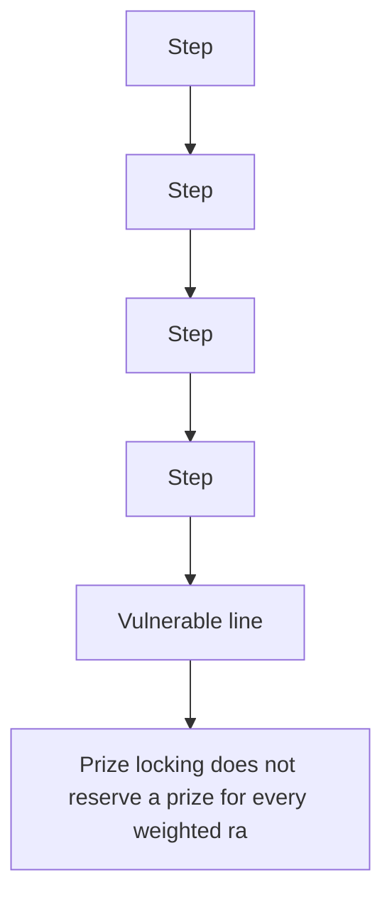

# SpinLottery: prize-lock/weight mismatch bricks higher-rarity spins

> **Vulnerability classes:** vuln/logic
>
> **Reproduction:** a faithful minimal reproduction of the vulnerable finding — the vulnerable code is reproduced **verbatim** (marked `@>`) with faithful minimal doubles; local deploy, no fork.

<!-- source-auditvault: https://github.com/pashov/audits/blob/master/team/md/[[RipIt]]-security-review_2025-04-25.md -->

## Root cause

Prize locking does not reserve a prize for every weighted rarity, so a spin whose VRF value maps to a higher rarity with no locked prize reverts in fulfillRandomness - the user's paid spinCost is permanently stuck (DoS).

```solidity
        // Iterate through rarities to find where the random value lands
        for (uint8 i = 1; i <= maxRarityId; i++) {
            RarityConfig memory config = rarityConfigs[i];
            if (config.active) {
                cumulativeWeight += config.weight; // @> VULN (this line)
```

## Why it's exploitable here

Prize locking does not reserve a prize for every weighted rarity, so a spin whose VRF value maps to a higher rarity with no locked prize reverts in fulfillRandomness - the user's paid spinCost is permanently stuck (DoS).

## Attack path



## Marked-line walkthrough (Playground)

The EVM Playground pins each step to the exact executed source line in `0x671d353a77…`:

1. **L67** — Step: Executes `function setRarity(uint8 id, bool active, uint128 basePrice, uint256 weight) external {`
2. **L84** — Step: Executes `for (uint8 i = 1; i <= maxRarityId; i++) {`
3. **L91** — Step: Executes `if (totalRarityWeight == 0) revert InvalidWeightConfiguration();`
4. **L103** — Step: Executes `for (uint8 i = 1; i <= maxRarityId; i++) {`
5. **L106** — Vulnerable line: Executes `cumulativeWeight += config.weight;`
6. **L123** — Step: Executes `lockedPrizes[i] += 1;`
7. **L134** — Step: Executes `lockedPrizes[rarity] -= 1;`

## PoC

Registry (Foundry, local deploy — verbatim vulnerable source + harm-asserting test):

```bash
cd 62540-h-03-prize-locking-mechanism-inconsistency-with-weight-propo_exp
forge test -vvv
```

The browser Playground replays the same synthetic opcode-for-opcode and measures the harm. Both gates are green (registry `forge test` PASS + Playground `_verify-poc` **VERDICT: PASS**).
