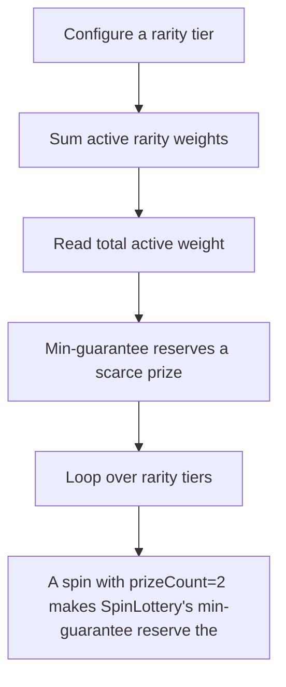

# RipIt: A spin with prizeCount=2 makes SpinLottery's min-guarantee reserve the lone scarce high-ra

> **Vulnerability classes:** vuln/locked-funds
>
> **Reproduction:** a faithful minimal reproduction of the vulnerable finding — the vulnerable function is reproduced **verbatim** (marked `@>`) with faithful minimal doubles; local deploy, no fork.

<!-- source-auditvault: https://github.com/Auditware/AuditVault/blob/main/findings/62541-h-04-dos-risk-from-pending-prize-locking-mechanism-pashov-au.md -->

## Root cause

A spin with prizeCount=2 makes SpinLottery's min-guarantee reserve the lone scarce high-rarity prize (whose weighted allocation is 0), locking the whole supply as pending so every subsequent user's spin reverts InsufficientPrizes — a temporary DoS; 1 scarce prize is marked locked to the SINK and UserB's spin actually reverts, while deleting the min-guarantee line lets UserB spin succeed.

```solidity
        uint256 pendingCount = (_prizeCount * weight) / totalWeight;

        // Ensure at least some prizes are allocated if weights allow it
        if (_prizeCount > 1 && pendingCount == 0 && weight > 0) { // @> min-guarantee reserves a scarce prize even when the weighted allocation is 0 -> locks the whole scarce supply
            pendingCount = 1;
        }
```

## Why it's exploitable here

A spin with prizeCount=2 makes SpinLottery's min-guarantee reserve the lone scarce high-rarity prize (whose weighted allocation is 0), locking the whole supply as pending so every subsequent user's spin reverts InsufficientPrizes — a temporary DoS; 1 scarce prize is marked locked to the SINK and UserB's spin actually reverts, while deleting the min-guarantee line lets UserB spin succeed.

## Attack path



## Marked-line walkthrough (Playground)

The EVM Playground pins each step to the exact executed source line in `0x8ea53755a6…`:

1. **L78** — Configure a rarity tier: Setup: admin sets a rarity's weight, price, and prize supply — the scarce high-rarity tier gets very few prizes.
2. **L94** — Sum active rarity weights: Setup: helper that totals the weights of all active rarities, used to size each spin's allocation.
3. **L111** — Read total active weight: Caches the summed active weight before computing how many prizes each rarity should reserve for this spin.
4. **L115** — Min-guarantee reserves a scarce prize: Root-cause: this min-guarantee force-reserves 1 prize whenever a weighted allocation rounds to 0, locking the lone scarce prize's whole supply as pending.
5. **L126** — Loop over rarity tiers: Iterates every rarity tier to accumulate the reservations computed above.
6. **L135** — Check tier has reservations: Gates the commit on tiers that actually reserved prizes this spin.
7. **L149** — Commit reserved pending counts: Adds the reserved amounts into each pool's `pendingCount`; the force-reserved scarce prize now sits locked, so later spins revert InsufficientPrizes.

## PoC

Registry (Foundry, local deploy — verbatim vulnerable source + harm-asserting test + negative control):

```bash
cd 62541-h-04-dos-risk-from-pending-prize-locking-mechanism-pashov-au_exp
forge test -vvv
```

The browser Playground replays the same synthetic opcode-for-opcode and measures the harm: **A spin with prizeCount=2 makes SpinLottery's min-guarantee reserve the lone scarce high-rarity prize (whose weighted allocation is 0), locki**. Both gates are green (registry `forge test` PASS + Playground `_verify-poc` **VERDICT: PASS**).
