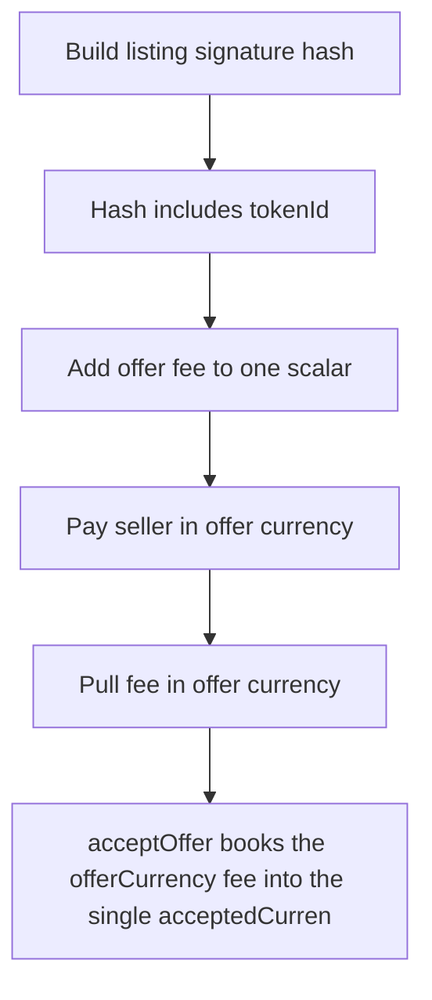

# RipIt: acceptOffer books the offerCurrency fee into the single acceptedCurrency-denominated total

> **Vulnerability classes:** vuln/locked-funds · vuln/unfair-mint · vuln/reward-accounting
>
> **Reproduction:** a faithful minimal reproduction of the vulnerable finding — the vulnerable function is reproduced **verbatim** (marked `@>`) with faithful minimal doubles; local deploy, no fork.

<!-- source-auditvault: https://github.com/Auditware/AuditVault/blob/main/findings/62542-h-05-currency-validation-missing-in-listing-and-offer-reques.md -->

## Root cause

acceptOffer books the offerCurrency fee into the single acceptedCurrency-denominated totalPendingFees scalar; an attacker offer in a worthless token inflates totalPendingFees to 2F while only F of real USDC is held, so emergencyShutdown (the only fee-withdrawal path) permanently reverts and the real F of USDC fees is locked.

```solidity
            uint256 sellerAmount = price - feeAmount;

            // Update state before external calls
            totalPendingFees += feeAmount; // @> fee booked into the single acceptedCurrency-denominated scalar while it is actually collected in offerCurrency below (no offerCurrency==acceptedCurrency check) -> phantom, unbacked fees
            // External calls after state changes
            IERC20(offers[i].request.offerCurrency).transferFrom(offers[i].request.requester, offers[i].receiver, sellerAmount);
```

## Why it's exploitable here

acceptOffer books the offerCurrency fee into the single acceptedCurrency-denominated totalPendingFees scalar; an attacker offer in a worthless token inflates totalPendingFees to 2F while only F of real USDC is held, so emergencyShutdown (the only fee-withdrawal path) permanently reverts and the real F of USDC fees is locked.

## Attack path



## Marked-line walkthrough (Playground)

The EVM Playground pins each step to the exact executed source line in `0xce01759b82…`:

1. **L158** — Build listing signature hash: Setup: pure helper that hashes a listing request for signature checks — unrelated to the fee-accounting bug.
2. **L162** — Hash includes tokenId: Setup: `tokenId` is one of the fields folded into the listing signature hash.
3. **L228** — Add offer fee to one scalar: Root-cause: the offer's fee (in arbitrary `offerCurrency`) is added to the single acceptedCurrency-denominated `totalPendingFees`, with no currency validation.
4. **L230** — Pay seller in offer currency: Transfers the sale amount to the seller in the buyer-chosen `offerCurrency`, which can be a worthless token.
5. **L231** — Pull fee in offer currency: Pulls the fee into the contract in `offerCurrency`, so a worthless-token fee counts toward `totalPendingFees` but holds no real value.
6. **L236** — Only fee-withdrawal path: The sole path that pays out accrued fees; it must move `totalPendingFees` worth of the real acceptedCurrency.
7. **L245** — Reset accepted currency: Would clear `acceptedCurrency` on shutdown, but the inflated `totalPendingFees` makes the preceding real-USDC transfer revert, locking the fees.

## PoC

Registry (Foundry, local deploy — verbatim vulnerable source + harm-asserting test + negative control):

```bash
cd 62542-h-05-currency-validation-missing-in-listing-and-offer-reques_exp
forge test -vvv
```

The browser Playground replays the same synthetic opcode-for-opcode and measures the harm: **acceptOffer books the offerCurrency fee into the single acceptedCurrency-denominated totalPendingFees scalar; an attacker offer in a worthle**. Both gates are green (registry `forge test` PASS + Playground `_verify-poc` **VERDICT: PASS**).
