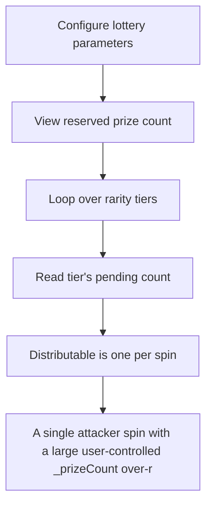

# RipIt: A single attacker spin with a large user-controlled _prizeCount over-reserves the entire p

> **Vulnerability classes:** vuln/locked-funds · vuln/unfair-mint
>
> **Reproduction:** a faithful minimal reproduction of the vulnerable finding — the vulnerable function is reproduced **verbatim** (marked `@>`) with faithful minimal doubles; local deploy, no fork.

<!-- source-auditvault: https://github.com/Auditware/AuditVault/blob/main/findings/62543-h-06-incorrect-pendingcounts-calculation-pashov-audit-group.md -->

## Root cause

A single attacker spin with a large user-controlled _prizeCount over-reserves the entire prize pool (prizePools[rarity].pendingCount inflated to == available), so a legitimate victim's spin(_,1) reverts InsufficientPrizes even though all prizes physically remain — a liveness DoS; over-reservation delta = reserved(3) − distributable-per-spin(1) = 2 prizes.

```solidity
        if (!rarityConfigs[rarity].active) return 0;

        uint256 weight = rarityConfigs[rarity].weight;
        uint256 pendingCount = (_prizeCount * weight) / totalRarityWeight; // @> user-controlled _prizeCount scales the reservation; a spin only ever distributes 1 prize

        if (_prizeCount > 1 && pendingCount == 0 && weight > 0) {
```

## Why it's exploitable here

A single attacker spin with a large user-controlled _prizeCount over-reserves the entire prize pool (prizePools[rarity].pendingCount inflated to == available), so a legitimate victim's spin(_,1) reverts InsufficientPrizes even though all prizes physically remain — a liveness DoS; over-reservation delta = reserved(3) − distributable-per-spin(1) = 2 prizes.

## Attack path



## Marked-line walkthrough (Playground)

The EVM Playground pins each step to the exact executed source line in `0x8ea53755a6…`:

1. **L99** — Configure lottery parameters: Setup: sets max rarity, total weight, available prizes, and per-tier weight for the harness.
2. **L114** — View reserved prize count: Setup: view returning how many prizes a rarity currently has reserved as pending.
3. **L127** — Loop over rarity tiers: Iterates rarity tiers to tally reservations across the prize pools.
4. **L138** — Read tier's pending count: Loads a rarity's current pending (reserved) count, which the attacker's spin will inflate to the full supply.
5. **L154** — Distributable is one per spin: A spin can actually hand out at most 1 prize — the mismatch against a large reservation is what causes over-reservation.
6. **L160** — Reserve scales with user _prizeCount: Root-cause: reservation scales with attacker-controlled `_prizeCount`, so a large value reserves the whole pool while only 1 prize is distributable per spin.
7. **L162** — Min-guarantee branch: The min-guarantee fallback reserves 1 when the weighted allocation rounds to 0, compounding the over-reservation from the line above.

## PoC

Registry (Foundry, local deploy — verbatim vulnerable source + harm-asserting test + negative control):

```bash
cd 62543-h-06-incorrect-pendingcounts-calculation-pashov-audit-group_exp
forge test -vvv
```

The browser Playground replays the same synthetic opcode-for-opcode and measures the harm: **A single attacker spin with a large user-controlled _prizeCount over-reserves the entire prize pool (prizePools[rarity].pendingCount inflate**. Both gates are green (registry `forge test` PASS + Playground `_verify-poc` **VERDICT: PASS**).
