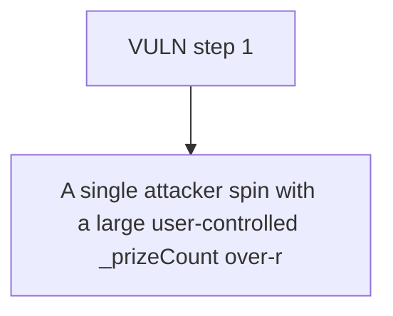

# RipIt: A single attacker spin with a large user-controlled _prizeCount over-reserves the entire p

> **Vulnerability classes:** vuln/locked-funds · vuln/unfair-mint
>
> **Reproduction:** a faithful minimal reproduction of the vulnerable finding — the vulnerable function is reproduced **verbatim** (marked `@>`) with faithful minimal doubles; local deploy, no fork.

<!-- source-auditvault: https://github.com/Auditware/AuditVault/blob/main/findings/62543-h-06-incorrect-pendingcounts-calculation-pashov-audit-group.md -->

## Root cause

A single attacker spin with a large user-controlled _prizeCount over-reserves the entire prize pool (prizePools[rarity].pendingCount inflated to == available), so a legitimate victim's spin(_,1) reverts InsufficientPrizes even though all prizes physically remain — a liveness DoS; over-reservation delta = reserved(3) − distributable-per-spin(1) = 2 prizes.

```solidity
        if (!rarityConfigs[rarity].active) return 0;

        uint256 weight = rarityConfigs[rarity].weight;
        uint256 pendingCount = (_prizeCount * weight) / totalRarityWeight; // @> user-controlled _prizeCount scales the reservation; a spin only ever distributes 1 prize

        if (_prizeCount > 1 && pendingCount == 0 && weight > 0) {
```

## Why it's exploitable here

A single attacker spin with a large user-controlled _prizeCount over-reserves the entire prize pool (prizePools[rarity].pendingCount inflated to == available), so a legitimate victim's spin(_,1) reverts InsufficientPrizes even though all prizes physically remain — a liveness DoS; over-reservation delta = reserved(3) − distributable-per-spin(1) = 2 prizes.

## Attack path



## Marked-line walkthrough (Playground)

The EVM Playground pins each step to the exact executed source line in `0x8ea53755a6…`:

1. **L160** — VULN step 1: user-controlled _prizeCount scales the reservation; a spin only ever distributes 1 prize

## PoC

Registry (Foundry, local deploy — verbatim vulnerable source + harm-asserting test + negative control):

```bash
cd 62543-h-06-incorrect-pendingcounts-calculation-pashov-audit-group_exp
forge test -vvv
```

The browser Playground replays the same synthetic opcode-for-opcode and measures the harm: **A single attacker spin with a large user-controlled _prizeCount over-reserves the entire prize pool (prizePools[rarity].pendingCount inflate**. Both gates are green (registry `forge test` PASS + Playground `_verify-poc` **VERDICT: PASS**).
