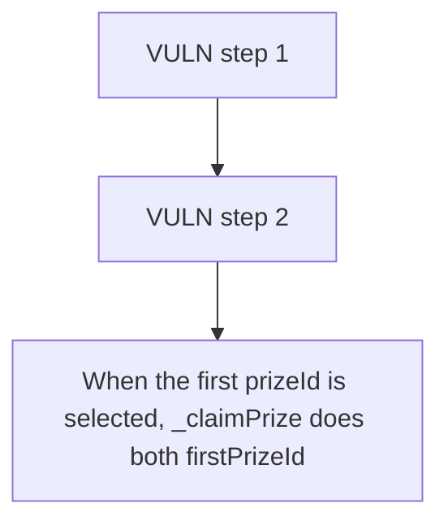

# RipIt: When the first prizeId is selected

> **Vulnerability classes:** vuln/locked-funds
>
> **Reproduction:** a faithful minimal reproduction of the vulnerable finding — the vulnerable function is reproduced **verbatim** (marked `@>`) with faithful minimal doubles; local deploy, no fork.

<!-- source-auditvault: https://github.com/Auditware/AuditVault/blob/main/findings/62544-h-07-spinlottery-will-break-if-the-first-prizeid-is-selected.md -->

## Root cause

When the first prizeId is selected, _claimPrize does both firstPrizeId++ and nextPrizeId--, collapsing a 2-prize window to 0 after one claim; the moved survivor and its escrowed NFT are permanently stranded (next spin reverts NoPrizesAvailable), vs the fixed variant which claims both prizes.

```solidity
        }

        // If we've removed the first prize, increment firstPrizeId
        if (prizeId == pool.firstPrizeId) {
            pool.firstPrizeId++; // @> BUG: with nextPrizeId-- below, the window shrinks by 2 not 1; the moved survivor at the freed slot falls below firstPrizeId and is stranded forever
        }
```

## Why it's exploitable here

When the first prizeId is selected, _claimPrize does both firstPrizeId++ and nextPrizeId--, collapsing a 2-prize window to 0 after one claim; the moved survivor and its escrowed NFT are permanently stranded (next spin reverts NoPrizesAvailable), vs the fixed variant which claims both prizes.

## Attack path



## Marked-line walkthrough (Playground)

The EVM Playground pins each step to the exact executed source line in `0x671d353a77…`:

1. **L144** — VULN step 1: BUG: with nextPrizeId-- below, the window shrinks by 2 not 1; the moved survivor at the freed slot falls below firstPrizeId and is stranded forever
2. **L145** — VULN step 2: BUG: with nextPrizeId-- below, the window shrinks by 2 not 1; the moved survivor at the freed slot falls below firstPrizeId and is stranded forever

## PoC

Registry (Foundry, local deploy — verbatim vulnerable source + harm-asserting test + negative control):

```bash
cd 62544-h-07-spinlottery-will-break-if-the-first-prizeid-is-selected_exp
forge test -vvv
```

The browser Playground replays the same synthetic opcode-for-opcode and measures the harm: **When the first prizeId is selected, _claimPrize does both firstPrizeId++ and nextPrizeId--, collapsing a 2-prize window to 0 after one claim**. Both gates are green (registry `forge test` PASS + Playground `_verify-poc` **VERDICT: PASS**).
