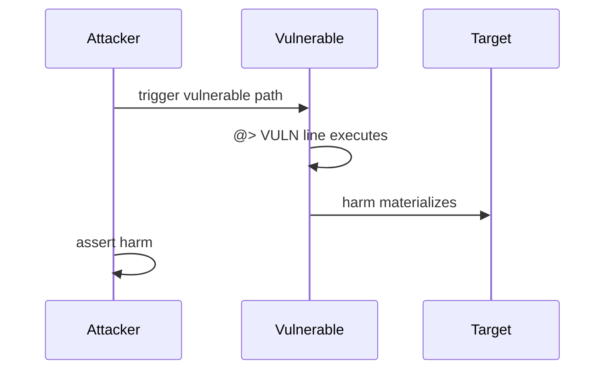

# C-02: Missing packet ID in finalizeOpen causes NFT loss

<!-- non-defihacklabs -->
<!-- source-auditvault: https://github.com/Auditware/AuditVault/blob/main/findings/62593-c-02-missing-packet-id-in-finalizeopen-causes-nft-loss-pasho.md -->
<!-- date: 2025-05 -->

| Field | Value |
|-------|-------|
| Protocol | RipIt |
| Severity | high |
| Source | AuditVault / https://github.com/pashov/audits/blob/master/team/md/RipIt-security-review_2025-05-10.md |
| Harm | Packet NFT stuck in contract; INSTANT_OPEN reverts; user loses NFT with no cards |

## TL;DR

Packet NFT stuck in contract; INSTANT_OPEN reverts; user loses NFT with no cards

## Vulnerable code

See the synthetic reproduction in `test/62593-c-02-missing-packet-id-in-finalizeopen-causes-nft-loss-pasho.sol` — the blamed line is marked `// @> VULN`.

## Root cause

Faithful reduction of the AuditVault finding. The vulnerable line is preserved so the Playground locator points at the real bug, not scaffolding.

## Attack walkthrough

1. Deploy the reduced protocol pieces via the `Exploit` constructor.
2. `run()` performs the attack end-to-end and `require`s the harm.

## Diagrams

## Impact

Packet NFT stuck in contract; INSTANT_OPEN reverts; user loses NFT with no cards

## Taxonomy

- severity/high
- sector/nft
- platform/auditvault

## Sources

- AuditVault finding: https://github.com/Auditware/AuditVault/blob/main/findings/62593-c-02-missing-packet-id-in-finalizeopen-causes-nft-loss-pasho.md
- Original report: https://github.com/pashov/audits/blob/master/team/md/RipIt-security-review_2025-05-10.md
- Reduced from: pashov/audits RipIt-security-review_2025-05-10 (Packet.finalizeOpen)
