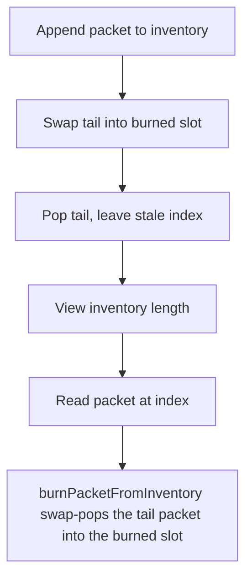

# RipIt: burnPacketFromInventory swap-pops the tail packet into the burned slot but never updates t

> **Vulnerability classes:** vuln/locked-funds
>
> **Reproduction:** a faithful minimal reproduction of the vulnerable finding — the vulnerable function is reproduced **verbatim** (marked `@>`) with faithful minimal doubles; local deploy, no fork.

<!-- source-auditvault: https://github.com/Auditware/AuditVault/blob/main/findings/62594-h-01-missing-index-updates-in-burnpacketfrominventory-cause.md -->

## Root cause

burnPacketFromInventory swap-pops the tail packet into the burned slot but never updates the moved packet's _packetInventoryIdx, so a later burn of that moved packet reads a stale out-of-bounds index and reverts with Panic(0x32) — the packet becomes permanently unremovable (inventory DoS).

```solidity
        uint256 idx = _packetInventoryIdx[packetId];

        _packetInventory[packetTypeId][idx] = _packetInventory[packetTypeId][_packetInventory[packetTypeId].length - 1];
        _packetInventory[packetTypeId].pop(); // @> swap-pop removes the entry but never sets _packetInventoryIdx[movedPacket]=idx nor deletes _packetInventoryIdx[packetId] — the moved packet's index goes stale (OOB)
    }

```

## Why it's exploitable here

burnPacketFromInventory swap-pops the tail packet into the burned slot but never updates the moved packet's _packetInventoryIdx, so a later burn of that moved packet reads a stale out-of-bounds index and reverts with Panic(0x32) — the packet becomes permanently unremovable (inventory DoS).

## Attack path



## Marked-line walkthrough (Playground)

The EVM Playground pins each step to the exact executed source line in `0x8ea53755a6…`:

1. **L69** — Append packet to inventory: Setup: `push` adds a newly-minted packet id to the type's inventory array.
2. **L78** — Swap tail into burned slot: Overwrites the burned packet's slot with the array's last element — the swap half of a swap-and-pop removal.
3. **L79** — Pop tail, leave stale index: Root-cause bug: `pop()` drops the tail but the moved packet's `_packetInventoryIdx` is never updated, so its stored index is now stale/out-of-bounds.
4. **L83** — View inventory length: `inventoryLength` returns the current packet count — used to bound later index reads.
5. **L87** — Read packet at index: `inventoryAt` returns the packet id stored at a given array position.
6. **L91** — Look up a packet's stored index: `idxOf` returns the packet's cached `_packetInventoryIdx` — the very value left stale after the swap-pop, causing the later out-of-bounds burn.
7. **L100** — Packet type constant: Setup: fixes `packetTypeId` to 1 for this demo inventory.

## PoC

Registry (Foundry, local deploy — verbatim vulnerable source + harm-asserting test + negative control):

```bash
cd 62594-h-01-missing-index-updates-in-burnpacketfrominventory-cause_exp
forge test -vvv
```

The browser Playground replays the same synthetic opcode-for-opcode and measures the harm: **burnPacketFromInventory swap-pops the tail packet into the burned slot but never updates the moved packet's _packetInventoryIdx, so a later **. Both gates are green (registry `forge test` PASS + Playground `_verify-poc` **VERDICT: PASS**).
