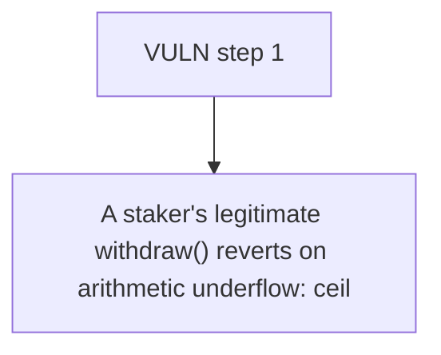

# Terplayer: A staker's legitimate withdraw() reverts on arithmetic underflow: ceiling-division delegat

> **Vulnerability classes:** vuln/locked-funds
>
> **Reproduction:** a faithful minimal reproduction of the vulnerable finding — the vulnerable function is reproduced **verbatim** (marked `@>`) with faithful minimal doubles; local deploy, no fork.

<!-- source-auditvault: https://github.com/Auditware/AuditVault/blob/main/findings/62638-c-01-withdrawal-calculation-causes-underflow-locking-all-use.md -->

## Root cause

A staker's legitimate withdraw() reverts on arithmetic underflow: ceiling-division delegated shares over-count so totalDelegatedAmount exceeds amount and remainingAmount = amount - totalDelegatedAmount underflows (Panic 0x11), permanently locking the staked position (2 BVT blocked here) behind a reverting withdraw.

```solidity
            address user = users[i];
            uint256 delegatedAmount = delegatedStakes[msg.sender][user];
            if (delegatedAmount > 0) {
                uint256 withdrawAmount = (delegatedAmount * amount + stakes[msg.sender] - 1)  / stakes[msg.sender]; // @> ceiling division: every per-delegatee term rounds UP, so the sum overshoots `amount`
                if (withdrawAmount > 0) {
                    totalDelegatedAmount += withdrawAmount;
```

## Why it's exploitable here

A staker's legitimate withdraw() reverts on arithmetic underflow: ceiling-division delegated shares over-count so totalDelegatedAmount exceeds amount and remainingAmount = amount - totalDelegatedAmount underflows (Panic 0x11), permanently locking the staked position (2 BVT blocked here) behind a reverting withdraw.

## Attack path



## Marked-line walkthrough (Playground)

The EVM Playground pins each step to the exact executed source line in `0x671d353a77…`:

1. **L115** — VULN step 1: ceiling division: every per-delegatee term rounds UP, so the sum overshoots `amount`

## PoC

Registry (Foundry, local deploy — verbatim vulnerable source + harm-asserting test + negative control):

```bash
cd 62638-c-01-withdrawal-calculation-causes-underflow-locking-all-use_exp
forge test -vvv
```

The browser Playground replays the same synthetic opcode-for-opcode and measures the harm: **A staker's legitimate withdraw() reverts on arithmetic underflow: ceiling-division delegated shares over-count so totalDelegatedAmount excee**. Both gates are green (registry `forge test` PASS + Playground `_verify-poc` **VERDICT: PASS**).
