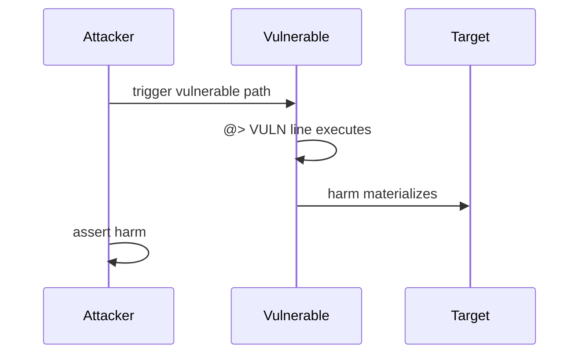

# Chat points manipulation via custom Uniswap V4 pools

<!-- non-defihacklabs -->
<!-- source-auditvault: https://github.com/Auditware/AuditVault/blob/main/findings/62647-chat-points-manipulation-by-adding-liquidity-to-custom-pools.md -->
<!-- date: 2025-05 -->

| Field | Value |
|-------|-------|
| Protocol | Semantic Layer |
| Severity | high |
| Source | AuditVault / https://github.com/spearbit/portfolio/blob/master/pdfs/Semantic-Layer-Spearbit-Security-Review-May-2025.pdf |
| Harm | Full chat points for ~1% capital via unvalidated custom pool key |

## TL;DR

Full chat points for ~1% capital via unvalidated custom pool key

## Vulnerable code

See the synthetic reproduction in `test/62647-chat-points-manipulation-by-adding-liquidity-to-custom-pools.sol` — the blamed line is marked `// @> VULN`.

## Root cause

Faithful reduction of the AuditVault finding. The vulnerable line is preserved so the Playground locator points at the real bug, not scaffolding.

## Attack walkthrough

1. Deploy the reduced protocol pieces via the `Exploit` constructor.
2. `run()` performs the attack end-to-end and `require`s the harm.

## Diagrams

## Impact

Full chat points for ~1% capital via unvalidated custom pool key

## Taxonomy

- severity/high
- sector/dex
- platform/auditvault

## Sources

- AuditVault finding: https://github.com/Auditware/AuditVault/blob/main/findings/62647-chat-points-manipulation-by-adding-liquidity-to-custom-pools.md
- Original report: https://github.com/spearbit/portfolio/blob/master/pdfs/Semantic-Layer-Spearbit-Security-Review-May-2025.pdf
- Reduced from: Spearbit Semantic Layer May 2025 (SVFHook.addLiquidity)
