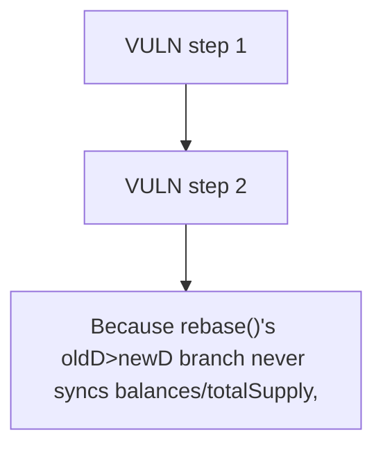

# NUTS Finance: Because rebase()'s oldD>newD branch never syncs balances/totalSupply

> **Vulnerability classes:** vuln/theft · vuln/locked-funds · vuln/access-control
>
> **Reproduction:** a faithful minimal reproduction of the vulnerable finding — the vulnerable function is reproduced **verbatim** (marked `@>`) with faithful minimal doubles; local deploy, no fork.

<!-- source-auditvault: https://github.com/Auditware/AuditVault/blob/main/findings/62662-buffer-drainage-through-repeated-rebase-calls-due-to-stale-s.md -->

## Root cause

Because rebase()'s oldD>newD branch never syncs balances/totalSupply, 3 permissionless calls each recompute the same 100-unit gap and drain the poolToken buffer 3x (300 destroyed) vs 100 for one legitimate call — a value-destruction DoS of LP-holder-owned buffer value.

```solidity

        if (oldD == newD) {
            return 0;
        } else if (oldD > newD) {
            poolToken.removeTotalSupply(oldD - newD, true, true); // @> drains buffer but never updates `balances`/`totalSupply`, so the SAME gap re-triggers every call
            return 0;
```

## Why it's exploitable here

Because rebase()'s oldD>newD branch never syncs balances/totalSupply, 3 permissionless calls each recompute the same 100-unit gap and drain the poolToken buffer 3x (300 destroyed) vs 100 for one legitimate call — a value-destruction DoS of LP-holder-owned buffer value.

## Attack path



## Marked-line walkthrough (Playground)

The EVM Playground pins each step to the exact executed source line in `0xbd4fd5a3ce…`:

1. **L192** — VULN step 1: drains buffer but never updates `balances`/`totalSupply`, so the SAME gap re-triggers every call
2. **L194** — VULN step 2: drains buffer but never updates `balances`/`totalSupply`, so the SAME gap re-triggers every call

## PoC

Registry (Foundry, local deploy — verbatim vulnerable source + harm-asserting test + negative control):

```bash
cd 62662-buffer-drainage-through-repeated-rebase-calls-due-to-stale-s_exp
forge test -vvv
```

The browser Playground replays the same synthetic opcode-for-opcode and measures the harm: **Because rebase()'s oldD>newD branch never syncs balances/totalSupply, 3 permissionless calls each recompute the same 100-unit gap and drain **. Both gates are green (registry `forge test` PASS + Playground `_verify-poc` **VERDICT: PASS**).
