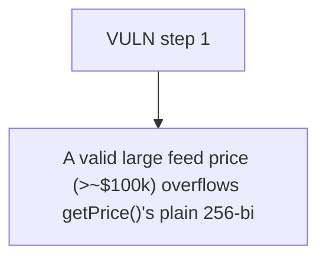

# NUTS Finance: A valid large feed price (>~$100k) overflows getPrice()'s plain 256-bit `compositePrice * 

> **Vulnerability classes:** vuln/locked-funds · vuln/reward-accounting · vuln/price
>
> **Reproduction:** a faithful minimal reproduction of the vulnerable finding — the vulnerable function is reproduced **verbatim** (marked `@>`) with faithful minimal doubles; local deploy, no fork.

<!-- source-auditvault: https://github.com/Auditware/AuditVault/blob/main/findings/62694-arithmetic-overflow-in-getprice-when-feeds-return-large-valu.md -->

## Root cause

A valid large feed price (>~$100k) overflows getPrice()'s plain 256-bit `compositePrice * rate` multiply, reverting permanently (Panic 0x11) and freezing every dependent market that must price or liquidate through the oracle — 1000e18 collateral locked in the demo LendingMarket.

```solidity
            (, int256 price,,,) = feed.latestRoundData();
            uint256 rate = uint256(price)
                * 10**(SCALING_DECIMALS - feed.decimals());
            compositePrice = (compositePrice * rate) // @> plain 256-bit multiply: `compositePrice * rate` overflows and reverts once a feed reports a large-but-valid price (> ~$100k), permanently bricking the oracle
                / SCALING_FACTOR; // 36-dec fixed-point
        }
```

## Why it's exploitable here

A valid large feed price (>~$100k) overflows getPrice()'s plain 256-bit `compositePrice * rate` multiply, reverting permanently (Panic 0x11) and freezing every dependent market that must price or liquidate through the oracle — 1000e18 collateral locked in the demo LendingMarket.

## Attack path



## Marked-line walkthrough (Playground)

The EVM Playground pins each step to the exact executed source line in `0xce01759b82…`:

1. **L172** — VULN step 1: plain 256-bit multiply: `compositePrice * rate` overflows and reverts once a feed reports a large-but-valid price (> ~$100k), permanently bricking the oracle

## PoC

Registry (Foundry, local deploy — verbatim vulnerable source + harm-asserting test + negative control):

```bash
cd 62694-arithmetic-overflow-in-getprice-when-feeds-return-large-valu_exp
forge test -vvv
```

The browser Playground replays the same synthetic opcode-for-opcode and measures the harm: **A valid large feed price (>~$100k) overflows getPrice()'s plain 256-bit `compositePrice * rate` multiply, reverting permanently (Panic 0x11)**. Both gates are green (registry `forge test` PASS + Playground `_verify-poc` **VERDICT: PASS**).
