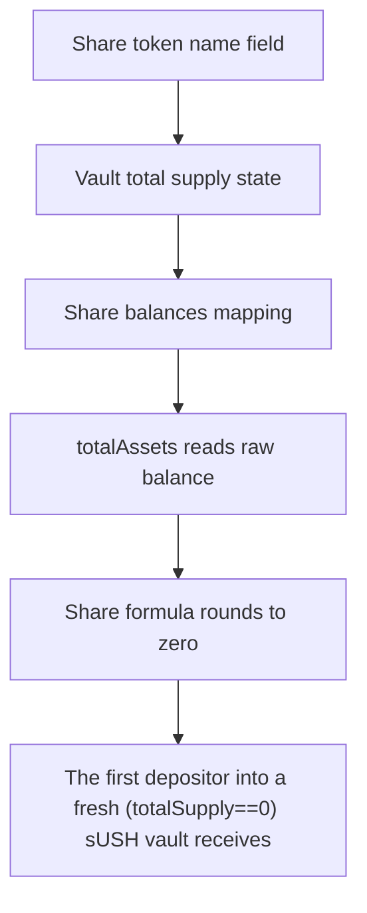

# ManifestFinance: The first depositor into a fresh (totalSupply==0) sUSH vault receives 0 shares for a posit

> **Vulnerability classes:** vuln/locked-funds
>
> **Reproduction:** a faithful minimal reproduction of the vulnerable finding — the vulnerable function is reproduced **verbatim** (marked `@>`) with faithful minimal doubles; local deploy, no fork.

<!-- source-auditvault: https://github.com/Auditware/AuditVault/blob/main/findings/62715-c-01-first-deposit-can-result-in-zero-shares-due-to-direct-t.md -->

## Root cause

The first depositor into a fresh (totalSupply==0) sUSH vault receives 0 shares for a positive 100 USH deposit after an attacker directly transfers 100 USH into the empty vault, so the victim's 100 USH is pulled in against 0 shares and permanently locked.

```solidity
    }

    function _convertToShares(uint256 assets) internal view returns (uint256 shares) {
        shares = Math.mulDiv(assets, totalSupply + 10 ** decimalsOffset, totalAssets() + 1); // @> shares = assets*(totalSupply+decimalsOffset)/(totalAssets+1): a direct USH transfer inflates totalAssets() so the first depositor floors to 0 shares
    }

```

## Why it's exploitable here

The first depositor into a fresh (totalSupply==0) sUSH vault receives 0 shares for a positive 100 USH deposit after an attacker directly transfers 100 USH into the empty vault, so the victim's 100 USH is pulled in against 0 shares and permanently locked.

## Attack path



## Marked-line walkthrough (Playground)

The EVM Playground pins each step to the exact executed source line in `0x671d353a77…`:

1. **L38** — Share token name field: Setup: declares the sUSH share token's `name` metadata.
2. **L41** — Vault total supply state: Setup: `totalSupply` is 0 on a fresh vault — the empty-state precondition the attack requires.
3. **L42** — Share balances mapping: Setup: `balanceOf` tracks each account's sUSH share holdings.
4. **L99** — totalAssets reads raw balance: `totalAssets()` returns the vault's live USH balance, so an attacker's direct token transfer inflates it with no shares minted.
5. **L103** — Share formula rounds to zero: Root-cause bug: with `totalSupply==0` and an attacker-donated USH balance inflating `totalAssets()`, `mulDiv` floors the victim's shares to 0.
6. **L111** — Deposit entrypoint: `deposit` pulls `assets` USH from the victim and mints the shares computed above — here 0, locking the funds.
7. **L127** — Underlying token balances mapping: Setup: another `balanceOf` mapping — this one on the USH token being deposited.

## PoC

Registry (Foundry, local deploy — verbatim vulnerable source + harm-asserting test + negative control):

```bash
cd 62715-c-01-first-deposit-can-result-in-zero-shares-due-to-direct-t_exp
forge test -vvv
```

The browser Playground replays the same synthetic opcode-for-opcode and measures the harm: **The first depositor into a fresh (totalSupply==0) sUSH vault receives 0 shares for a positive 100 USH deposit after an attacker directly tra**. Both gates are green (registry `forge test` PASS + Playground `_verify-poc` **VERDICT: PASS**).
