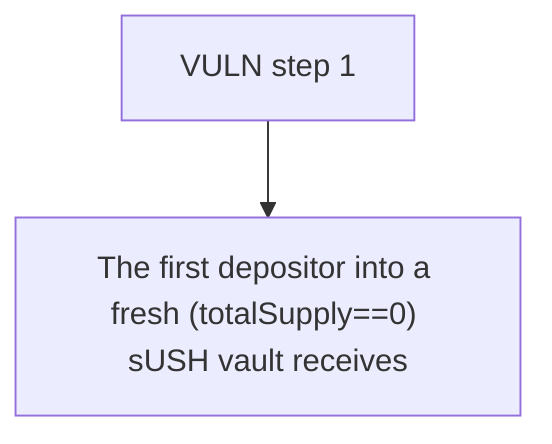

# ManifestFinance: The first depositor into a fresh (totalSupply==0) sUSH vault receives 0 shares for a posit

> **Vulnerability classes:** vuln/locked-funds
>
> **Reproduction:** a faithful minimal reproduction of the vulnerable finding — the vulnerable function is reproduced **verbatim** (marked `@>`) with faithful minimal doubles; local deploy, no fork.

<!-- source-auditvault: https://github.com/Auditware/AuditVault/blob/main/findings/62715-c-01-first-deposit-can-result-in-zero-shares-due-to-direct-t.md -->

## Root cause

The first depositor into a fresh (totalSupply==0) sUSH vault receives 0 shares for a positive 100 USH deposit after an attacker directly transfers 100 USH into the empty vault, so the victim's 100 USH is pulled in against 0 shares and permanently locked.

```solidity
    }

    function _convertToShares(uint256 assets) internal view returns (uint256 shares) {
        shares = Math.mulDiv(assets, totalSupply + 10 ** decimalsOffset, totalAssets() + 1); // @> shares = assets*(totalSupply+decimalsOffset)/(totalAssets+1): a direct USH transfer inflates totalAssets() so the first depositor floors to 0 shares
    }

```

## Why it's exploitable here

The first depositor into a fresh (totalSupply==0) sUSH vault receives 0 shares for a positive 100 USH deposit after an attacker directly transfers 100 USH into the empty vault, so the victim's 100 USH is pulled in against 0 shares and permanently locked.

## Attack path



## Marked-line walkthrough (Playground)

The EVM Playground pins each step to the exact executed source line in `0x671d353a77…`:

1. **L103** — VULN step 1: shares = assets*(totalSupply+decimalsOffset)/(totalAssets+1): a direct USH transfer inflates totalAssets() so the first depositor floors to 0 shares

## PoC

Registry (Foundry, local deploy — verbatim vulnerable source + harm-asserting test + negative control):

```bash
cd 62715-c-01-first-deposit-can-result-in-zero-shares-due-to-direct-t_exp
forge test -vvv
```

The browser Playground replays the same synthetic opcode-for-opcode and measures the harm: **The first depositor into a fresh (totalSupply==0) sUSH vault receives 0 shares for a positive 100 USH deposit after an attacker directly tra**. Both gates are green (registry `forge test` PASS + Playground `_verify-poc` **VERDICT: PASS**).
