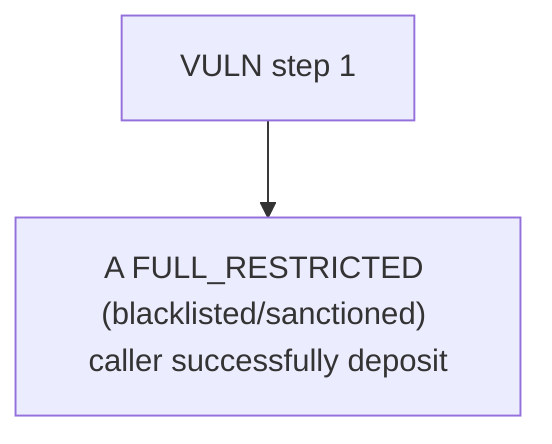

# ManifestFinance: A FULL_RESTRICTED (blacklisted/sanctioned) caller successfully deposits and mints 1000e18 

> **Vulnerability classes:** vuln/unfair-mint
>
> **Reproduction:** a faithful minimal reproduction of the vulnerable finding — the vulnerable function is reproduced **verbatim** (marked `@>`) with faithful minimal doubles; local deploy, no fork.

<!-- source-auditvault: https://github.com/Auditware/AuditVault/blob/main/findings/62716-h-01-full-restricted-users-can-still-deposit-kann-none-manif.md -->

## Root cause

A FULL_RESTRICTED (blacklisted/sanctioned) caller successfully deposits and mints 1000e18 vault shares to a clean receiver they control — a deposit that must revert with OperationNotAllowed instead succeeds, bypassing the compliance restriction; the fixed variant (caller-side FULL check) correctly reverts.

```solidity

    // ── VERBATIM from the finding ────────────────────────────────────────────
    function _update(address from, address to, uint256 value) internal override {
        if (hasRole(FULL_RESTRICTED_STAKER_ROLE, from) && to != address(0)) { // @> only `from`/`to` are gated; the mint path passes from=address(0), so a FULL_RESTRICTED msg.sender/caller is never checked → bypass
            revert OperationNotAllowed();
        }
```

## Why it's exploitable here

A FULL_RESTRICTED (blacklisted/sanctioned) caller successfully deposits and mints 1000e18 vault shares to a clean receiver they control — a deposit that must revert with OperationNotAllowed instead succeeds, bypassing the compliance restriction; the fixed variant (caller-side FULL check) correctly reverts.

## Attack path



## Marked-line walkthrough (Playground)

The EVM Playground pins each step to the exact executed source line in `0x671d353a77…`:

1. **L228** — VULN step 1: only `from`/`to` are gated; the mint path passes from=address(0), so a FULL_RESTRICTED msg.sender/caller is never checked → bypass

## PoC

Registry (Foundry, local deploy — verbatim vulnerable source + harm-asserting test + negative control):

```bash
cd 62716-h-01-full-restricted-users-can-still-deposit-kann-none-manif_exp
forge test -vvv
```

The browser Playground replays the same synthetic opcode-for-opcode and measures the harm: **A FULL_RESTRICTED (blacklisted/sanctioned) caller successfully deposits and mints 1000e18 vault shares to a clean receiver they control — a **. Both gates are green (registry `forge test` PASS + Playground `_verify-poc` **VERDICT: PASS**).
