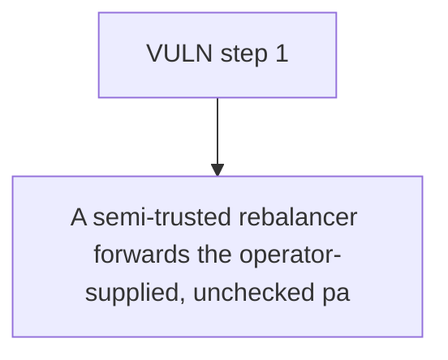

# Malda: A semi-trusted rebalancer forwards the operator-supplied

> **Vulnerability classes:** vuln/logic
>
> **Reproduction:** a faithful minimal reproduction of the vulnerable finding — the vulnerable function is reproduced **verbatim** (marked `@>`) with faithful minimal doubles; local deploy, no fork.

<!-- source-auditvault: https://github.com/Auditware/AuditVault/blob/main/findings/62723-h-1-rebalancer-can-steal-funds-from-markets-by-sending-to-cu.md -->

## Root cause

A semi-trusted rebalancer forwards the operator-supplied, unchecked params.receiver to Everclear's newIntent, so 1000e18 of market funds extracted for cross-chain rebalancing are delivered to the attacker's own address instead of the destination market.

```solidity
        SafeApprove.safeApprove(params.inputAsset, address(everclearFeeAdapter), params.amount);
        (bytes32 id,) = everclearFeeAdapter.newIntent(
            params.destinations,
            params.receiver, // @> attacker-controlled receiver forwarded UNCHECKED — market funds routed to the rebalancer's own address
            params.inputAsset,
            params.outputAsset,
```

## Why it's exploitable here

A semi-trusted rebalancer forwards the operator-supplied, unchecked params.receiver to Everclear's newIntent, so 1000e18 of market funds extracted for cross-chain rebalancing are delivered to the attacker's own address instead of the destination market.

## Attack path



## Marked-line walkthrough (Playground)

The EVM Playground pins each step to the exact executed source line in `0xbd4fd5a3ce…`:

1. **L329** — VULN step 1: attacker-controlled receiver forwarded UNCHECKED — market funds routed to the rebalancer's own address

## PoC

Registry (Foundry, local deploy — verbatim vulnerable source + harm-asserting test + negative control):

```bash
cd 62723-h-1-rebalancer-can-steal-funds-from-markets-by-sending-to-cu_exp
forge test -vvv
```

The browser Playground replays the same synthetic opcode-for-opcode and measures the harm: **A semi-trusted rebalancer forwards the operator-supplied, unchecked params.receiver to Everclear's newIntent, so 1000e18 of market funds ext**. Both gates are green (registry `forge test` PASS + Playground `_verify-poc` **VERDICT: PASS**).
