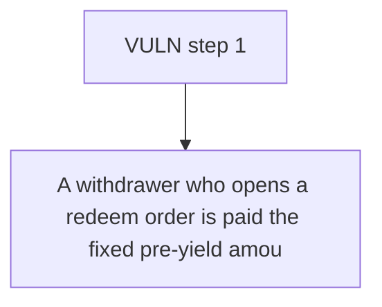

# YuzuUSD: A withdrawer who opens a redeem order is paid the fixed pre-yield amount (100e18) at final

> **Vulnerability classes:** vuln/logic
>
> **Reproduction:** a faithful minimal reproduction of the vulnerable finding — the vulnerable function is reproduced **verbatim** (marked `@>`) with faithful minimal doubles; local deploy, no fork.

<!-- source-auditvault: https://github.com/Auditware/AuditVault/blob/main/findings/62756-h-01-pending-withdrawals-in-yuzuilp-contract-are-not-conside.md -->

## Root cause

A withdrawer who opens a redeem order is paid the fixed pre-yield amount (100e18) at finalize, while their still-counted shares earned 50e18 of yield during the pending window; that 50e18 leaks to the remaining holder (B's redeemable rises 150e18->200e18), so the withdrawer loses their rightful pro-rata yield.

```solidity
            revert ExceededMaxRedeemOrder(owner, tokens, maxTokens);
        }

        uint256 assets = previewRedeemOrder(tokens); // @> asset value FIXED at current pre-yield price; the redeemed shares are NOT excluded from totalAssets()/totalSupply(), so they keep accruing yield the withdrawer never receives
        address caller = _msgSender();
        uint256 orderId = _createRedeemOrder(caller, receiver, owner, tokens, assets);
```

## Why it's exploitable here

A withdrawer who opens a redeem order is paid the fixed pre-yield amount (100e18) at finalize, while their still-counted shares earned 50e18 of yield during the pending window; that 50e18 leaks to the remaining holder (B's redeemable rises 150e18->200e18), so the withdrawer loses their rightful pro-rata yield.

## Attack path



## Marked-line walkthrough (Playground)

The EVM Playground pins each step to the exact executed source line in `0x671d353a77…`:

1. **L158** — VULN step 1: asset value FIXED at current pre-yield price; the redeemed shares are NOT excluded from totalAssets()/totalSupply(), so they keep accruing yield the withdrawer never receives

## PoC

Registry (Foundry, local deploy — verbatim vulnerable source + harm-asserting test + negative control):

```bash
cd 62756-h-01-pending-withdrawals-in-yuzuilp-contract-are-not-conside_exp
forge test -vvv
```

The browser Playground replays the same synthetic opcode-for-opcode and measures the harm: **A withdrawer who opens a redeem order is paid the fixed pre-yield amount (100e18) at finalize, while their still-counted shares earned 50e18**. Both gates are green (registry `forge test` PASS + Playground `_verify-poc` **VERDICT: PASS**).
