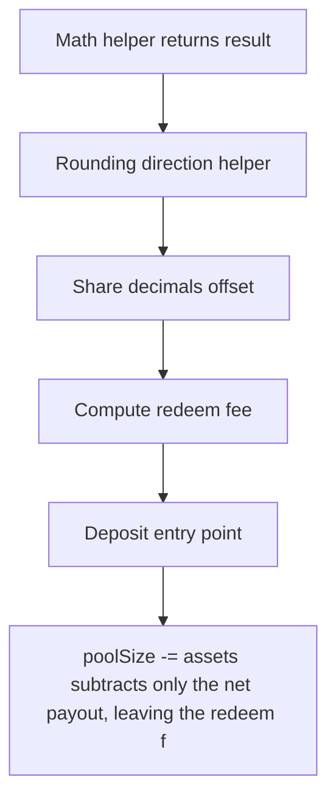

# YuzuUSD: Redeem fee left in poolSize inflates share price

> **Vulnerability classes:** vuln/unfair-mint · vuln/reward-accounting · vuln/price
>
> **Reproduction:** a faithful minimal reproduction of the vulnerable finding — the vulnerable function is reproduced **verbatim** (marked `@>`) with faithful minimal doubles; local deploy, no fork.

<!-- source-auditvault: https://github.com/Auditware/AuditVault/blob/main/findings/62758-h-03-fee-avoidance-possible-by-uncollected-fees-in-pool-acco.md -->

## Root cause

poolSize -= assets subtracts only the net payout, leaving the redeem fee in the pool; the escaped fee inflates the share price for remaining holders instead of going to the fee treasury — value silently redistributed rather than collected.

```solidity
    // ── verbatim YuzuILP._withdraw (the bug) followed by the flattened
    //    YuzuIssuer._withdraw body (burn shares, pay out the net `assets`). ──
    function _withdraw(address, address receiver, address owner, uint256 assets, uint256 shares) internal {
        poolSize -= assets; // @> BUG: only the NET payout leaves poolSize; the redeem fee stays in the pool and inflates share price for remaining holders
        // super._withdraw: burn the FULL share amount, transfer the NET assets out
        balanceOf[owner] -= shares;
```

## Why it's exploitable here

YuzuILP._withdraw subtracts only the net payout (gross minus redeem fee) from poolSize, so the fee stays in the pool and inflates share price for remaining holders; the second of two identical 100-yzUSD redeemers recovers a ~8.26 yzUSD windfall and pays a ~0.83% effective fee vs the first's ~9.09%, so ~8.26 yzUSD of redeem fees escape the protocol instead of being collected.

## Attack path



## Marked-line walkthrough (Playground)

The EVM Playground pins each step to the exact executed source line in `0x671d353a77…`:

1. **L54** — Math helper returns result: Setup: internal math library helper returning a computed value.
2. **L57** — Rounding direction helper: Setup: helper deciding whether a rounding mode rounds up.
3. **L128** — Share decimals offset: Setup: returns the vault's share/asset decimals offset used in conversions.
4. **L157** — Compute redeem fee: Computes the redeem fee taken out of a redemption amount.
5. **L169** — Deposit entry point: Setup: standard deposit function minting shares against incoming assets.
6. **L193** — Withdraw path (net payout): The withdraw core, where `assets` is the net payout after the redeem fee has already been deducted.
7. **L194** — Fee left in pool, not collected: Root cause: subtracts only the net payout from `poolSize`, so the redeem fee stays in the pool, inflating share price for holders instead of reaching the treasury.

## PoC

Registry (Foundry, local deploy — verbatim vulnerable source + harm-asserting test + negative control):

```bash
cd 62758-h-03-fee-avoidance-possible-by-uncollected-fees-in-pool-acco_exp
forge test -vvv
```

The browser Playground replays the same synthetic opcode-for-opcode and measures the harm: **YuzuILP._withdraw subtracts only the net payout (gross minus redeem fee) from poolSize, so the fee stays in the pool and inflates share price for remaining holders; the second of two identical 100-yzUSD redeemers recovers a ~8.26 yzUSD windfall and pays a ~0.83% effective fee vs the first's ~9.09%, so ~8.26 yzUSD of redeem fees escape the protocol instead of being collected.**. Both gates are green (registry `forge test` PASS + Playground `_verify-poc` **VERDICT: PASS**).
