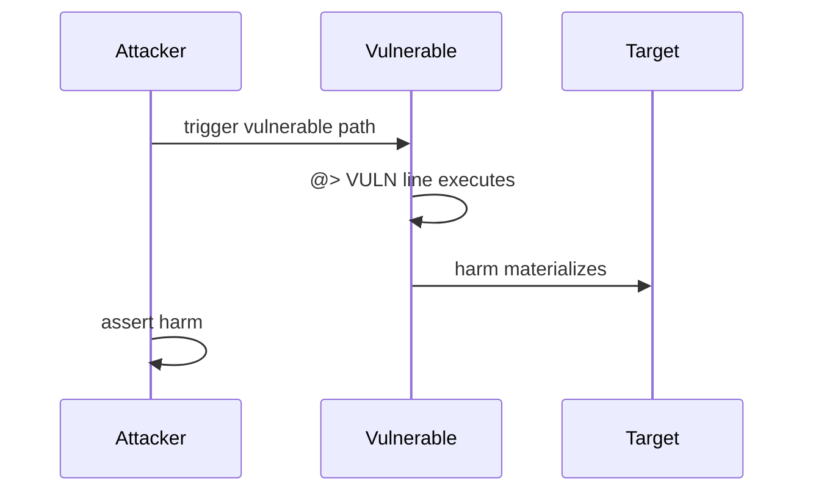

# H-1: notifyUnsubscribe gas underestimation leaves phantom gauge liquidity

<!-- non-defihacklabs -->
<!-- source-auditvault: https://github.com/Auditware/AuditVault/blob/main/findings/62808-h-1-gas-consumed-in-notifyunsubscribe-is-underestimated-duri.md -->
<!-- date: 2025-09 -->

| Field | Value |
|-------|-------|
| Protocol | BMX Deli Swap |
| Severity | high |
| Source | AuditVault / https://github.com/sherlock-audit/2025-09-bmx-deli-swap-judging |
| Harm | Uniswap unsubscribes while Deli gauge keeps full position liquidity (phantom dilution) |

## TL;DR

Uniswap unsubscribes while Deli gauge keeps full position liquidity (phantom dilution)

## Vulnerable code

See the synthetic reproduction in `test/62808-h-1-gas-consumed-in-notifyunsubscribe-is-underestimated-duri.sol` — the blamed line is marked `// @> VULN`.

## Root cause

Faithful reduction of the AuditVault finding. The vulnerable line is preserved so the Playground locator points at the real bug, not scaffolding.

## Attack walkthrough

1. Deploy the reduced protocol pieces via the `Exploit` constructor.
2. `run()` performs the attack end-to-end and `require`s the harm.

## Diagrams

## Impact

Uniswap unsubscribes while Deli gauge keeps full position liquidity (phantom dilution)

## Taxonomy

- severity/high
- sector/dex
- platform/auditvault

## Sources

- AuditVault finding: https://github.com/Auditware/AuditVault/blob/main/findings/62808-h-1-gas-consumed-in-notifyunsubscribe-is-underestimated-duri.md
- Original report: https://github.com/sherlock-audit/2025-09-bmx-deli-swap-judging
- Reduced from: sherlock-audit/2025-09-bmx-deli-swap (PositionManagerAdapter/Notifier gas path)
