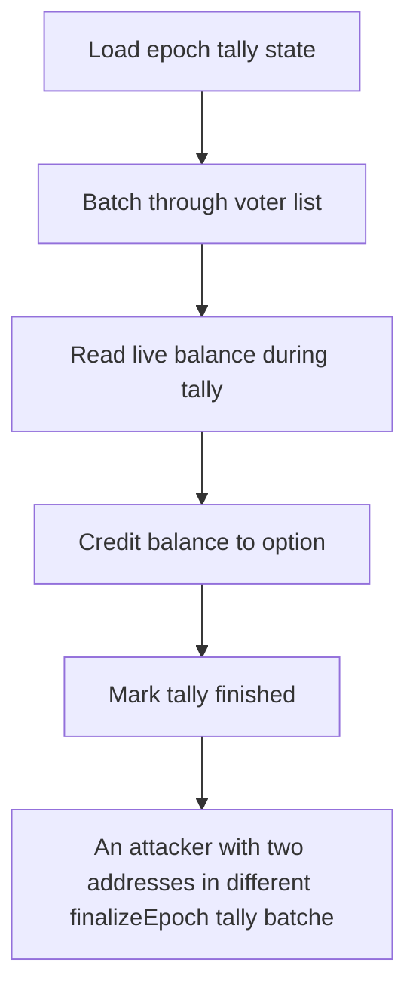

# BMX: An attacker with two addresses in different finalizeEpoch tally batches unstakes 1000e18 s

> **Vulnerability classes:** vuln/unfair-mint
>
> **Reproduction:** a faithful minimal reproduction of the vulnerable finding — the vulnerable function is reproduced **verbatim** (marked `@>`) with faithful minimal doubles; local deploy, no fork.

<!-- source-auditvault: https://github.com/Auditware/AuditVault/blob/main/findings/62809-h-2-users-voting-weight-can-be-double-counted-when-finalize.md -->

## Root cause

An attacker with two addresses in different finalizeEpoch tally batches unstakes 1000e18 sbfBMX from an already-tallied address and restakes it to a not-yet-tallied one, so the same balance is counted twice — a voting option's weight is inflated to 2000e18 (2x the real 1000e18 stake), crediting 1000e18 phantom vote weight to the attacker's chosen option.

```solidity
            if (userVoteWeight[ep][voterAddr] > 0) continue;

            //@audit current balance is used for voterAddr
            uint256 bal = SBF_BMX.balanceOf(voterAddr); // @> live balance read at tally time — enables cross-batch double-count
            if (bal == 0) {
                // queue for removal instead of removing now
```

## Why it's exploitable here

An attacker with two addresses in different finalizeEpoch tally batches unstakes 1000e18 sbfBMX from an already-tallied address and restakes it to a not-yet-tallied one, so the same balance is counted twice — a voting option's weight is inflated to 2000e18 (2x the real 1000e18 stake), crediting 1000e18 phantom vote weight to the attacker's chosen option.

## Attack path



## Marked-line walkthrough (Playground)

The EVM Playground pins each step to the exact executed source line in `0x671d353a77…`:

1. **L84** — Load epoch tally state: Loads the epoch's tally storage that accumulates each option's vote weight.
2. **L86** — Batch through voter list: Iterates voters in bounded batches — the multi-transaction tally that makes the double-count possible.
3. **L97** — Read live balance during tally: Root cause: reads a voter's live staked `balanceOf` mid-tally, so an attacker can move the same balance to an untallied address and have it counted twice.
4. **L103** — Credit balance to option: Adds that read balance to the voter's chosen option's accumulated weight.
5. **L108** — Mark tally finished: Flags the epoch tally complete once the cursor has processed every voter in the list.
6. **L119** — Pending removals list: Setup: loads the epoch's pending voter-removals list.
7. **L157** — Per-option weight storage: Setup: the mapping that stores accumulated vote weight per option.

## PoC

Registry (Foundry, local deploy — verbatim vulnerable source + harm-asserting test + negative control):

```bash
cd 62809-h-2-users-voting-weight-can-be-double-counted-when-finalize_exp
forge test -vvv
```

The browser Playground replays the same synthetic opcode-for-opcode and measures the harm: **An attacker with two addresses in different finalizeEpoch tally batches unstakes 1000e18 sbfBMX from an already-tallied address and restakes**. Both gates are green (registry `forge test` PASS + Playground `_verify-poc` **VERDICT: PASS**).
