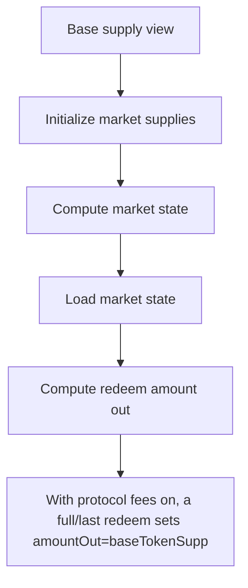

# Covenant: With protocol fees on

> **Vulnerability classes:** vuln/locked-funds · vuln/reward-accounting
>
> **Reproduction:** a faithful minimal reproduction of the vulnerable finding — the vulnerable function is reproduced **verbatim** (marked `@>`) with faithful minimal doubles; local deploy, no fork.

<!-- source-auditvault: https://github.com/Auditware/AuditVault/blob/main/findings/62822-h-01-not-excluding-accruedprotocolfee-from-state-update-oper.md -->

## Root cause

With protocol fees on, a full/last redeem sets amountOut=baseTokenSupply (== the full baseSupply, since the accrued fee is never excluded), so the state update baseSupply-amountOut-protocolFees underflows and reverts for any fee>0 — the final redeemer can never withdraw and the entire 1,000,000 base supply is permanently locked (redeem DoS).

```solidity
        (amountOut,) = _computeAmountOut(calculatedState, redeemParams.aTokenAmountIn, redeemParams.zTokenAmountIn);

        // Update market state (storage). VERBATIM state-update line from the finding:
        marketState[redeemParams.marketId].baseSupply = baseSupply - amountOut - protocolFees; // @> full redeem sets amountOut=baseTokenSupply(==baseSupply, fee never excluded); subtracting protocolFees>0 underflows -> full/last redeem reverts, base supply locked
        if (protocolFees > 0) marketState[redeemParams.marketId].protocolFeeGrowth += protocolFees;
    }
```

## Why it's exploitable here

With protocol fees on, a full/last redeem sets amountOut=baseTokenSupply (== the full baseSupply, since the accrued fee is never excluded), so the state update baseSupply-amountOut-protocolFees underflows and reverts for any fee>0 — the final redeemer can never withdraw and the entire 1,000,000 base supply is permanently locked (redeem DoS).

## Attack path



## Marked-line walkthrough (Playground)

The EVM Playground pins each step to the exact executed source line in `0x8ea53755a6…`:

1. **L89** — Base supply view: Setup: view returning a market's base token supply.
2. **L99** — Initialize market supplies: Setup: seeds a market with its base, Z, and A token supplies for the test.
3. **L110** — Compute market state: Recomputes the market's current state, including the accrued `protocolFees`.
4. **L115** — Load market state: Copies the stored market state into memory for the redeem calculation.
5. **L126** — Compute redeem amount out: Computes the redeem payout; on a full/last redeem this equals the entire `baseSupply` without excluding the accrued fee.
6. **L139** — Redeem entry point: The `redeem` function that pays out `amountOut` and then updates the market's base supply.
7. **L146** — Double-subtracting fee underflows: Root cause: on a full redeem `amountOut` equals the whole `baseSupply` (fee not excluded), so subtracting `protocolFees` underflows and reverts, locking funds.

## PoC

Registry (Foundry, local deploy — verbatim vulnerable source + harm-asserting test + negative control):

```bash
cd 62822-h-01-not-excluding-accruedprotocolfee-from-state-update-oper_exp
forge test -vvv
```

The browser Playground replays the same synthetic opcode-for-opcode and measures the harm: **With protocol fees on, a full/last redeem sets amountOut=baseTokenSupply (== the full baseSupply, since the accrued fee is never excluded), **. Both gates are green (registry `forge test` PASS + Playground `_verify-poc` **VERDICT: PASS**).
