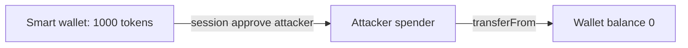

# Etherspot CredibleAccountModule — session-key approval drains the wallet

> **Vulnerability classes:** vuln/access-control/missing-owner-check · vuln/logic/missing-validation
>
> **Reproduction:** local synthetic Foundry reduction; the complete passing trace is in [output.txt](output.txt).

<!-- non-defihacklabs -->
<!-- source-auditvault: https://github.com/Auditware/AuditVault/blob/main/findings/62847-c-01-sessionkey-owner-can-drain-the-smart-wallet-shieldify-n.md -->
<!-- date: 2025-01 -->

## Key info

| Field | Value |
|---|---|
| Loss | A session key approves itself and transfers all 1,000 synthetic wallet tokens. |
| Vulnerable contract | `CredibleAccountModule.validateApproval` in [test/62847-c-01-sessionkey-owner-drain-smart-wallet.sol](test/62847-c-01-sessionkey-owner-drain-smart-wallet.sol) |
| Attacker EOA | `0x1111111111111111111111111111111111111111` |
| Attack contract | `Exploit` |
| Attack tx | Local Foundry `Exploit.run()` |
| Chain · block · date | Ethereum model · block 0 · synthetic |
| Compiler | Solidity `^0.8.24` |
| Bug class | Unrestricted ERC20 approve spender |

## TL;DR

Session-key call validation allows any ERC20 `approve` target. The key owner chooses itself as spender, then calls `transferFrom` to remove every token held by the smart wallet rather than only the locked allocation.

## Background

CredibleAccountModule sessions are intended to constrain both callable selectors and token amounts. `approve` is safe only when the spender is the module and the amount is bounded by the session.

## The vulnerable code

```solidity
function validateApproval(address /*spender*/, uint256 /*amount*/) external pure returns (bool) {
    // @> VULN: approve calls are accepted without requiring the module as spender.
    return true;
}
```

See the complete reduction in [test/62847-c-01-sessionkey-owner-drain-smart-wallet.sol](test/62847-c-01-sessionkey-owner-drain-smart-wallet.sol).

## Root cause

The selector allowlist treats all `approve` calls as equivalent and does not decode the spender (or amount). A valid session signature consequently grants an unlimited delegated-transfer primitive.

## Preconditions

- The smart wallet holds ERC20 tokens.
- A session key can submit an `approve` call.
- The validator does not require the module as spender or enforce the locked amount.

## Attack walkthrough

1. `Exploit.run()` mints 1,000 units to `SmartWallet`.
2. The session call approves the attacker contract for 1,000 units.
3. `transferFrom` moves the full balance; the passing assertion is at [output.txt:4](output.txt#L4).

## Diagrams



## Remediation

Decode every approve call, require `spender == address(CredibleAccountModule)`, and cap the approved amount to the session's locked token amount. Apply the same validation to batch execution.

## How to reproduce

```bash
cd evm-hack-registry/62847-c-01-sessionkey-owner-drain-smart-wallet_exp
forge test -vvvvv
```

## Sources

- [AuditVault finding #62847](https://github.com/Auditware/AuditVault/blob/main/findings/62847-c-01-sessionkey-owner-can-drain-the-smart-wallet-shieldify-n.md)
- [Shieldify Etherspot GasTank review](https://github.com/shieldify-security/audits-portfolio-md/blob/main/Etherspot-GasTankPaymasterModule-Extended-Security-Review.md)
- [Synthetic test](test/62847-c-01-sessionkey-owner-drain-smart-wallet.sol)

*Reference: https://github.com/shieldify-security/audits-portfolio-md/blob/main/Etherspot-GasTankPaymasterModule-Extended-Security-Review.md*
