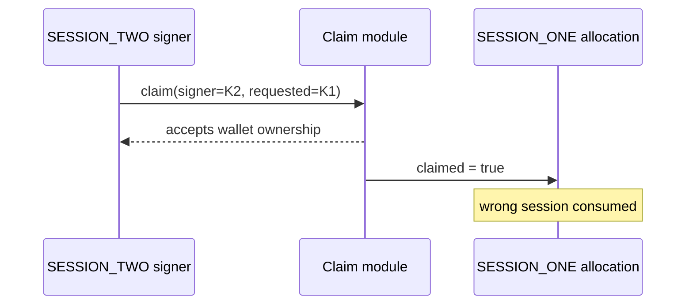

# Etherspot CredibleAccountModule — session owner can consume a sibling session

> **Vulnerability classes:** vuln/access-control/missing-owner-check · vuln/auth/signature-validation
>
> **Reproduction:** local synthetic Foundry reduction; the complete passing trace is in [output.txt](output.txt).

<!-- non-defihacklabs -->
<!-- source-auditvault: https://github.com/Auditware/AuditVault/blob/main/findings/62848-h-01-sessionkey-owner-can-impersonate-another-session-key-ow.md -->
<!-- date: 2025-01 -->

## Key info

| Field | Value |
|---|---|
| Loss | SESSION_ONE is consumed by SESSION_TWO; the legitimate key's allocation becomes unavailable. |
| Vulnerable contract | `SessionClaimModule.claim` in [test/62848-h-01-sessionkey-owner-impersonate-session-key-owner.sol](test/62848-h-01-sessionkey-owner-impersonate-session-key-owner.sol) |
| Attacker EOA | `0x1111111111111111111111111111111111111111` |
| Attack contract | `Exploit` |
| Attack tx | Local Foundry `Exploit.run()` |
| Chain · block · date | Ethereum model · block 0 · synthetic |
| Compiler | Solidity `^0.8.24` |
| Bug class | Session signer not bound to claimed session |

## TL;DR

The module verifies that a signer belongs to the smart wallet but never checks that the session named in `claim()` is the same signer. One active session key can therefore consume another key's claim.

## Background

Wallets may have many simultaneous time-limited sessions. Each signature must authorize exactly one session identity; checking only wallet ownership is insufficient.

## The vulnerable code

```solidity
function claim(address sessionKeySigner, address requestedSession, address wallet) external {
    require(sessionWallet[sessionKeySigner] == wallet, "signer not wallet session");
    require(!claimed[requestedSession], "already claimed");
    // @> VULN: requestedSession is not required to equal sessionKeySigner.
    claimed[requestedSession] = true;
}
```

## Root cause

The authorization domain omits the session key parameter. A signature produced by SESSION_TWO is accepted for a call that names SESSION_ONE.

## Preconditions

- The smart wallet has at least two active session keys.
- The claim entrypoint accepts both the recovered signer and a caller-supplied session id.
- No equality check binds those values.

## Attack walkthrough

1. `Exploit.run()` enables `SESSION_ONE` and `SESSION_TWO` for one wallet.
2. It calls `claim(SESSION_TWO, SESSION_ONE, wallet)`.
3. `SESSION_ONE` is marked claimed while SESSION_TWO remains unused; see [output.txt:4](output.txt#L4).

## Diagrams



## Remediation

Decode the `claim` calldata and require its session key to equal the recovered signer before consuming state. Include the session key in the signed digest and test cross-session claims.

## How to reproduce

```bash
cd evm-hack-registry/62848-h-01-sessionkey-owner-impersonate-session-key-owner_exp
forge test -vvvvv
```

## Sources

- [AuditVault finding #62848](https://github.com/Auditware/AuditVault/blob/main/findings/62848-h-01-sessionkey-owner-can-impersonate-another-session-key-ow.md)
- [Shieldify Etherspot GasTank review](https://github.com/shieldify-security/audits-portfolio-md/blob/main/Etherspot-GasTankPaymasterModule-Extended-Security-Review.md)
- [Synthetic test](test/62848-h-01-sessionkey-owner-impersonate-session-key-owner.sol)

*Reference: https://github.com/shieldify-security/audits-portfolio-md/blob/main/Etherspot-GasTankPaymasterModule-Extended-Security-Review.md*
